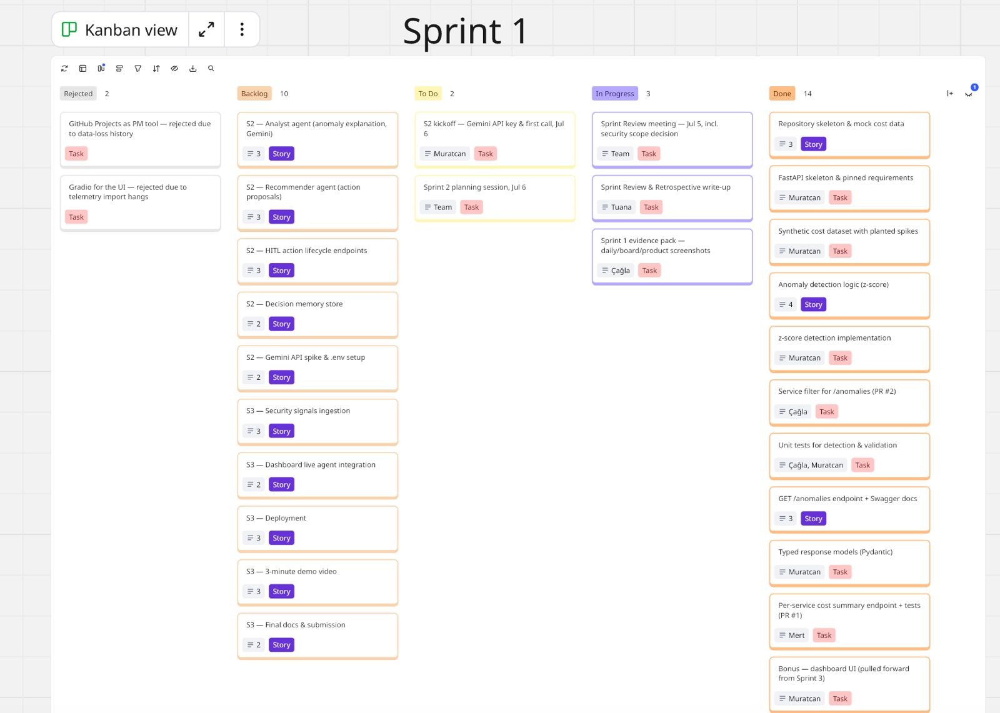
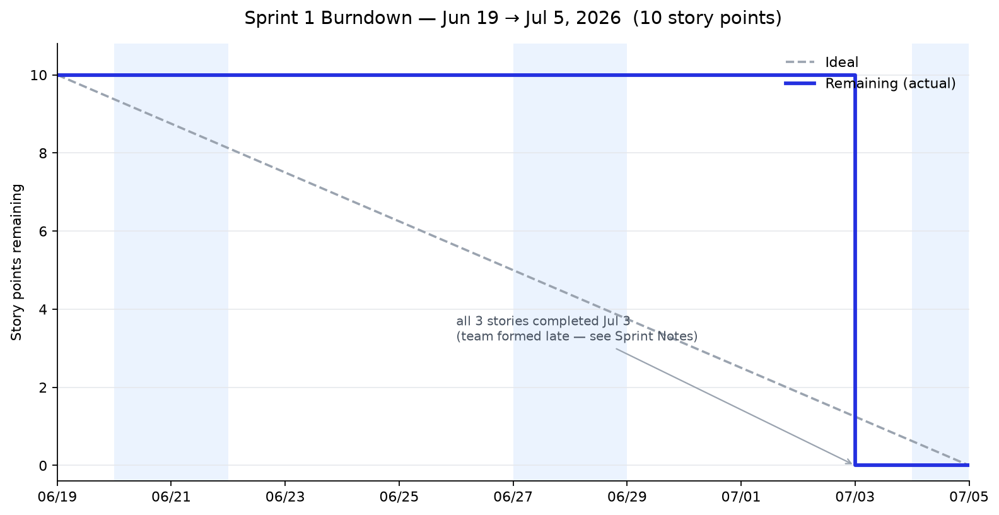
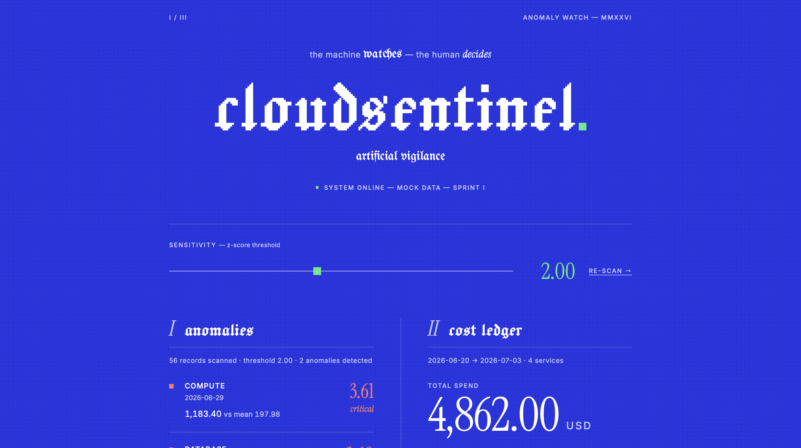
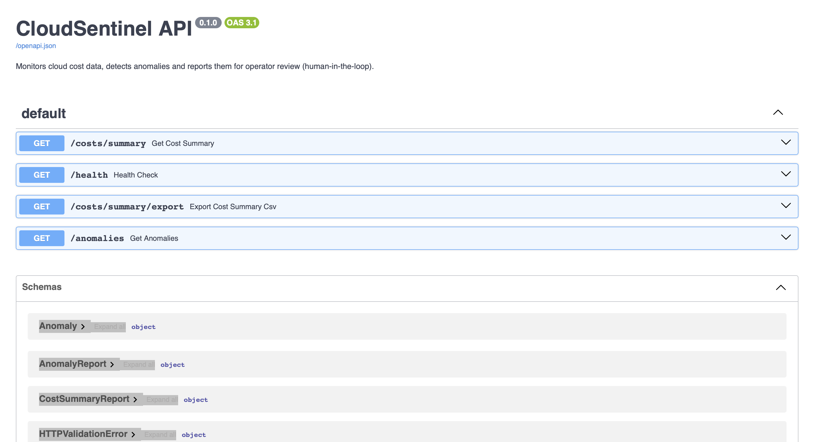

<div align="center">

# ☁️ CloudSentinel

### AI-agent powered cloud cost & security anomaly detection — with a human in the loop

**YZTA Bootcamp 2026 · AI Track · Group 60**

[Product](#information-about-the-product) · [Architecture](docs/architecture.md) · [How to Run](#how-to-run-local) · [Sprint 1](#sprint-1)


</div>

## 📖 Table of Contents

- [Team Name](#team-name)
- [Information About the Product](#information-about-the-product)
  - [Team Members](#team-members)
  - [Product Name](#product-name) · [Product Description](#product-description) · [Product Features](#product-features) · [Target Audience](#target-audience)
  - [What Makes CloudSentinel Different](#what-makes-cloudsentinel-different)
  - [How to Run (Local)](#how-to-run-local)
  - [Built With](#built-with) · [Project Status](#project-status--sprint-1-deliverables) · [Roadmap](#roadmap-sprint-2-3)
  - [Requirements Compliance](#requirements-compliance) · [Scope & Limitations](#scope--limitations-by-design)
  - [Product Backlog URL](#product-backlog-url)
- [Sprint 1](#sprint-1) · [Sprint 2](#sprint-2) · [Sprint 3](#sprint-3)

# Team Name

Group 60 – Team CloudSentinel

# Information About the Product

## Team Members

<table align="center">
<tr>
<td align="center">
  <a href="https://github.com/tuanaydin">
    
    <br/><sub><b>Tuana Aydın</b></sub>
  </a>
  <br/><sub>Product Owner</sub>
</td>
<td align="center">
  <a href="https://github.com/muratcan-ates">
    
    <br/><sub><b>Muratcan Ateş</b></sub>
  </a>
  <br/><sub>Scrum Master</sub>
</td>
<td align="center">
  <a href="https://github.com/caglayurtsvn">
    
    <br/><sub><b>Çağla Yurtseven</b></sub>
  </a>
  <br/><sub>Developer</sub>
</td>
<td align="center">
  <a href="https://github.com/mertefekurt">
    
    <br/><sub><b>Mert Kurt</b></sub>
  </a>
  <br/><sub>Developer</sub>
</td>
</tr>
</table>

## Product Name

CloudSentinel

## Product Description

CloudSentinel is an agentic decision-support system that monitors cloud cost and security data, detects anomalies in that data, generates action recommendations for detected anomalies through AI agents, and leaves the final approval of critical actions to a human operator (human-in-the-loop). The backend is being developed with FastAPI + Python; Gemini is planned for the LLM layer. At the MVP stage the system runs on synthetic (mock) data.

## Product Features

- Anomaly detection on cloud cost data
- Monitoring of security data and signals
- AI-agent-generated action recommendations for detected anomalies
- Human-in-the-loop approval flow for critical actions
- REST API (FastAPI) with automatic Swagger documentation
- Multi-agent orchestration for decision making (in upcoming sprints)

## Target Audience

- DevOps / platform engineering teams operating cloud infrastructure
- FinOps specialists managing cloud spending
- Security operations (SecOps) teams
- SMEs and startups that want to keep their cloud costs under control

## What Makes CloudSentinel Different

Cloud providers and observability tools (AWS Cost Anomaly Detection, GCP cost
alerts, Datadog Cloud Cost Management) can already *detect* cost anomalies.
CloudSentinel's differentiator is what happens after detection: AI agents
reason about each anomaly, propose concrete remediation actions with risk
levels, and a human operator gives the final approval — closing the
detect → decide → act loop with human-in-the-loop safety instead of leaving
the operator alone with a raw alert. The planned agent design is documented
in [docs/architecture.md](docs/architecture.md).

## How to Run (Local)

```bash
python3 -m venv .venv
.venv/bin/pip install -r requirements-dev.txt
.venv/bin/uvicorn main:app --reload
```

Then open the dashboard at `http://127.0.0.1:8000/` (Swagger at `/docs`), or query directly:

```bash
curl "http://127.0.0.1:8000/anomalies"
# → detects the 2 planted spikes in the mock data:
#   compute 2026-06-29 (z=3.61) and database 2026-07-02 (z=3.60)
```

Per-service spending breakdown:

```bash
curl "http://127.0.0.1:8000/costs/summary"
# → total spend, per-service totals and each service's share of overall cost
```

Daily trend series (powers the dashboard's spend-trend chart and per-signal evidence sparkline):

```bash
curl "http://127.0.0.1:8000/costs/daily"
# → aligned per-service daily series, date axis and daily totals
```

Run the test suite with `.venv/bin/pytest`.

> On Windows, replace `.venv/bin/` with `.venv\Scripts\` in the commands above.

Or run it with Docker:

```bash
docker build -t cloudsentinel .
docker run -p 8000:8000 cloudsentinel
```

## Built With

| Technology | Purpose |
|---|---|
| **Python 3.12** | Core language (pinned in venv, CI and Docker) |
| **FastAPI + Uvicorn** | REST API and ASGI server |
| **Pydantic v2** | Typed request/response models and validation |
| **pytest + httpx** | Automated test suite (65 tests) |
| **Docker** | Containerized, deployment-ready packaging |
| **Gemini** (`google-genai`) | LLM provider layer with quota-aware retry and rule-based fallback |
| **Miro** | Scrum board and product backlog (official bootcamp template) |

## Project Status — Sprint 1 Deliverables

| Deliverable | Description | Status |
|---|---|---|
| Mock cost dataset | 4 services × 14 days of synthetic costs with 2 planted spikes | ✅ [`data/mock_costs.json`](data/mock_costs.json) |
| Anomaly detection API | `GET /anomalies` — per-service z-score with typed responses | ✅ [`main.py`](main.py) · [`detection.py`](detection.py) |
| Cost summary API | `GET /costs/summary` — per-service spend aggregates and shares | ✅ [`main.py`](main.py) · [`detection.py`](detection.py) |
| Cyber dashboard | Root-served UI: anomaly feed, cost matrix, live threshold control | ✅ [`static/`](static/) |
| Test suite | 27 pytest cases: detection, aggregation, filtering, export, validation, dashboard | ✅ [`tests/`](tests/) |
| Containerization | `python:3.12-slim` image | ✅ [`Dockerfile`](Dockerfile) |
| Agent & HITL architecture design | Sprint 2–3 technical plan | ✅ [`docs/architecture.md`](docs/architecture.md) |
| Health check & CSV export | `GET /health` liveness · downloadable cost summary (PR #3) | ✅ [`main.py`](main.py) |

## Roadmap (Sprint 2-3)

Planned next, in line with [docs/architecture.md](docs/architecture.md) and the sprint point plan:

| Planned work | Sprint |
|---|---|
| Gemini agents — Analyst (anomaly explanation) & Recommender (action proposals) | Sprint 2 |
| Human-in-the-loop action lifecycle (`proposed → approved/rejected → executed`) | Sprint 2 |
| Continuous integration — tests on every push | Sprint 2 |
| Dashboard palette revision after UI reference research | Sprint 2 |
| Security-signal ingestion through the same detection pipeline (mock events) | Sprint 3 |
| Deployment, live demo & 3-minute product video | Sprint 3 |

## Requirements Compliance

Mapping of the official bootcamp scrum-notebook requirements to their evidence in this repository:

| Requirement | Status | Evidence |
|---|---|---|
| Team name & roles documented | ✅ | [Team Name](#team-name) · [Team Members](#team-members) |
| Product name, description, features, target audience | ✅ | [Information About the Product](#information-about-the-product) |
| Product Backlog board (Miro) | ✅ | [Product Backlog URL](#product-backlog-url) |
| Sprint Notes (never left empty) | ✅ | [Sprint 1](#sprint-1) |
| Point estimates & completion logic | ✅ | [Sprint 1](#sprint-1) |
| Daily Scrum documentation | ✅ | [Slack & WhatsApp evidence](ProjectManagement/Sprint1Documents/) |
| Sprint board screenshots | ✅ | [Miro board](ProjectManagement/Sprint1Documents/miro_board.jpeg) · [burndown](ProjectManagement/Sprint1Documents/burndown_sprint1.png) |
| Product status screenshots | ✅ | [dashboard](ProjectManagement/Sprint1Documents/dashboard.png) · [Swagger](ProjectManagement/Sprint1Documents/swagger_docs.png) |
| Sprint Review & Retrospective | ✅ | [Sprint 1](#sprint-1) |
| Working product increment | ✅ | [`GET /anomalies`](main.py) · [`GET /costs/summary`](main.py) · [CSV export & `/health`](main.py) · [tests](tests/) |

## Scope & Limitations (By Design)

These constraints are intentional Sprint 1 decisions, not oversights:

- **Synthetic mock data only** — real cloud-provider connectors are outside the
  competition scope; the detection pipeline is data-source agnostic by design.
- **Read-only endpoints for now** — `/anomalies`, `/costs/summary` (+ CSV
  export), `/costs/daily` and `/health` only observe; the action-proposal and approval endpoints arrive with the
  human-in-the-loop flow in Sprint 2
  (see [docs/architecture.md](docs/architecture.md)).
- **Security signals arrive in Sprint 3** — the Sprint 1 review decided to
  extend the same detection pipeline with mock security events in Sprint 3
  (see the Sprint Review notes).
- **Deployment lands in Sprint 3** — the app is already containerized and
  deployment-ready; the target platform is chosen during Sprint 3.

## Product Backlog URL

[Miro Scrum Board — official bootcamp template](https://miro.com/app/board/uXjVH-p0md4=/?share_link_id=656166042252)

---

# Sprint 1

- **Sprint Notes**:
  - `FastAPI + Python` was chosen as the backend stack (required by the bootcamp guide).
  - `Gemini` is planned for the LLM layer.
  - `Miro` (the official bootcamp Scrum template) was chosen as the project management tool; `GitHub Projects` was not preferred due to data-loss experiences in previous terms.
  - It was decided that Daily Scrum meetings would be held over `WhatsApp`.
  - The scope of Sprint 1 was limited to a single anomaly-detection endpoint running on synthetic (mock) data; Gemini integration and the multi-agent architecture were deferred to later sprints.
  - Code, commit messages and all project documentation, including this scrum notebook, are kept in `English`.
  - Samet Kargın was unable to participate during Sprint 1; the team continues with four active members and the Sprint 1 stories were distributed accordingly.

- **Expected point completion within the sprint**: 10 points

- **Point Completion Logic**: The total backlog planned for the whole project is 36 points. Since Sprint 1 was shortened due to the late formation of teams, the target for this sprint was set at 10 points. The remaining points are split between Sprint 2 (13 points) and Sprint 3 (13 points).

- **Backlog order and story selections**: The backlog is ordered by the stories that will be tackled first. The estimate for each story is kept below half of the sprint total. Sprint 1 stories: repository skeleton and mock cost data (3 points), anomaly detection logic (4 points), `GET /anomalies` endpoint with Swagger documentation (3 points). Stories are split into tasks on the Miro board and assigned across the four team members. On the board, blue cards represent user stories and red/orange cards represent tasks (see the legend on the board itself).

- **Daily Scrum**: Daily communication runs over WhatsApp; team meetings and huddles are held on Slack. Evidence in [ProjectManagement/Sprint1Documents/](ProjectManagement/Sprint1Documents/): [team formation & GitHub sharing](ProjectManagement/Sprint1Documents/slack_team_github_sharing.jpeg) · [project pitch](ProjectManagement/Sprint1Documents/slack_project_pitch.jpeg) · [meeting scheduling & 2h huddle](ProjectManagement/Sprint1Documents/slack_meeting_and_huddle.jpeg) · [in-team design review request](ProjectManagement/Sprint1Documents/whatsapp_design_review_request.jpeg) · [design feedback & decision](ProjectManagement/Sprint1Documents/whatsapp_design_feedback.jpeg).

- **Sprint board update**:

  

  

  Detail: [Done column with per-member assignments](ProjectManagement/Sprint1Documents/miro_board_done_column.jpeg).

- **Product Status**: the increment runs locally — dashboard at `/`, Swagger at `/docs`.

  

  

  More: [cost ledger & footer](ProjectManagement/Sprint1Documents/dashboard_ledger.png) · [typed schemas](ProjectManagement/Sprint1Documents/swagger_schemas.png).

- **Sprint Review**: Sprint 1 closed with all three committed stories completed (10/10 points). Beyond the committed scope, three teammate pull requests were reviewed and merged during the sprint — per-service cost summary (PR #1), case-insensitive service filter for `/anomalies` (PR #2), and `/health` plus CSV export (PR #3) — and the dashboard was pulled forward from Sprint 3 as a bonus, so every team member shipped reviewed, merged code in Sprint 1. The increment was demoed over the dashboard and Swagger and behaves correctly: 27 automated tests, both planted anomalies detected with zero false positives. Decisions taken: security-signal ingestion stays in scope and will flow through the same detection pipeline in Sprint 3 with mock security events, as designed in [docs/architecture.md](docs/architecture.md); the 36-point plan (10/13/13) was confirmed; the dashboard's cobalt palette will be revisited in Sprint 2 after UI reference research. Carried over to Sprint 2: Gemini integration (Analyst + Recommender agents), the human-in-the-loop action lifecycle, the decision-memory store, and a code packaging refactor.

  | Story | Points | Result |
  |---|---|---|
  | Repository skeleton & mock cost data | 3 | ✅ Completed |
  | Anomaly detection logic (z-score) | 4 | ✅ Completed |
  | `GET /anomalies` endpoint + Swagger documentation | 3 | ✅ Completed |
  | Bonus: cost summary (PR #1) · service filter (PR #2) · `/health` & CSV export (PR #3) · dashboard | — | ✅ Delivered |
  | **Total** | **10 / 10** | |

- **Sprint Review Participants**: `Tuana Aydın, Muratcan Ateş, Çağla Yurtseven, Mert Kurt`

- **Sprint Retrospective**:
  - **What went well**: a working increment was ready two days before the sprint deadline; scope discipline held with no feature creep; the team switched to a pull-request workflow mid-sprint and all three teammate PRs were reviewed and merged the day they were opened; the scrum notebook, architecture design and evidence pack were kept current throughout the sprint.
  - **What to improve**: the late team formation compressed delivery into the final days of the sprint (clearly visible in the burndown chart); the project-management board was set up late; in-team design review surfaced that the dashboard's cobalt background is tiring on the eyes.
  - **Action items**: the Sprint 2 board is filled before planning on July 6; evidence (board and daily screenshots) is captured weekly rather than at sprint end; the Gemini API spike is the first task of Sprint 2; the dashboard palette is revised after UI reference research (owner: Tuana); every member ships at least one reviewed PR per sprint.

---

# Sprint 2

*Sprint 2 runs July 6 – July 19; planning outputs land here on July 6.*

---

# Sprint 3

*The final sprint runs July 20 – August 2 and closes with deployment, the live demo and the 3-minute product video.*

---


<div align="center"><sub>Built by Team CloudSentinel — YZTA Bootcamp 2026 · AI Track · Group 60</sub></div>
