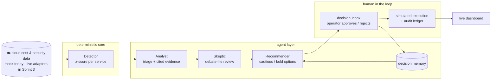

<div align="center">

# ☁️ CloudSentinel

### AI-agent powered cloud cost & security anomaly detection — with a human in the loop

**YZTA Bootcamp 2026 · AI Track · Group 60**

[Product](#information-about-the-product) · [Architecture](docs/architecture.md) · [How to Run](#how-to-run-local) · [Sprint 2](#sprint-2) · [Field Guide](#field-guide--sixty-seconds-to-a-decision)


</div>

## 📖 Table of Contents

- [Team Name](#team-name)
- [Information About the Product](#information-about-the-product)
  - [Team Members](#team-members)
  - [Product Name](#product-name) · [Product Description](#product-description) · [Product Features](#product-features) · [Target Audience](#target-audience)
  - [Three Roles, One Control Room](#three-roles-one-control-room) · [What Makes CloudSentinel Different](#what-makes-cloudsentinel-different)
  - [The System at a Glance](#the-system-at-a-glance) · [Repository Map](#repository-map)
  - [How to Run (Local)](#how-to-run-local)
  - [Built With](#built-with) · [Sprint 1 Deliverables](#project-status--sprint-1-deliverables) · [Sprint 2 Progress](#project-status--sprint-2-progress) · [Roadmap](#roadmap-sprint-2-3)
  - [Requirements Compliance](#requirements-compliance) · [Scope & Limitations](#scope--limitations-by-design)
  - [Product Backlog URL](#product-backlog-url)
- [Sprint 1](#sprint-1) · [Sprint 2](#sprint-2) · [Sprint 3](#sprint-3)
- [Field Guide](#field-guide--sixty-seconds-to-a-decision) · [In Short](#in-short) · [Acknowledgements](#acknowledgements)

# Team Name

Group 60 – Team CloudSentinel

# Information About the Product

## Team Members

<table align="center">
<tr>
<td align="center">
  <a href="https://github.com/tuanaydin">
    
    <br/><sub><b>Tuana Aydın</b></sub>
  </a>
  <br/><sub>Product Owner</sub>
</td>
<td align="center">
  <a href="https://github.com/muratcan-ates">
    
    <br/><sub><b>Muratcan Ateş</b></sub>
  </a>
  <br/><sub>Scrum Master</sub>
</td>
<td align="center">
  <a href="https://github.com/caglayurtsvn">
    
    <br/><sub><b>Çağla Yurtseven</b></sub>
  </a>
  <br/><sub>Developer</sub>
</td>
<td align="center">
  <a href="https://github.com/mertefekurt">
    
    <br/><sub><b>Mert Kurt</b></sub>
  </a>
  <br/><sub>Developer</sub>
</td>
</tr>
</table>

## Product Name

CloudSentinel

## Product Description

CloudSentinel is an agentic decision-support system that monitors cloud cost and security data, detects anomalies in that data, generates action recommendations for detected anomalies through AI agents, and leaves the final approval of critical actions to a human operator (human-in-the-loop). The backend is FastAPI + Python; the LLM layer is built for Gemini behind a provider abstraction, with a deterministic fake provider that keeps every agent behavior testable and demo-able offline. At the MVP stage the system runs on synthetic (mock) data.

## Product Features

- Anomaly detection on cloud cost data (per-service z-score, live threshold control)
- **Analyst agent** — triages every anomaly (REAL / SEASONAL / DATA_ERROR / KNOWN_CHANGE) with cited evidence rows and a self-assessed confidence; self-reflects on critical signals
- **Recommender agent** — proposes exactly two options (cautious / bold) with risk and rollback plans; estimated savings are computed deterministically in Python, never by the model
- **Debate-lite skeptic** — low-confidence or contested recommendations get one extra adversarial review; the transcript ships with the proposal
- **Decision memory** — operator verdicts are stored and fed back into the Recommender's context, so repeated anomaly patterns meet an agent that remembers
- **Human-in-the-loop lifecycle** — `proposed → approved/rejected → executed (simulated)` with idempotent decisions, request-triggered timeouts and a full audit trail; nothing ever executes without a human
- **Pulse** — one call drives the whole chain (detect → analyze → debate → recommend → inbox) with a tagged JSON log stream
- Live dashboard: anomaly feed, cost ledger, investigation evidence, decision inbox and audit ledger
- REST API (FastAPI, 15 endpoints) with automatic Swagger documentation
- Monitoring of security data and signals (mock security events land in Sprint 3 through the same pipeline)

## Target Audience

- DevOps / platform engineering teams operating cloud infrastructure
- FinOps specialists managing cloud spending
- Security operations (SecOps) teams
- SMEs and startups that want to keep their cloud costs under control

## Three Roles, One Control Room

Companies run cloud operations through three roles, each with its own toolbelt
and its own daily question. CloudSentinel is designed as the surface where the
three meet **after** detection — the moment their current tools hand the
problem back to a human with nothing but a raw alert:

| Role | On their desk today | Their daily question | Where CloudSentinel answers it |
|---|---|---|---|
| **FinOps analyst** | AWS Cost Explorer, GCP billing alerts, spreadsheets | *"Why did spend jump, and what is it worth fixing?"* | Cost ledger with share-of-spend, trend curve with anomaly marks, deterministic Python-computed savings on every proposal, CSV export for the finance review |
| **DevOps / platform engineer** | Datadog / Grafana, PagerDuty, Terraform | *"What exactly do I change, and how do I roll it back?"* | Analyst triage with cited evidence rows, cautious / bold options each carrying risk **and a rollback plan**, execution that stays simulated until a human approves |
| **SecOps operator** | SIEM dashboards, IAM audit logs, ticket queues | *"Who decided what, and can I prove it?"* | Human-in-the-loop state machine with idempotent decisions, the append-only decision ledger, and security signals flowing through the same pipeline in Sprint 3 |

## What Makes CloudSentinel Different

Cloud providers and observability tools (AWS Cost Anomaly Detection, GCP cost
alerts, Datadog Cloud Cost Management) can already *detect* cost anomalies.
CloudSentinel's differentiator is what happens after detection: AI agents
reason about each anomaly, propose concrete remediation actions with risk
levels, and a human operator gives the final approval — closing the
detect → decide → act loop with human-in-the-loop safety instead of leaving
the operator alone with a raw alert. The agent design is documented — and now
implemented — in [docs/architecture.md](docs/architecture.md).

## The System at a Glance

Every piece of the product in one picture — data falls from the cloud, agents
reason about it, and nothing touches infrastructure without a human hand:



The full design rationale, agent contracts and API evolution live in
[docs/architecture.md](docs/architecture.md).

## Repository Map

Short and flat on purpose — every path says what it holds:

```text
cloudsentinel/
├── main.py               ASGI entry point: routes, CORS, security headers
├── app/                  application package
│   ├── detection.py      z-score detector + cost aggregations (deterministic)
│   ├── analyst.py        Analyst agent — triage, evidence, reflection
│   ├── recommender.py    Recommender agent + debate-lite skeptic
│   ├── actions.py        human-in-the-loop action lifecycle
│   ├── decisions.py      decision memory retrieval
│   ├── pulse.py          one-call end-to-end chain
│   ├── llm.py            provider layer: Gemini, fake provider, fallbacks
│   ├── db.py             SQLite core — WAL, idempotency, seed-on-startup
│   ├── models.py         Pydantic schemas
│   └── data/             mock cost dataset (2 planted spikes)
├── static/               dashboard — tokenized design system, 3 palettes
├── tests/                232 pytest cases incl. performance budgets
├── docs/                 architecture & agent design
└── ProjectManagement/    sprint evidence packs (boards, screenshots)
```

## How to Run (Local)

```bash
python3 -m venv .venv
.venv/bin/pip install -r requirements-dev.txt
.venv/bin/uvicorn main:app --reload
```

Then open the dashboard at `http://127.0.0.1:8000/` (Swagger at `/docs`), or query directly:

```bash
curl "http://127.0.0.1:8000/anomalies"
# → detects the 2 planted spikes in the mock data:
#   compute 2026-06-29 (z=3.61) and database 2026-07-02 (z=3.60)
```

Per-service spending breakdown:

```bash
curl "http://127.0.0.1:8000/costs/summary"
# → total spend, per-service totals and each service's share of overall cost
```

Daily trend series (powers the dashboard's spend-trend chart and per-signal evidence sparkline):

```bash
curl "http://127.0.0.1:8000/costs/daily"
# → aligned per-service daily series, date axis and daily totals
```

Run the test suite with `SENTINEL_FAKE_LLM=1 .venv/bin/pytest` (the fake
provider keeps tests deterministic and quota-free).

The full agent chain can be driven end to end with one call — watch the
tagged `[SIGNAL]/[ANALYST]/[DEBATE]/[RECOMMENDER]/[HITL]` log stream in the
server output:

```bash
curl -X POST "http://127.0.0.1:8000/pulse"
# → detect → Analyst triage → (debate-lite) → Recommender → decision inbox
```

**Contributing setup (once per clone):** run `sh scripts/check_identity.sh` —
it verifies your git identity is GitHub-linked and installs the repo hooks
(Conventional Commits subject + trailer guard).

> On Windows, replace `.venv/bin/` with `.venv\Scripts\` in the commands above.

Or run it with Docker:

```bash
docker build -t cloudsentinel .
docker run -p 8000:8000 cloudsentinel
```

## Built With

| Technology | Purpose |
|---|---|
| **Python 3.12** | Core language (pinned in venv, CI and Docker) |
| **FastAPI + Uvicorn** | REST API and ASGI server |
| **Pydantic v2** | Typed request/response models and validation |
| **pytest + httpx** | Automated test suite (232 tests, incl. performance budgets) |
| **SQLite** (stdlib `sqlite3`) | WAL-mode persistence core: action lifecycle, decision memory, LLM cache, idempotency |
| **Docker** | Containerized, deployment-ready packaging |
| **Gemini** (`google-genai`) | LLM provider layer with quota-aware retry and rule-based fallback |
| **Miro** | Scrum board and product backlog (official bootcamp template) |

## Project Status — Sprint 1 Deliverables

| Deliverable | Description | Status |
|---|---|---|
| Mock cost dataset | 4 services × 14 days of synthetic costs with 2 planted spikes | ✅ [`data/mock_costs.json`](app/data/mock_costs.json) |
| Anomaly detection API | `GET /anomalies` — per-service z-score with typed responses | ✅ [`main.py`](main.py) · [`detection.py`](app/detection.py) |
| Cost summary API | `GET /costs/summary` — per-service spend aggregates and shares | ✅ [`main.py`](main.py) · [`detection.py`](app/detection.py) |
| Cyber dashboard | Root-served UI: anomaly feed, cost matrix, live threshold control | ✅ [`static/`](static/) |
| Test suite | 27 pytest cases: detection, aggregation, filtering, export, validation, dashboard | ✅ [`tests/`](tests/) |
| Containerization | `python:3.12-slim` image | ✅ [`Dockerfile`](Dockerfile) |
| Agent & HITL architecture design | Sprint 2–3 technical plan | ✅ [`docs/architecture.md`](docs/architecture.md) |
| Health check & CSV export | `GET /health` liveness · downloadable cost summary (PR #3) | ✅ [`main.py`](main.py) |

## Project Status — Sprint 2 Progress

Sprint 2's development stories are code-complete as of July 12 (sprint review and demo on July 19):

| Deliverable | Description | Status |
|---|---|---|
| SQLite persistence core | WAL journal, write-lock discipline, idempotency keys, seed-on-startup for ephemeral disks | ✅ [`app/db.py`](app/db.py) |
| Analyst agent | `POST /anomalies/{id}/analyze` — triage badge + cited evidence + confidence, reflection on critical signals, response caching | ✅ [`app/analyst.py`](app/analyst.py) |
| Recommender + debate-lite | `POST /anomalies/{id}/recommend` — two options with Python-computed savings; skeptic review on low-confidence/contested calls | ✅ [`app/recommender.py`](app/recommender.py) |
| HITL action lifecycle | `GET /actions` · approve / reject / execute (simulated) with `Idempotency-Key` support and request-triggered timeouts | ✅ [`app/actions.py`](app/actions.py) |
| Decision memory | Operator verdicts stored and retrieved (`GET /decisions/similar`) and injected into the Recommender's context | ✅ [`app/decisions.py`](app/decisions.py) |
| Pulse end-to-end chain | `POST /pulse` — detect → analyze → debate → recommend → inbox with a tagged JSON log stream | ✅ [`app/pulse.py`](app/pulse.py) |
| Live dashboard | Sections I–V run against the real API: investigation triage, recommendation filing, decision inbox, audit ledger | ✅ [`static/`](static/) |
| Quota & safety discipline | Deterministic fake provider for tests/CI, rule-based fallbacks tagged in the UI, spotlighted untrusted data, security headers + CSP + CORS | ✅ [`app/llm.py`](app/llm.py) · [`main.py`](main.py) |
| Contributor tooling | Conventional-commit hook + identity check script | ✅ [`scripts/check_identity.sh`](scripts/check_identity.sh) |
| Dashboard interactivity | Persisted palette switch (cobalt / **night** / paper), sortable signal ledger (z / date / a–z), click-to-filter cost rows, monotone-curve charts that never overshoot the data | ✅ [`static/`](static/) |
| Swagger CSP regression fix | `/docs` rendered blank under the strict dashboard CSP; a docs-scoped policy restored it, locked by regression tests | ✅ [`main.py`](main.py) · [`tests/test_dashboard.py`](tests/test_dashboard.py) |
| Performance budgets | Wall-clock budgets over scans, aggregations, CSV export and the full pulse chain on mock data | ✅ [`tests/test_performance.py`](tests/test_performance.py) |

## Roadmap (Sprint 2-3)

In line with [docs/architecture.md](docs/architecture.md) and the sprint point plan:

| Work | Sprint | Status |
|---|---|---|
| Gemini agents — Analyst (anomaly triage) & Recommender (action proposals) | Sprint 2 | ✅ shipped (running on the deterministic provider until the live key is provisioned) |
| Human-in-the-loop action lifecycle (`proposed → approved/rejected → executed`) | Sprint 2 | ✅ shipped |
| Decision memory feeding the Recommender | Sprint 2 | ✅ shipped |
| Continuous integration — tests on every push | Sprint 2 | 🔄 in progress |
| Dashboard palette revision after UI reference research | Sprint 2 | 🔄 switcher shipped (cobalt / night / paper, persisted); final palette locked at the Friday design session |
| Security-signal ingestion through the same detection pipeline (mock events) | Sprint 3 | planned |
| Live-data adapters replacing the mock feed (source-agnostic pipeline) | Sprint 3 | planned |
| Calendar / notification layer — pending-approval reminders & daily digest | Sprint 3 | planned |
| User's-eye UX pass — gaps, friction and flow measured from the operator's seat | Sprint 3 | planned |
| Deployment, live demo & 3-minute product video | Sprint 3 | planned |

## Requirements Compliance

Mapping of the official bootcamp scrum-notebook requirements to their evidence in this repository:

| Requirement | Status | Evidence |
|---|---|---|
| Team name & roles documented | ✅ | [Team Name](#team-name) · [Team Members](#team-members) |
| Product name, description, features, target audience | ✅ | [Information About the Product](#information-about-the-product) |
| Product Backlog board (Miro) | ✅ | [Product Backlog URL](#product-backlog-url) |
| Sprint Notes (never left empty) | ✅ | [Sprint 1](#sprint-1) |
| Point estimates & completion logic | ✅ | [Sprint 1](#sprint-1) |
| Daily Scrum documentation | ✅ | [Slack & WhatsApp evidence](ProjectManagement/Sprint1Documents/) |
| Sprint board screenshots | ✅ | [Miro board](ProjectManagement/Sprint1Documents/miro_board.jpeg) · [burndown](ProjectManagement/Sprint1Documents/burndown_sprint1.png) |
| Product status screenshots | ✅ | Sprint 2: [dashboard](ProjectManagement/Sprint2Documents/dashboard_cobalt.png) · [Swagger](ProjectManagement/Sprint2Documents/swagger_13_endpoints.png) — Sprint 1: [dashboard](ProjectManagement/Sprint1Documents/dashboard.png) · [Swagger](ProjectManagement/Sprint1Documents/swagger_docs.png) |
| Sprint Review & Retrospective | ✅ | [Sprint 1](#sprint-1) |
| Working product increment | ✅ | [`GET /anomalies`](main.py) · agent chain ([analyze](app/analyst.py) · [recommend](app/recommender.py) · [pulse](app/pulse.py)) · [HITL lifecycle](app/actions.py) · [tests](tests/) |

## Scope & Limitations (By Design)

These constraints are intentional Sprint 1 decisions, not oversights:

- **Synthetic mock data only** — real cloud-provider connectors are outside the
  competition scope; the detection pipeline is data-source agnostic by design.
- **Human-in-the-loop lifecycle landed in Sprint 2** — `GET /actions` plus
  `POST /actions/{id}/approve|reject` (idempotent via `Idempotency-Key`)
  implement the operator decision gate; nothing ever executes without an
  approval, and execution stays simulated
  (see [docs/architecture.md](docs/architecture.md)).
- **Security signals arrive in Sprint 3** — the Sprint 1 review decided to
  extend the same detection pipeline with mock security events in Sprint 3
  (see the Sprint Review notes).
- **Deployment lands in Sprint 3** — the app is already containerized and
  deployment-ready; the target platform is chosen during Sprint 3.

## Product Backlog URL

[Miro Scrum Board — official bootcamp template](https://miro.com/app/board/uXjVH-p0md4=/?share_link_id=656166042252)

---

# Sprint 1

- **Sprint Notes**:
  - `FastAPI + Python` was chosen as the backend stack (required by the bootcamp guide).
  - `Gemini` is planned for the LLM layer.
  - `Miro` (the official bootcamp Scrum template) was chosen as the project management tool; `GitHub Projects` was not preferred due to data-loss experiences in previous terms.
  - It was decided that Daily Scrum meetings would be held over `WhatsApp`.
  - The scope of Sprint 1 was limited to a single anomaly-detection endpoint running on synthetic (mock) data; Gemini integration and the multi-agent architecture were deferred to later sprints.
  - Code, commit messages and all project documentation, including this scrum notebook, are kept in `English`.
  - Samet Kargın was unable to participate during Sprint 1; the team continues with four active members and the Sprint 1 stories were distributed accordingly.

- **Expected point completion within the sprint**: 10 points

- **Point Completion Logic**: The total backlog planned for the whole project is 36 points. Since Sprint 1 was shortened due to the late formation of teams, the target for this sprint was set at 10 points. The remaining points are split between Sprint 2 (13 points) and Sprint 3 (13 points).

- **Backlog order and story selections**: The backlog is ordered by the stories that will be tackled first. The estimate for each story is kept below half of the sprint total. Sprint 1 stories: repository skeleton and mock cost data (3 points), anomaly detection logic (4 points), `GET /anomalies` endpoint with Swagger documentation (3 points). Stories are split into tasks on the Miro board and assigned across the four team members. On the board, blue cards represent user stories and red/orange cards represent tasks (see the legend on the board itself).

- **Daily Scrum**: Daily communication runs over WhatsApp; team meetings and huddles are held on Slack. Evidence in [ProjectManagement/Sprint1Documents/](ProjectManagement/Sprint1Documents/): [team formation & GitHub sharing](ProjectManagement/Sprint1Documents/slack_team_github_sharing.jpeg) · [project pitch](ProjectManagement/Sprint1Documents/slack_project_pitch.jpeg) · [meeting scheduling & 2h huddle](ProjectManagement/Sprint1Documents/slack_meeting_and_huddle.jpeg) · [in-team design review request](ProjectManagement/Sprint1Documents/whatsapp_design_review_request.jpeg) · [design feedback & decision](ProjectManagement/Sprint1Documents/whatsapp_design_feedback.jpeg).

- **Sprint board update**:

  

  

  Detail: [Done column with per-member assignments](ProjectManagement/Sprint1Documents/miro_board_done_column.jpeg).

- **Product Status**: the increment runs locally — dashboard at `/`, Swagger at `/docs`.

  

  

  More: [cost ledger & footer](ProjectManagement/Sprint1Documents/dashboard_ledger.png) · [typed schemas](ProjectManagement/Sprint1Documents/swagger_schemas.png).

- **Sprint Review**: Sprint 1 closed with all three committed stories completed (10/10 points). Beyond the committed scope, three teammate pull requests were reviewed and merged during the sprint — per-service cost summary (PR #1), case-insensitive service filter for `/anomalies` (PR #2), and `/health` plus CSV export (PR #3) — and the dashboard was pulled forward from Sprint 3 as a bonus, so every team member shipped reviewed, merged code in Sprint 1. The increment was demoed over the dashboard and Swagger and behaves correctly: 27 automated tests, both planted anomalies detected with zero false positives. Decisions taken: security-signal ingestion stays in scope and will flow through the same detection pipeline in Sprint 3 with mock security events, as designed in [docs/architecture.md](docs/architecture.md); the 36-point plan (10/13/13) was confirmed; the dashboard's cobalt palette will be revisited in Sprint 2 after UI reference research. Carried over to Sprint 2: Gemini integration (Analyst + Recommender agents), the human-in-the-loop action lifecycle, the decision-memory store, and a code packaging refactor.

  | Story | Points | Result |
  |---|---|---|
  | Repository skeleton & mock cost data | 3 | ✅ Completed |
  | Anomaly detection logic (z-score) | 4 | ✅ Completed |
  | `GET /anomalies` endpoint + Swagger documentation | 3 | ✅ Completed |
  | Bonus: cost summary (PR #1) · service filter (PR #2) · `/health` & CSV export (PR #3) · dashboard | — | ✅ Delivered |
  | **Total** | **10 / 10** | |

- **Sprint Review Participants**: `Tuana Aydın, Muratcan Ateş, Çağla Yurtseven, Mert Kurt`

- **Sprint Retrospective**:
  - **What went well**: a working increment was ready two days before the sprint deadline; scope discipline held with no feature creep; the team switched to a pull-request workflow mid-sprint and all three teammate PRs were reviewed and merged the day they were opened; the scrum notebook, architecture design and evidence pack were kept current throughout the sprint.
  - **What to improve**: the late team formation compressed delivery into the final days of the sprint (clearly visible in the burndown chart); the project-management board was set up late; in-team design review surfaced that the dashboard's cobalt background is tiring on the eyes.
  - **Action items**: the Sprint 2 board is filled before planning on July 6; evidence (board and daily screenshots) is captured weekly rather than at sprint end; the Gemini API spike is the first task of Sprint 2; the dashboard palette is revised after UI reference research (owner: Tuana); every member ships at least one reviewed PR per sprint.

---

# Sprint 2

*Sprint 2 runs July 6 – July 19. Status below is mid-sprint; the Sprint Review and Retrospective land here after the July 19 meeting.*

- **Sprint Notes**:
  - Sprint 2's goal is the agent layer on top of the Sprint 1 detection core: Analyst and Recommender agents, the human-in-the-loop action lifecycle, and decision memory — as designed in [docs/architecture.md](docs/architecture.md).
  - The LLM layer was built provider-agnostic: a deterministic fake provider (`SENTINEL_FAKE_LLM=1`) drives all tests and offline demos, and the rule-based fallback path keeps every endpoint answering even with the LLM unavailable. The live Gemini key is provisioned from a billing-disabled project, so the quota-safety posture stays zero-cost by construction.
  - Quota discipline was locked early: responses are cached, reflection runs only on critical signals, and the debate-lite skeptic costs at most one extra call per decision.
  - The Recommender's prompt interface was frozen mid-sprint so decision memory could be injected later as a single isolated change — which is exactly how it landed.
  - Money figures shown to the operator are computed deterministically in Python; the model narrates, it never invents numbers.
  - Execution stays simulated by design: the state machine records an executed action with a SIMULATION marker and no real infrastructure is ever touched.
  - The dashboard was rebuilt on a tokenized design system with three palette directions (cobalt / mission / paper); a persisted in-dashboard switch — night mode included — now lets the team and reviewers flip palettes live. The final palette decision (retro action item, owner: Tuana) lands at the Friday design session.
  - Mid-sprint hardening from the July 12 review requests: interactive ledger tables (sortable signals, click-to-filter cost rows), monotone-curve charts, performance budget tests over the mock-data pipeline, and a regression fix that restored Swagger UI under the strict CSP.
  - The CI restore remains the open non-code item of the sprint.

- **Expected point completion within the sprint**: 13 points

- **Point Completion Logic**: Sprint 2 carries 13 of the 36 total backlog points: Gemini agent spike (2), Analyst agent (3), Recommender with debate-lite (3), human-in-the-loop lifecycle (3), decision memory (2). All five stories are code-complete as of July 12 — the suite has since grown to 232 automated tests (~7s on the fake provider) — and formal completion is assessed at the July 19 review and demo.

- **Daily Scrum**: daily communication continues over WhatsApp with team meetings on Slack; evidence screenshots are collected in `ProjectManagement/Sprint2Documents/` through the sprint.

- **Product Status — input → output on the running increment**: full-page captures of the Sprint 2 dashboard on mock data. One `POST /pulse` (input) drives the whole chain; the inbox, ledger and summary strip below are the output of exactly that call plus one operator approval:

  ```bash
  curl -X POST http://127.0.0.1:8000/pulse
  ```

  ```json
  {"threshold": 2.0, "signals": 2, "analyzed": 2, "proposals_filed": 2,
   "chain": [
     {"event_id": 1, "service": "compute",  "severity": "critical", "triage": "REAL",
      "action_id": 1, "action_state": "proposed", "preferred": "CAUTIOUS"},
     {"event_id": 2, "service": "database", "severity": "critical", "triage": "REAL",
      "action_id": 2, "action_state": "proposed", "preferred": "CAUTIOUS"}]}
  ```

  

  Both planted spikes are detected, triaged REAL, filed as proposals; the compute action was approved and executed — SIMULATION, the database action still awaits the hand. Palette directions for the design decision: [night](ProjectManagement/Sprint2Documents/dashboard_night.png) · [paper](ProjectManagement/Sprint2Documents/dashboard_paper.png) · [Swagger — 13 endpoints](ProjectManagement/Sprint2Documents/swagger_13_endpoints.png).

---

# Sprint 3

*The final sprint runs July 20 – August 2 and closes with deployment, the live demo and the 3-minute product video.*

- **Planned scope** (carried from the Sprint 2 backlog review and the July 12 planning notes):
  - **Live data** — replace the mock feed with live-data adapters and re-run the same test discipline against it; the detection pipeline is source-agnostic by design, so this is an adapter, not a rewrite.
  - **Security signals** — mock security events (failed-login bursts, IAM policy changes) enter through the identical detect → analyse → recommend → approve chain.
  - **User's-eye UX pass** — gaps, friction and flow measured from the operator's seat; findings feed the final polish.
  - **Optimization & deduplication** — the Sprint 2 code-repetition sweep continues across backend and dashboard.
  - **Calendar / notification layer** — pending-approval reminders and a daily digest so a filed proposal never expires unseen.
  - **Deployment, live demo & the 3-minute product video** — target platform chosen at sprint start.

---

# Field Guide — Sixty Seconds to a Decision

1. **Run it** — `uvicorn main:app --reload`, open `http://127.0.0.1:8000/` (Swagger at `/docs`).
2. **Tune the watch** — drag the sensitivity slider or pick a service; section I re-scans live. Prefer the dark room? Flip the palette to **night** in the control rail — the choice persists.
3. **Investigate** — hit *investigate →* on a signal: evidence sparkline, baseline, deviation, then *run analyst agent →* for triage with cited rows.
4. **Decide** — *file recommendation →*, then approve or reject in the inbox. Execution is always a simulation, and the ledger remembers every hand that touched it.

# In Short

CloudSentinel closes the gap between *"your cloud bill spiked"* and *"someone accountable did something about it"*: a deterministic detector finds the spike, AI agents explain it and propose two ways out with computed savings, a skeptic challenges weak calls — and nothing executes until a human says so, in writing, forever.

# Acknowledgements

- **Yapay Zeka ve Teknoloji Akademisi** — for the YZTA Bootcamp 2026 program, the scrum template and the mentoring hours behind this repo.
- **Team CloudSentinel** — every feature here crossed at least one teammate's review before it landed.
- **The open tools that carried us** — FastAPI, Pydantic, pytest, SQLite, Docker, Gemini (`google-genai`), and the Google Fonts faces (Instrument Serif, Jacquard 24, UnifrakturMaguntia) that give the dashboard its voice.
- **Michelangelo** — for the two hands we borrowed; the machine watches, the human decides.

---


<div align="center"><sub>Built by Team CloudSentinel — YZTA Bootcamp 2026 · AI Track · Group 60</sub></div>
