<div align="center">

# ☁️ CloudSentinel

### From alert to accountable decision — agentic cloud cost & security operations with a human hand on every action

**YZTA Bootcamp 2026 · AI Track · Group 60**

**🟢 [Live demo](https://cloudsentinel-y5zh.onrender.com)** — read-only showcase, self-refreshing · [Product](#information-about-the-product) · [Architecture](docs/architecture.md) · [How to Run](#how-to-run-local) · [Sprint 3](#sprint-3) · [Field Guide](#field-guide--sixty-seconds-to-a-decision) · [Türkçe Özet](docs/README.tr.md)


</div>

## The thirty-second version

**Cloud teams do not have an alerting problem. They have a deciding
problem.**

AWS Cost Anomaly Detection, GCP budget alerts, Datadog Cloud Cost
Management and every SIEM on the market are already excellent at telling
you *that* something moved. Then each of them does the same thing: it hands
the problem back to a human with a number and a timestamp. What follows is
the expensive part — reading the evidence, working out **why**, judging what
it is worth doing, deciding, and being able to answer *"who approved this,
and on what basis?"* six weeks later when someone asks. That interval is
where the operator hours actually go, and no dashboard shortens it.

**CloudSentinel is built for that interval, and only for it.** A
deterministic detector finds the anomaly. A chain of AI agents explains it
while citing the exact rows it read, and names what it is unsure about
rather than only how sure it is. A skeptic — or, when a critical signal is
contested, a three-seat review panel that votes, dissents and abstains on
the record — argues against the draft before a human ever sees it. Two
costed options arrive with a risk and a rollback plan each, and the money on
them is computed in Python and re-checked against the model's own narrative.
**Nothing executes until a human says so, in writing.** Every verdict is
then sealed into a hash-chained ledger that `GET /audit/verify` recomputes
from genesis rather than asserting intact.

The result is not a faster alert. It is an **accountable decision** —
explained, argued, approved by a named human, and provable afterwards.

<div align="center">

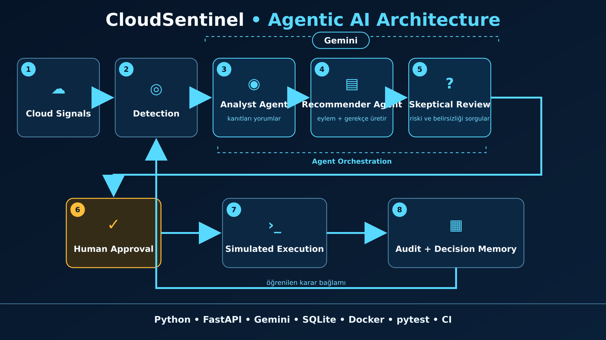

<sub>The eight stages, and the one that is a gate rather than a step: **⑥ human approval**. Nothing downstream of it runs without a hand.</sub>

</div>

| | |
|---|---|
| **What it is** | An agentic decision-support MVP for cloud cost, security and fraud signals — one detection line, six agents, one human gate |
| **Who it is for** | The FinOps analyst, the platform engineer and the SecOps operator — [three roles who meet after detection](#three-roles-one-control-room) |
| **What makes it different** | The reasoning is *inspectable*: cited evidence, named uncertainty, a recorded adversarial review, and a tamper-evident decision trail. Money figures are computed in Python and re-checked against the model's own narrative at ±5% — [the model narrates, it never counts](#how-the-intelligence-is-actually-built) |
| **What proves it** | 1321 tests · 96% line coverage over 6,329 statements · 61 API operations across 59 documented paths · a 288-case adversarial golden set · a live read-only deployment · `make verify` measuring every counter claim in these docs |
| **What it deliberately is not** | A production system. Bundled fixtures are the default, the infrastructure mutation is simulated, storage is SQLite on an ephemeral disk — [all of it written down](docs/LIMITATIONS.md) |

## 📖 Table of Contents

- [Team Name](#team-name)
- [Information About the Product](#information-about-the-product)
  - [Team Members](#team-members)
  - [Product Name](#product-name) · [Product Description](#product-description) · [Product Features](#product-features) · [Does / Does Not](#what-it-does--what-it-deliberately-does-not) · [Target Audience](#target-audience)
  - [Three Roles, One Control Room](#three-roles-one-control-room) · [What Makes CloudSentinel Different](#what-makes-cloudsentinel-different)
  - [The System at a Glance](#the-system-at-a-glance) · [Repository Map](#repository-map)
  - [How to Run (Local)](#how-to-run-local)
  - [Built With](#built-with) · [Sprint 1 Deliverables](#project-status--sprint-1-deliverables) · [Sprint 2 Progress](#project-status--sprint-2-progress) · [Roadmap](#roadmap-sprint-2-3)
  - [Requirements Compliance](#requirements-compliance) · [Scope & Limitations](#scope--limitations-by-design)
  - [Product Backlog URL](#product-backlog-url)
- [Sprint 1](#sprint-1) · [Sprint 2](#sprint-2) · [Sprint 3](#sprint-3) · [Sprint 3 Backlog](docs/sprint3_backlog.md) · [48-Hour Closeout](docs/CLOSEOUT_48H.md)
- [Field Guide](#field-guide--sixty-seconds-to-a-decision) · [In Short](#in-short) · [Acknowledgements](#acknowledgements) · [Türkçe Özet](docs/README.tr.md)

# Team Name

Group 60 – Team CloudSentinel

# Information About the Product

## Team Members

<table align="center">
<tr>
<td align="center">
  <a href="https://github.com/tuanaydin">
    
    <br/><sub><b>Tuana Aydın</b></sub>
  </a>
  <br/><sub>Product Owner</sub>
</td>
<td align="center">
  <a href="https://github.com/muratcan-ates">
    
    <br/><sub><b>Muratcan Ateş</b></sub>
  </a>
  <br/><sub>Scrum Master</sub>
</td>
<td align="center">
  <a href="https://github.com/caglayurtsvn">
    
    <br/><sub><b>Çağla Yurtseven</b></sub>
  </a>
  <br/><sub>Developer</sub>
</td>
<td align="center">
  <a href="https://github.com/mertefekurt">
    
    <br/><sub><b>Mert Kurt</b></sub>
  </a>
  <br/><sub>Developer</sub>
</td>
</tr>
</table>

## Product Name

CloudSentinel

## Product Description

CloudSentinel is an agentic decision-support system that monitors cloud cost and security data, detects anomalies in that data, generates action recommendations for detected anomalies through AI agents, and leaves the final approval of critical actions to a human operator (human-in-the-loop). The backend is FastAPI + Python; the LLM layer is built for Gemini behind a provider abstraction, with a deterministic fake provider that keeps every agent behavior testable and demo-able offline. Bundled synthetic datasets are the default — that is what keeps the test suite hermetic and the demo reproducible — and four env-gated live lanes sit behind the same seam: the application's own request telemetry, a credential-free import of a real cloud billing export, external JSON feeds in the same contract, and a simulated stream. Whichever lane is serving, `/health` and the dashboard badge report what it **actually served** rather than what it was configured with.

## Product Features

- Anomaly detection on cloud cost data (per-service z-score, live threshold control)
- **Analyst agent** — triages every anomaly (REAL / SEASONAL / DATA_ERROR / KNOWN_CHANGE) with cited evidence rows and a self-assessed confidence; self-reflects on critical signals
- **Recommender agent** — proposes exactly two options (cautious / bold) with risk and rollback plans; savings figures are **scenario estimates** (30-day horizon, cautious/bold capture rates, assumes the excess persists) computed deterministically in Python, never by the model
- **Debate-lite skeptic** — low-confidence or contested recommendations get one extra adversarial review; the transcript ships with the proposal
- **Decision memory** — operator verdicts are stored and fed back into the Recommender's context, so repeated anomaly patterns meet an agent that remembers
- **Human-in-the-loop lifecycle** — `proposed → approved/rejected → executed (simulated)` with idempotent decisions, request-triggered timeouts and a full audit trail; nothing ever executes without a human. Execution of the infrastructure change is simulated by design — and when an operator configures a webhook (`SENTINEL_EXECUTE_WEBHOOK_URL`), the decided incident is **really dispatched** to their endpoint and the delivery outcome lands in the audit detail
- **Tamper-evident ledger** (`GET /audit/verify`) — "append-only" was an architectural claim, and an unfalsifiable one: anyone with the database file could open it in `sqlite3` and rewrite a verdict. Every decision and lifecycle transition is now sealed at write time, inside the caller's transaction, with the hash of the entry before it (SHA-256 over `prev_hash | stream | ref_id | canonical row body`). The endpoint recomputes the chain from genesis against the live source rows rather than asserting it intact, and reports the **first** broken link and which of four ways it broke — an entry spliced into or dropped from the middle of the chain, the ledger row itself edited, the source row rewritten, the source row gone. Two boundaries we state rather than hide, both measured: **truncating the tail** of the chain is not reported as a break (every surviving link still verifies; the only trace is a rising `unsealed` count, which is also a benign condition), and a row that arrived outside the decision desk — a `?seed=1` demo verdict — reports as `unsealed` only until the next lifecycle transition, because sealing deliberately sweeps every unsealed row so no caller has to remember to. The chain proves that sealed history was not *rewritten*; it does not prove nothing was *removed from the end*, and it does not make the history survive a restart — that is still Postgres's job
- **Alert suppression** — per-event dedupe already stopped the same signal minting a second card; it did nothing about the operator's real burden, a service that deviates again tomorrow and again the day after while the first card is still unanswered. Now, while an **undecided** card speaks for a service on a lane, later signals fold into it as counted repeats carrying their dates and z-scores, so the inbox stays one card and reads "this is the third day" at a glance. Nothing is discarded, the window is configurable (`SENTINEL_SUPPRESSION_WINDOW_HOURS`, 24 h default, `≤ 0` disables), and the fold is scoped by event kind so a cost card can never silence a fraud hold on the same service. The moment a human approves, rejects or executes, that conversation is closed and the next signal earns its own card — folding into a decided card would apply an old verdict to a new fact
- **Pulse + Chronicler** — one call drives the whole chain (detect → analyze → debate → recommend → inbox) with a tagged JSON log stream; a chronicler agent narrates every run into an operator briefing, and the last run survives reloads (`GET /pulse/last`)
- **Agent trace** — every proposal persists a hop-by-hop record of how the chain actually ran (source, model, measured duration, reflection/skeptic outcome, memory recalled) and shows it on the card
- **Agent bus + live feed** — every inter-agent hop (pickup, handoff, skeptic challenge and verdict, briefing, operator decision) publishes to a persisted feed; the dashboard's side panel streams the conversation live, and `GET /agents` names the six-agent team with roles, triggers and guardrails
- **Mission DSL** — declarative YAML missions (`configs/`) drive detection thresholds, detectors, escalation bars and the fraud rule bands; validated hard, with a reflex engine whose latency is measured, not claimed. The three missions declare genuinely different postures, so flipping the switch changes the numbers rather than the label: **security** watches at 1.75 over a 14-day window and scores with **MAD** (a credential burst is small and fast, it must be caught before it is large, and it inflates the very mean a z-score would measure it against); **fraud** rises to 2.75 over 21 days because the published rule score is that lane's primary instrument and a low statistical bar would drown it in noise it never raised; **finops** is deliberately untouched at 2.0 over 28 days, since it is the lane the demo walks through and every screenshot, test and figure already pins its numbers. The debate bars move with them — 0.75 security, 0.6 finops, 0.5 fraud
- **Reflex-rule drafts** (`GET /reflex/suggestions`) — decision memory is mined for signatures (service · severity · direction · category) the operators have approved unanimously inside the window. Each draft states its condition, the most conservative threshold that still covers every approval (a threshold at the mean would propose a rule for cases the humans have not actually seen), the decisions and actions it rests on, the median deliberation hours and the sentence explaining itself. Contested signatures — any rejection, or two different stances — are counted and excluded rather than averaged away. There is no adoption code path anywhere in the repository: the machine drafts the reflex, the human enacts it, and that asymmetry is enforced by absence rather than by a flag someone could flip
- **Unified watch** — mock security events ride the identical detection line as cost (own mission, own event kind, scored deterministically with no LLM agent, never routed into the cost agents); an **experimental fraud lane** runs the same governance rails on a third source — payment events get a published deterministic rule score with per-rule point attribution — suggestions only, a demonstration that the human-in-the-loop infrastructure generalizes, not a production fraud engine
- **Debate ladder** — a contested warning signal gets one adversarial Skeptic review; a contested **critical** signal convenes a three-seat heterogeneous review panel (three Gemini variants when live on one billing-disabled key, three deterministic personas offline) whose majority decides the stance with dissent and abstentions on the record; a service tripping the reflex on three anomaly days inside two weeks forces the debate even at high confidence
- **Mission quick-switch** — a dashboard dropdown flips the active mission live through `POST /pulse?mission=` (in-memory override); thresholds, detector and the debate bar re-read from another YAML and every mission-following surface flips together — one engine, three missions, proven on stage
- **Guardrail pack** — per-pulse LLM call budget (overridable per run), hard transport timeout, ±5% numeric post-check of narrative figures, stakes-raised debate bar for bold answers to critical signals, prompt spotlighting for untrusted data; the pipeline's contract is measured by a 288-case golden-set eval — nine adversarial families of thirty-two ([scorecard](docs/EVAL_SCORECARD.md))
- **Named uncertainty, per agent turn** — every hop publishes what is shaky about *that* answer, derived from the evidence it was handed rather than self-reported: a baseline shorter than the evidence window, a service with no history to compare against, a narrative citing no frozen row, a flagged day sitting inside the baseline it is measured against, seasonality off where a regular weekly peak would read as a surprise, a warning-grade signal, a panel seat that abstained, a panel short of the quorum needed to overrule a draft at all, a review carried by a single voice so one reviewer never reads as consensus, low upstream confidence, no operator precedent, an operator precedent that is *split*, a triage that disputes the premise it was asked to act on, narrative figures the post-check could not re-verify, no measurable excess to recover, and a simulated provider. Fifteen named codes, drawn from a closed vocabulary that raises on an unlabelled entry rather than letting a typo reach the dashboard reading like a real finding. The list is identical whether Gemini, the demo composer or the rule-based fallback wrote the prose — a confidence score can be talked up, these cannot, and `/analytics/quality` tallies which of them fire most often
- **Operations intelligence** — HITL funnel, approved savings, window-over-window trend, month-end forecast with budget signal, what-if and before/after ROI, detection precision proxy, and a self-accounting ledger of the system's own AI usage — calls, cache hits, fallbacks and free-tier quota, zero-cost by design
- **Decision quality** (`GET /analytics/quality`) — the measures that move when the product gets better at *deciding* rather than better at generating: acceptance rate, mean and median time-to-decision read off the append-only trail (so timeout expiries and reopened cards cannot flatter it), per-service acceptance and recurrence, what one human decision cost in model calls, the average agent confidence across every hop that spoke, which named uncertainty sources fire most often, and the confidence-calibration buckets. Plain SQL over persisted state — no model is called and no figure is estimated
- **Run receipts** (`GET /analytics/receipts`) — the agentic equivalent of an itemised bill, one per watch cycle: signals, proposals filed and reused, agent turns, panel seats answered, turns that went unmeasured, the reflex and agent milliseconds actually measured, wall clock, the per-run LLM call budget against the calls used, and money once a price per call is configured. Assembled entirely on the read side from records the pulse already leaves behind, so asking for the receipt never changes what the run cost
- Live dashboard: anomaly feed with a live sentinel radar, cost ledger, investigation evidence, decision inbox (with operator identity + rationale capture), audit ledger and operations intelligence — real page rooms (`/watch`, `/investigate`, `/decide`, `/intel`, `/brain`, `/broadsheet`), five palettes, strict CSP, and contrast **measured rather than asserted**: [`tests/test_contrast.py`](tests/test_contrast.py) computes every foreground/background pair across five palettes at two widths and fails the build on a regression. Thirty-two pairs currently sit below WCAG AA and are pinned in the file **by name, with their measured ratio and the value they should reach** — dominated by one muted ink token that carries real content rather than decoration. We would rather ship the list than the claim
- **The desk** — a card surface that reads the estate in three columns: what the system is holding (open signals, awaiting you, decided), what it can *prove* about itself, and what is waiting on a human. Every capability row is a live fetch of the endpoint it names, and a row that cannot answer says `unavailable` rather than showing a hopeful dash — a dash reads as zero, and zero is a claim. It exists because a broadsheet gives every row the same weight, which is exactly what makes it beautiful and exactly what hid the endpoints that landed last
- **A fifth palette and an accessibility panel** — `vivid` joins the four editorial palettes (horizon · night · paper · dawn): light ground, white cards with a real shadow, one saturated blue for anything actionable, colour used as a lane signal rather than decoration, and a wider measure because a control surface is not prose. The four editorial palettes are untouched, so one click restores the newspaper mid-demo. The accessibility panel sets text scale, line height, letter spacing, a readable face, highlighted links and headings, a reading mask, a larger pointer and forced contrast — every toggle is a data attribute on `:root` and the three numeric settings are custom properties set on it, all persisted in this browser only — no third-party overlay and nothing loaded from another host, because the CSP allows no remote origin on any path
- **Shift-handover brief** (`GET /analytics/handover`) — the standing operator questions answered from persisted state, printable to one page; a **guided jury tour** (`?tour=1`) walks the rooms in reading order
- **Fully self-contained** — every font is self-hosted (`static/fonts/`) and Swagger is vendored, so the CSP allows no remote host on any path; shareable deep links (`?threshold=&service=`) open on the exact scene, and a `[BOOT]` manifest names each instance on startup
- **A production profile that refuses a demo posture** — every safety property here is an environment variable that defaults to off, which is right for a laptop and silent everywhere else. Under `SENTINEL_ENV=production` each gap is fatal and the app refuses to boot, naming the fix: writes open to anyone, an approver requirement with no bootstrap admin (or one whose password is under twelve characters), the deterministic fake provider about to answer real users, the outbound guard's developer escape hatch left open. Every other profile — this deployment's `render` showcase included — logs the identical findings as `[CONFIG]` lines and behaves exactly as before. The check exists before the deployment that needs it, which is the only order that ever works
- **Outbound targets are checked before the socket opens** — the feed and webhook URLs are configuration rather than user input today, but an unguarded fetch is a server-side request forgery waiting for the day they are not: point a "feed" at `169.254.169.254` and the app reads the cloud instance metadata for you, from inside the trust boundary. The guard allows https only and refuses loopback, link-local, private, multicast, reserved and unspecified destinations — literal *and* resolved — while the callers never follow redirects, because a public host answering `302 → 169.254.169.254` would walk straight through an address check that already passed. A name that does not resolve is allowed through, since the request behind it cannot reach anything either. `SENTINEL_ALLOW_PRIVATE_TARGETS=1` reopens http for a developer pointing at a local stub, and the boot audit names that as a gap
- **Correlation ids and machine-readable logs** — the HTTP layer mints (or accepts) an `X-Request-ID`, binds it to a context variable that follows both async and threadpool work, and returns it on the response, so every `[SIGNAL]/[ANALYST]/[DEBATE]/[RECOMMENDER]/[HITL]` line the chain emits carries the request it belongs to; two operators clicking at once no longer interleave into one unreadable stream. `SENTINEL_LOG_FORMAT=json` re-emits the whole stream as one object per line — level, timestamp, logger, the bracketed tag re-expanded into real fields rather than left as a string for the pipeline to parse a second time, and lines it does not recognise passed through with their message intact. Opt-in on purpose: with the knob unset the output is byte-identical to the lines the demo reads out loud
- **Live tape, simulated** — `SENTINEL_SIM_STREAM=1` (on in `make demo`) adds a trading-floor ticker to the watch room: per-service run-rates on a mean-reverting random walk with occasional spikes, sparklines refreshing every 2.5 s. Synthetic by construction and labeled as such on the strip and in the payload (`simulated: true`) — no billing data, no credentials, and the strip never appears on deployments without the flag. With `SENTINEL_COSTS_SOURCE=sim` (`make demo-sim`) the same stream also **drives the cost lane end to end**: the demo estate's own history — planted spikes and all — brought up to today, with TODAY projected live from the run-rate onto each service's own historical spread. A calm day stays quiet and a genuine excursion is flagged at a credible z-score (measured: the calm lane crosses the threshold under 5% of the time, a doubling reads z ~ 2.8), the trend chart carries a breathing marker on today's point, and the badge reads `SIMULATED LIVE` — never plain "live data"
- REST API (FastAPI, 59 endpoints) with self-hosted Swagger documentation (no CDN); a `/health` liveness ping and a `/ready` readiness probe (database, mission config and dataset) for deploy/uptime gating
- **`GET /metrics`** — a Prometheus text exposition of what this instance already counts: build info, decision cards by lifecycle state, verdicts, model calls by source and cache hit, requests served through its own telemetry, and the standing watch's condition. Written by hand in one small stdlib module rather than added as a dependency, read from the tables that hold the numbers rather than a registry kept warm between scrapes (so a scraper that never arrives costs nothing), and a source that cannot be read is **omitted rather than reported as zero** — on a graph those mean different things and only one of them would be true. No per-request histograms: a scrape endpoint that keeps its own state is a memory leak waiting for a slow scraper, and the run receipts already carry measured durations
- **The watch reports on itself** — `/health` answers as long as the *process* is up, which is exactly how a sentinel that froze at 20:40 kept returning 200 for three hours before anyone noticed. `GET /ops/health/watch` publishes the watch's own vitals — last successful beat, staleness against its configured cadence, consecutive failed ticks — and `/ready` folds them in as `degraded`: 200, deliberately not 503, because a slipped heartbeat must not take the public showcase down with it. `GET /ops/preflight` is [docs/DEMO_PREFLIGHT.md](docs/DEMO_PREFLIGHT.md) as code — dataset, mission, provider, read-only posture, watchdog, last pulse age, writable disk, data sources, security headers and demo reset, each pass / warn / fail with a sentence and one `ok` at the top, so the checks a human runs by eye before a take are one call instead of a checklist
- **Live data modes, env-gated** — the bundled datasets are the default (hermetic tests, reproducible demo), and each lane can go live: `SENTINEL_COSTS_SOURCE=self` runs the cost lane over the app's **own request telemetry** (`GET /telemetry/usage` — real traffic, accumulating while the server runs, `make demo-live`); `SENTINEL_COSTS_FILE` serves a **real billing export** converted credential-free by `scripts/import_costs.py` (Azure Cost Management / AWS CUR CSV headers recognized); and `SENTINEL_COSTS_FEED_URL` / `SENTINEL_SECURITY_FEED_URL` / `SENTINEL_FRAUD_FEED_URL` poll external JSON feeds in the exact mock contract (TTL-cached, malformed records dropped, failures fall back feed → last good payload → fixture); `/health` names each lane's source **as served, not as configured** and the dashboard's data badge renders it honestly — the statistical organs still demand real accumulated history before they score a live lane (no fabricated days)
- Demo operations, all env-gated: whole-week date rebase, demo reset with seeded verdict history, read-only public showcase mode; a borderline signal makes the sensitivity slider meaningful (lower it, a third warning surfaces)
- **Decision brain** (`GET /insights`) — reflects on persisted history into observations, a run-rate cost projection and improvement recommendations, all computed not generated; a **self-review cycle** (`POST /insights/self-review`) proposes changes to the system itself (reflex candidates, threshold reviews, calibration, backlog) and applies nothing, publishing the cycle to the agent feed
- **Market watch** (`GET /market/opportunities`) — the anomaly lanes answer *what changed*; this one answers *what is worth doing anyway*. A curated catalogue of published market moves (commitment discounts, ARM families, non-prod scheduling, storage tiering, spot capacity, idle sweeps, egress routing) is matched to the services the estate actually runs and costed against each service's own run rate: `run rate × addressable share × published band`. Every row ships its source, the date the team last checked it and the assumption it rests on; the gross total is labelled an upper bound because bands over one service overlap. Suggestions only — this lane never files an action. `SENTINEL_MARKET_FEED_URL` swaps the bundled catalogue for an external one on the same feed discipline (TTL cache, malformed rows dropped, fall back to curated)
- **Routines** (`/routines`, `/routines/suggestions`) — saved, read-only analysis playbooks plus a routines agent that suggests them from the current state, runnable on demand
- **Local identity** (`/auth`) — register/login with salted PBKDF2 and `viewer/analyst/approver/admin` roles; a signed-in operator's identity is **server-derived** onto every approval and rejection, so the audit trail is not free browser text
- **Signal enrichment** — each incident report carries a blast-radius tier (L0 contained → L3 severe, from the deviation magnitude), an industry-framework reference, a post-action verification plan and a cited remediation runbook from a curated, keyword-matched library (`/runbooks`, RAG-lite, offline). The framework reference is a deep-linked **MITRE ATT&CK** technique for the security and fraud lanes — keyed to the surface, so `auth-gateway` reads T1110 Brute Force, `api-edge` T1110.003 Password Spraying, `admin-portal` T1078.004 Valid Accounts, and a fraud hold T1657 Financial Theft — and a **FinOps Framework** capability for cost, keyed to the card's category (rightsizing → Workload Optimization, lifecycle → Architecting for Cloud, budget guard → Budgeting, and so on). The mapping is a table, not a model call: the answer is the same every time because it was looked up, and a surface we cannot map honestly falls back to the lane's general entry instead of inventing a plausible id
- **Runbook effectiveness** (`GET /runbooks/effectiveness`) — the library's five runbooks carry their own hit rate over the verdicts on record. A runbook whose matched cards were approved at 70% or above is promoted one rank step, 30% or below demotes it one step, and under three decided cards nothing moves at all. Recomputed on read and never stored — matching is deterministic, so the association between a decided card and a runbook is a function rather than a record that could drift — with the adjustment capped at a single step and no model anywhere in it
- **Detection backtest** (`GET /metrics/backtest`) — precision/recall on planted synthetic ground truth across z-score, MAD and leave-one-out scoring, so contamination resistance is measured, not claimed. The day-of-week baseline now runs too: the bundled fourteen-day fixture can never satisfy the guard protecting the seasonal path (a weekday bucket needs enough samples to be a baseline of its own), so that code shipped real and permanently unexercised. `app/data/seasonal_costs.json` is ten weeks built for it — deterministically generated by `scripts/make_seasonal_fixture.py`, `--check`-able against the committed file so it cannot rot silently — and its point is a contrast rather than a number: a planted Saturday on `analytics-batch` that is an ordinary Tuesday's figure and an impossible Saturday's, invisible inside a pooled bimodal baseline and obvious the moment Saturdays are compared with Saturdays. **Incident reports** export as shareable Markdown (`GET /actions/{id}/report`)
- **Orchestration console** (`POST /chat` · [`/static/chat.html`](static/chat.html)) — the operator picks one of four agents (analyst, recommender, skeptic, chronicler) and asks a question about *this* estate; the answer comes back beside the evidence rows it used, sometimes a table, and a badge naming whether it was written live, by the deterministic composer or by the rule-based fallback. Read-only **by enforcement rather than by promise**: a SQLite authorizer denies every write and DDL verb for the duration of the turn, so the console cannot approve, execute, suppress or schedule anything even if it were asked to. A question that matches none of its six grounded topics is refused deterministically without spending a provider call at all, and every figure it quotes comes from the same helpers `/analytics` uses, so chat can never cite a number the dashboard would dispute
- **Brain room** in the dashboard (`/brain`) — insights, self-review, routines, runbook search, the backtest table and operator sign-in, wired live

## How the intelligence is actually built

Most of the work in an agentic system is not the prompt. It is deciding what
the model is *allowed* to be wrong about. Here is the whole arrangement,
and the file that holds each piece.

**The model is a governed dependency, not a call.** A four-model allowlist
([`app/llm.py`](app/llm.py), [ADR 0003](docs/adr/0003-model-allowlist.md))
decides what may answer live, and membership was earned by measurement, not
by preference — the August 1 spike against a real free-tier key found the
pinned 2.5 family returns 404 to new keys and the pro tier carries zero free
quota, so the defaults moved to `-latest` aliases immune to model
retirement. A model outside the list never reaches a client: the error is
caught, logged, and the deterministic provider serves instead, so a bad pin
degrades the narrative rather than taking the product down.

**Orchestration is a budget, not a hope.** One `POST /pulse` spends a
hard-capped call budget (14 by default, settable per run) across
reflex → analyst → *reflection on critical signals* → decision memory →
recommender → the debate ladder → chronicler. The budget is a context
variable charged inside *every* provider — including the fake one — so the
accounting is identical offline and live, and an overrun raises the same
error the fallback path already handles.

**The debate ladder escalates on stakes, not on vibes.** A contested warning
gets one skeptic. A contested **critical** convenes three seats with
genuinely different charters (stability, throughput, evidence) — three
different Gemini models when live, three deterministic personas offline.
A majority of *answered* seats decides; a seat that fails abstains rather
than casting a fabricated vote; below quorum the draft stands and the card
says so. A bold stance on a critical signal has its confidence bar raised
by 0.15, so self-reported confidence can never wave a high-stakes action
past review.

**Memory is retrieval the operator can see.** The newest verdicts for that
service are read by plain SQL and injected into a frozen prompt slot
([`app/decisions.py`](app/decisions.py),
[`app/recommender.py`](app/recommender.py)); the card then shows how many
were considered. No embeddings, no vector store — and that is a decision,
not a gap: the retrieval key is `service · severity · direction · category`,
which is exact, and a similarity score would only make an exact lookup
fuzzy. We did not add a vector database to have one.

**The guardrails are structural.** Typed schemas rather than parsed prose;
an evidence-citation validator that drops any row id the model invented; a
±5% numeric post-check of every money figure in the narrative against the
Python arithmetic that produced it; spotlight delimiters around untrusted
data, stripped to a fixed point so the payload cannot forge a closing tag;
and — for the chat console — a SQLite authorizer that denies every write
verb at statement-preparation time, so *read-only* is enforced by the
database rather than promised by a docstring.

**Uncertainty is derived, not self-reported.** Fifteen named codes from a
closed vocabulary, computed in Python from the evidence each agent was
handed: a baseline shorter than the evidence window, an operator precedent
that is split, a triage disputing the premise, a panel seat that abstained,
figures the post-check could not verify. A confidence score can be talked
up; these cannot. The list is byte-identical whether Gemini, the demo
composer or the rule-based fallback wrote the prose.

**The deterministic provider is a first-class lane, and the demo runs on it
on purpose.** ([ADR 0005](docs/adr/0005-the-fake-provider-is-a-first-class-lane.md).)
It is not a stub standing in for missing work: it is a per-schema composer
that narrates the *real* payload, so the guardrails, the call budget, the
escalation triggers and the uncertainty codes behave identically to the live
lane and only the prose changes. That is what makes the whole chain testable
in 35 seconds and demoable with no network. The live lane is real and was
measured — the August 1 spike ran the schema end to end at 0.8–2.9 s per
call — but a demo that can be taken down by someone else's rate limit is not
a demo. So the honest statement is this: **what a visitor sees on the public
link was composed deterministically**, `/health` says so, the data badge says
so, and every figure in it was computed in Python either way.

**And it is measured.** A 288-case adversarial golden set across nine
families sweeps the *real* analyze → recommend chain
([`app/evalset.py`](app/evalset.py), [scorecard](docs/EVAL_SCORECARD.md)):
grounding, unsafe actions, prompt injection carried on the service name
including a forged closing delimiter, numeric contradiction in both
directions, and explicit abstention. It measures the pipeline's containment
contract on the deterministic provider — which is the honest scope, and the
scorecard says so rather than implying live-model obedience.

## Where this sits in the category

Three tool families already touch this problem, and each stops at a
different point. Naming where they stop is the clearest way to say what
CloudSentinel is — and, just as importantly, what it is not.

| | Detects | Explains | Proposes | Governs the decision | Proves it afterwards |
|---|---|---|---|---|---|
| **Cost tooling** — Cost Explorer, GCP budget alerts, Datadog CCM, Vantage, CloudZero | ✅ mature | partial | ✗ | ✗ | ✗ |
| **Observability & SIEM** — Datadog, Grafana, Splunk | ✅ mature | partial | ✗ | ticketing hand-off | audit of the *alert*, not the decision |
| **CSPM / posture** — Prowler, Wiz, Defender for Cloud | ✅ mature (misconfiguration) | rule text | remediation script | policy gate | scan history |
| **CloudSentinel** | deterministic, three lanes, one detection line | evidence-cited agent triage with **named uncertainty** | two costed options with risk *and* rollback | human approval with server-derived identity and a mandatory rejection rationale | hash-chained ledger recomputed from genesis |

The row that matters is the last two columns. Detection is a solved
commodity — we did not try to beat anyone at it, and the detector here is
deliberately plain statistics. **The unsolved part is the twenty minutes
after the alert**: reading the evidence, judging the trade-off, deciding,
and being able to answer *"who approved this, on what basis?"* six weeks
later. That interval is where operator hours actually go, and it is the
only interval this product builds for.

Two consequences follow, and they are the reason the architecture looks the
way it does rather than incidental to it.

**Autonomy is bounded by accountability, not by capability.** It would be
straightforward to let the chain execute what it proposes — the state
machine, the webhook dispatch and the rollback plans are all already there.
It does not, and the learning loop that mines settled decisions for reflex
rules has **no adoption code path anywhere in the repository**: the machine
drafts the rule, a human enacts it, and that asymmetry is enforced by
absence rather than by a flag someone could flip. An organisation adopts
agentic operations exactly as fast as it can answer for what the agents did,
so the audit trail is not a compliance feature bolted on at the end. It is
the thing that makes the autonomy adoptable at all.

**Being model-agnostic is worth more than being model-optimal.** The
provider sits behind an abstraction with a measured allowlist, a charged
call budget and a deterministic lane that behaves identically to the live
one. The immediate benefit is that a quota failure degrades the prose and
nothing else — every figure, every guardrail and every escalation trigger is
Python. The durable benefit is that the reasoning layer does not depend on
which model is cheapest or best this quarter, which is the dependency that
ages an agentic system fastest.

## Written by us — what that means precisely

Nothing in the reasoning layer came from somewhere else. Being exact about
it, because a vague claim here is worth less than a narrow true one:

- **No agent framework.** There is no LangChain, LlamaIndex, CrewAI,
  AutoGen or any other orchestration library anywhere in the dependency
  list. The chain, the call budget, the retry policy, the debate ladder,
  the panel quorum, the fallbacks and the decision memory are ours, written
  against the provider SDK directly — a decision taken deliberately and
  written down at the time ([ADR 0002](docs/adr/0002-no-agent-framework.md)).
  Seven pinned runtime packages, and that is the whole list.
- **No copied application code.** No template, no starter, no tutorial
  repository, no generated scaffold. Every module under [`app/`](app/) was
  written for this product.
- **No scraped or borrowed content.** Every dataset in
  [`app/data/`](app/data/) is hand-authored — the cost fixture with its two
  planted spikes, the security events, the payment records, the ten-week
  seasonal fixture (generated by a committed script that can re-verify
  itself), the runbook library and the market-watch catalogue. No public
  dataset was downloaded, and nothing was scraped from news, Reddit or X —
  which is also why the market lane ships a *curated* catalogue with a
  source and a check date on every row rather than a live feed.
- **No retrieval over someone else's corpus.** Runbook matching is keyword
  retrieval over our own five-entry library. There is no vector database
  and no embedding model, and that is a design decision rather than a
  missing feature: the retrieval key is exact, and similarity would only
  make an exact lookup fuzzy.
- **No third-party front-end.** No UI framework, no component library, no
  CSS framework, no analytics or accessibility overlay. Vanilla JavaScript
  and hand-written CSS under a strict Content-Security-Policy that permits
  **no remote origin on any path** — which is enforced by test, not by
  intention.

What *is* other people's work, named plainly: the open-source libraries in
[Built With](#built-with) (FastAPI, Pydantic, Uvicorn, PyYAML, httpx,
python-dotenv and the `google-genai` SDK); Swagger UI, vendored under
Apache 2.0 and served from our own origin rather than a CDN; the Google
Fonts faces under SIL OFL 1.1, self-hosted for the same reason; Gemini
itself as the model behind the live lane; and Michelangelo, for the two
hands on the banner. Everything else in this repository we wrote.

## Market, and who would pay

The honest version, because an MVP that overstates its market is easier to
disbelieve than one that scopes it:

**The wedge.** Cloud cost management is a crowded market at the *reporting*
end — the hyperscalers' native tools, Vantage, CloudZero, Finout, Datadog
CCM — and an empty one at the *accountable decision* end. Those products
answer "what changed"; the human still owns "what do we do, who approved it,
and can we prove it later". That handoff is where the hours go, and it is
the only thing CloudSentinel builds.

**The beachhead.** Not "SMEs and startups" generally — the segment with the
smallest bill has the least to gain. The wedge is the **50–500-engineer
company that has just outgrown a spreadsheet**: large enough that cloud
spend is a line item someone defends in a meeting, small enough to have no
dedicated FinOps team, and already carrying an audit obligation from a
SOC 2 or ISO 27001 programme. That buyer already owns detection. What they
lack is the trail.

**Why the trail is the product.** The hash-chained ledger, the server-derived
operator identity, the mandatory rejection rationale and the append-only
lifecycle trail are not compliance decoration — they are the reason a team
would let agents near a spend decision at all. An organisation adopts
agentic operations exactly as fast as it can answer *"who decided this?"*

**Where the money would be.** Per-seat for the operators who decide, not
per-monitored-dollar — the value accrues to the decision, and pricing on
spend punishes the customer for the savings the product delivers.
Deliberately untested: this is a hypothesis from the design, not a validated
model, and no customer has paid for anything.

**What we can honestly claim.** The market-watch lane
([`GET /market/opportunities`](app/market.py)) shows the shape of the
opportunity with real arithmetic: published reduction bands for commitment
discounts, ARM families, non-production scheduling, spot capacity and idle
sweeps, matched to the services this estate actually runs and costed as
`run rate × addressable share × published band`. Every row ships its source,
the date the team last checked it, its assumption and its watch-out, and the
gross total is labelled an upper bound because the bands overlap. That is a
demonstration of method on synthetic data — not a customer, not a pipeline,
and not a number anyone should put in a business case.

## What It Does / What It Deliberately Does Not

The whole contract on one table — the right column is design, not backlog:

| ✅ Does | 🚫 Deliberately does not |
|---|---|
| Detects cost & security anomalies over a rolling baseline (z-score / MAD, weekly seasonality, min-history discipline) | Connect to real cloud providers — synthetic data by design; the detection pipeline is source-agnostic |
| Reasons about every cost signal with AI agents: evidence-cited triage, two remediation options with risk + rollback, adversarial review of contested calls | Let a model invent numbers — every figure the operator acts on is deterministic Python arithmetic, post-checked ±5% against the narrative |
| Files proposals into a human decision inbox with rationale + actor capture and a hash-chained audit trail that `GET /audit/verify` recomputes from genesis instead of asserting; a decided incident can be **really dispatched** to an operator-configured webhook, delivery recorded in the audit detail | Execute anything on real infrastructure — the infrastructure mutation is simulated by design, and nothing runs unapproved |
| Folds a repeating signal into the open card already asking about that service, counted and dated, so one unanswered question does not become five | Discard the repeats, or fold anything into a card a human has already decided — that would apply an old verdict to a new fact |
| Scores payment events with published, hand-reproducible rules (per-rule point attribution) — an experimental lane showing the governance rails generalize past cost & security | Run ML fraud models, auto-block payments, hide the scoring arithmetic, or present fraud as the core product |
| Remembers operator verdicts and feeds them back into future recommendations, disclosing how many were considered | Learn silently — memory use is visible on the card, and the chain's execution is traced hop by hop |
| Accounts for its own AI spend (call ledger, cache hits, fallbacks, quota view) under a per-run call budget | Burn quota unbounded, retry forever, or fail when the LLM is unavailable — every agent degrades to a labeled rule-based fallback |
| Ships hardened: strict CSP with self-hosted docs, security headers, rate-limited pulse and sign-in, idempotent decisions, JSON failure envelope, local auth (salted PBKDF2, roles) that gives every decision a server-derived operator identity, an outbound guard that will not let a configured URL aim back inside, a boot-time configuration audit that is fatal under `SENTINEL_ENV=production`, and a correlation id on every response and every log line | Ship Postgres, a job queue, real cloud adapters or Slack — deliberate boundaries of this build, not oversights; the standing watch is one opt-in daemon thread running a serial loop, not a scheduler |

## Target Audience

- DevOps / platform engineering teams operating cloud infrastructure
- FinOps specialists managing cloud spending
- Security operations (SecOps) teams
- SMEs and startups that want to keep their cloud costs under control

## Three Roles, One Control Room

Companies run cloud operations through three roles, each with its own toolbelt
and its own daily question. CloudSentinel is designed as the surface where the
three meet **after** detection — the moment their current tools hand the
problem back to a human with nothing but a raw alert:

| Role | On their desk today | Their daily question | Where CloudSentinel answers it |
|---|---|---|---|
| **FinOps analyst** | AWS Cost Explorer, GCP billing alerts, spreadsheets | *"Why did spend jump, and what is it worth fixing?"* | Cost ledger with share-of-spend, trend curve with anomaly marks, deterministic Python-computed savings on every proposal, CSV export for the finance review |
| **DevOps / platform engineer** | Datadog / Grafana, PagerDuty, Terraform | *"What exactly do I change, and how do I roll it back?"* | Analyst triage with cited evidence rows, cautious / bold options each carrying risk **and a rollback plan**, execution that stays simulated until a human approves |
| **SecOps operator** | SIEM dashboards, IAM audit logs, ticket queues | *"Who decided what, and can I prove it?"* | Human-in-the-loop state machine with idempotent decisions, the append-only decision ledger, and security signals flowing through the same detection pipeline (shipped with the Sprint 3 core pulled forward) |

## What Makes CloudSentinel Different

Cloud providers and observability tools (AWS Cost Anomaly Detection, GCP cost
alerts, Datadog Cloud Cost Management) can already *detect* cost anomalies.
CloudSentinel's differentiator is what happens after detection: AI agents
reason about each anomaly, propose concrete remediation actions with risk
levels, and a human operator gives the final approval — closing the
detect → decide → act loop with human-in-the-loop safety instead of leaving
the operator alone with a raw alert. The agent design is documented — and now
implemented — in [docs/architecture.md](docs/architecture.md).

## The System at a Glance

Every piece of the product in one picture — data falls from the cloud, agents
reason about it, and nothing touches infrastructure without a human hand:

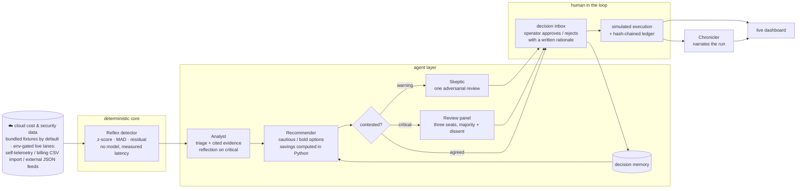
```mermaid
flowchart LR
    CLOUD[("☁️ cloud cost &amp; security data<br/>bundled fixtures by default · env-gated live lanes:<br/>self-telemetry / billing CSV import / external JSON feeds")] --> DET

    subgraph deterministic core
        DET["Reflex detector<br/>z-score · MAD · residual<br/>no model, measured latency"]
    end

    subgraph agent layer
        DET --> AN["Analyst<br/>triage + cited evidence<br/>reflection on critical"]
        MEM[("decision memory")] --> REC
        AN --> REC["Recommender<br/>cautious / bold options<br/>savings computed in Python"]
        REC --> DEB{"contested?"}
        DEB -->|"warning"| SK["Skeptic<br/>one adversarial review"]
        DEB -->|"critical"| PAN["Review panel<br/>three seats, majority + dissent"]
    end

    subgraph human in the loop
        SK --> INBOX["decision inbox<br/>operator approves / rejects<br/>with a written rationale"]
        PAN --> INBOX
        DEB -->|"agreed"| INBOX
        INBOX --> EXEC["simulated execution<br/>+ hash-chained ledger"]
    end

    INBOX --> MEM
    EXEC --> DASH["live dashboard"]
    EXEC --> CHR["Chronicler<br/>narrates the run"]
    CHR --> DASH
```

The full design rationale, agent contracts and API evolution live in
[docs/architecture.md](docs/architecture.md).

## Repository Map

Short and flat on purpose — every path says what it holds:

```text
cloudsentinel/
├── main.py               ASGI entry point: routes, CSP/security headers, failure envelope
├── app/                  application package
│   ├── detection.py      detector registry — rolling window, z-score/MAD, seasonality
│   ├── missions.py       mission DSL — YAML configs, hard validation
│   ├── reflex.py         reflex engine — measured latency + reflex-rule drafts
│   ├── analyst.py        Analyst agent — triage, evidence, reflection, uncertainty
│   ├── recommender.py    Recommender agent + debate-lite skeptic
│   ├── debate.py         review panel — three seats, dissent and abstentions
│   ├── chronicler.py     Chronicler agent — pulse briefings
│   ├── security.py       security lane — same detection line, own event kind
│   ├── stream.py         simulated live tape — env-gated synthetic ticker
│   ├── feeds.py          data-source resolution — fixtures, self-telemetry, external feeds
│   ├── netguard.py       outbound guard — no feed or webhook may aim back inside
│   ├── fraud.py          fraud lane — published deterministic rule score
│   ├── actions.py        human-in-the-loop action lifecycle incl. reopen + suppression
│   ├── history.py        append-only lifecycle trail — the desk's per-card timeline
│   ├── ledger.py         hash-chained audit seal + /audit/verify
│   ├── decisions.py      decision memory retrieval + ledger export
│   ├── analytics.py      funnel, savings, trend/forecast/ROI, decision quality, receipts
│   ├── telemetry.py      self-request counters + run-receipt assembly
│   ├── insights.py       decision brain — history synthesis + HITL-safe self-review
│   ├── routines.py       saved read-only analysis playbooks + routines agent
│   ├── runbooks.py       curated runbooks — keyword retrieval (RAG-lite) + hit rate
│   ├── market.py         market watch — curated catalogue costed against the estate
│   ├── enrichment.py     blast-radius tiers, ATT&CK / FinOps refs, verification plans
│   ├── auth.py           local identity — salted PBKDF2, roles, session tokens
│   ├── bus.py            agent bus — persisted inter-agent feed
│   ├── pulse.py          one-call end-to-end chain + persisted last run
│   ├── watchdog.py       opt-in standing watch + its own vitals, /ready verdict
│   ├── ops.py            env-gated demo reset, watch health, executable preflight
│   ├── configcheck.py    boot-time configuration audit — fatal under production
│   ├── logstream.py      tagged log grammar — correlation id, opt-in JSON format
│   ├── metrics.py        Prometheus text exposition of what the app already counts
│   ├── dispatch.py       execute webhook delivery, recorded in the audit detail
│   ├── chat.py           orchestration console — grounded Q&A, read-only by authorizer
│   ├── evalset.py        golden-set eval cases + scorers (288 cases, nine families)
│   ├── benchmark.py      synthetic detector scenarios — the golden set's ground truth
│   ├── llm.py            provider layer: Gemini, context-aware fake, fallbacks, budget
│   ├── db.py             SQLite core — WAL, idempotency, seed-on-startup
│   ├── models.py         Pydantic schemas
│   └── data/             mock datasets — cost, security, payments, seasonal, inventory,
│                         market catalogue
├── configs/              mission YAMLs — finops, security, fraud (three postures)
├── static/               four pages, one product — dashboard, console, handbook, API
│                         browser; appearance.js stamps palette + accessibility before
│                         first paint, self-hosted fonts, vendored Swagger UI
├── scripts/              smoke sweep, failure drill, demo proof, golden-set eval harness,
│                         benchmark, release verification, billing import, seasonal
│                         fixture generator, demo incident, Gemini spike, identity check
├── tests/                1321 pytest cases incl. performance budgets and the
│                         route-discovering contract suites
├── docs/                 architecture, ADRs, limitations, SLO, data dictionary
├── Makefile              setup / run / test / demo / smoke / drill
└── ProjectManagement/    sprint evidence packs (boards, screenshots)
```

## How to Run (Local)

Two commands to a running product:

```bash
make setup && make demo       # the demo stage: deterministic provider, fresh dates, reset armed
make smoke                    # (other shell) PASS/FAIL sweep of the running chain
```

`make demo` is the recommended way in, and the one every screenshot and the
video are taken on: it pins `SENTINEL_FAKE_LLM=1`, so the whole agent chain
runs on the deterministic provider and cannot spend a single token. `make run`
is the same product **without** that pin — if a `GEMINI_API_KEY` is present in
your environment or `.env`, `make run` will call the live model. That is the
intended difference (it is how the live lane gets exercised), but it is worth
knowing before you press *Pulse* with a key loaded. `make demo-sim` adds the
simulated cost lane, `make demo-live` puts the cost lane on the app's own
request telemetry.

Before a release, the counters check themselves instead of a human checking
them at midnight:

```bash
bash scripts/verify_release.sh                  # counters + every relative link
bash scripts/verify_release.sh https://<host>   # ...plus the live link
```

It counts the suite with `pytest --collect-only` and the API surface from the
app's own OpenAPI document, reads every "N tests / N endpoints" claim out of
the shipped docs and fails on any that disagrees (sprint records are
recognised and left alone), and follows every relative markdown link. Given a
URL it also confirms the host is serving *our* app, that the deployed surface
matches this checkout, that the security headers are on the live response and
that the standing watch is still beating.

Or by hand:

```bash
python3 -m venv .venv
.venv/bin/pip install -r requirements-dev.txt        # pulls requirements.txt too
SENTINEL_FAKE_LLM=1 SENTINEL_SIM_STREAM=1 \
  .venv/bin/uvicorn main:app --reload
```

The two flags are not decoration: without `SENTINEL_FAKE_LLM` a present API
key makes the chain call the live model, and without `SENTINEL_SIM_STREAM`
the watch room's live tape and its breathing chart never appear — `/stream/metrics`
answers 404 by design, which is why a plain `uvicorn main:app` looks frozen
next to the demo.

Then open the dashboard at `http://127.0.0.1:8000/` (Swagger at `/docs`), or query directly:

```bash
curl "http://127.0.0.1:8000/anomalies"
# → detects the 2 planted spikes in the mock data:
#   compute 2026-06-29 (z=3.61) and database 2026-07-02 (z=3.60)
```

Per-service spending breakdown:

```bash
curl "http://127.0.0.1:8000/costs/summary"
# → total spend, per-service totals and each service's share of overall cost
```

Daily trend series (powers the dashboard's spend-trend chart and per-signal evidence sparkline):

```bash
curl "http://127.0.0.1:8000/costs/daily"
# → aligned per-service daily series, date axis and daily totals
```

Run the test suite with `SENTINEL_FAKE_LLM=1 .venv/bin/pytest` (the fake
provider keeps tests deterministic and quota-free).

The full agent chain can be driven end to end with one call — watch the
tagged `[SIGNAL]/[ANALYST]/[DEBATE]/[RECOMMENDER]/[HITL]` log stream in the
server output:

```bash
curl -X POST "http://127.0.0.1:8000/pulse"
# → detect → Analyst triage → (debate-lite) → Recommender → decision inbox
```

**Contributing setup (once per clone):** run `sh scripts/check_identity.sh` —
it verifies your git identity is GitHub-linked and installs the repo hooks
(Conventional Commits subject + trailer guard).

> On Windows, replace `.venv/bin/` with `.venv\Scripts\` in the commands above.

Or run it with Docker:

```bash
docker build -t cloudsentinel .
docker run -p 8000:8000 cloudsentinel
```

### Deployment modes

One deploy target, two honest postures — pick one per link, don't mix:

- **Showcase mode** — `SENTINEL_READONLY=1`: a public link that survives
  strangers' clicks. Every write (login included) is blocked while the
  panels keep reading, and the opt-in watchdog
  (`SENTINEL_WATCH_INTERVAL_SECONDS`) keeps the estate refreshing itself.
- **Live-ops mode** — `SENTINEL_REQUIRE_APPROVER=1` plus the bootstrap pair
  `SENTINEL_ADMIN_USER` / `SENTINEL_ADMIN_PASSWORD`: the team decides on the
  live link. The three decision verbs (approve / reject / execute) demand a
  signed-in approver or admin; reads stay public and registration stays open
  (self-registered accounts are viewers, so strangers can look but never
  decide). The bootstrap admin is recreated on every ephemeral-disk boot,
  never overwriting an existing user and never logging the password.
- In either mode, `SENTINEL_EXECUTE_WEBHOOK_URL` optionally delivers each
  executed incident report to your own webhook, with the delivery outcome
  recorded in the audit detail. The target is checked before the socket
  opens — https, public destination, no redirect-following — so a webhook
  or feed URL cannot be aimed back inside the trust boundary.
- Whichever posture the link runs, `SENTINEL_ENV` decides how loudly a gap
  is reported. `production` (or `prod`) makes every finding of the boot
  audit fatal: open writes, a missing or short-passworded bootstrap admin,
  the fake provider about to answer real users, or the outbound escape
  hatch left open, and the app refuses to start rather than serve a demo
  posture. Any other value — the live link runs `render` — logs the same
  findings as `[CONFIG]` and boots unchanged.
- Two operational knobs for a real deployment, both off by default:
  `SENTINEL_LOG_FORMAT=json` turns the tagged stream into one JSON object
  per line for a log pipeline, and `GET /metrics` is already there for a
  Prometheus scrape. `GET /ops/preflight` answers, in one call, whether
  this instance is actually ready to be shown.

## Built With

| Technology | Purpose |
|---|---|
| **Python 3.12** | Core language (pinned in venv, CI and Docker) |
| **FastAPI + Uvicorn** | REST API and ASGI server |
| **Pydantic v2** | Typed request/response models and validation |
| **pytest** | Automated test suite (1321 tests in ~41 s on the fake provider, incl. performance budgets and the endpoint contract suites below) — **96% line coverage** over 6,329 statements in `app/` + `main.py` (`make coverage`) |
| **Hypothesis** | Property-based tests: generated NaN / duplicate / extreme / reversed-window inputs against the detector |
| **bandit + pip-audit** | The security product scans its own source and its own dependencies (`make audit`); both gate CI |
| **SQLite** (stdlib `sqlite3`) | WAL-mode persistence core: action lifecycle, decision memory, LLM cache, idempotency — plus the statement authorizer that makes the chat console read-only by enforcement |
| **PyYAML** | The Mission DSL — validated YAML missions drive thresholds, detectors, escalation bars and fraud bands ([`app/missions.py`](app/missions.py) · [`configs/`](configs/)) |
| **httpx** | Outbound transport for external feeds and the execute webhook, behind the SSRF guard; also the test client |
| **python-dotenv** | Local `.env` loading that never overrides a real shell variable |
| **Docker** | Containerized, deployment-ready packaging |
| **Gemini** (`google-genai`) | LLM provider layer with quota-aware retry, model allowlist and rule-based fallback |
| **Miro** | Scrum board and product backlog (official bootcamp template) |

Seven pinned runtime packages, and that is the whole list — the dependency
budget is a design constraint, not an accident. Everything else in the
product (the hash-chained ledger, the Prometheus exposition, the auth layer,
the correlation-id log grammar, the simulated tape) is written against the
standard library so a clean `make setup` and the Render image keep behaving
exactly as the jury will see them. The dev/CI list is free to grow
([`requirements-dev.txt`](requirements-dev.txt): pytest, ruff, pytest-cov,
Hypothesis, bandit, pip-audit) because none of it ships.

Most of the suite tests one organ deeply. Two suites instead hold the whole
HTTP surface at once, and they **discover the endpoints themselves** by
walking `app.routes`, so a route added tomorrow is enrolled the moment it is
mounted rather than when someone remembers. The first pins the house rules on
every endpoint: a write verb answers 403 while `SENTINEL_READONLY=1` and no
read is blocked by it, an id that does not exist answers 404 instead of 500,
a malformed body answers 422 in the project's one-key failure envelope, every
response carries `X-Request-ID` and the security headers (taken from
`main.py`'s own constants, so tightening them there tightens the test), and
no response leaks a traceback or a filesystem path. The second pins the
published OpenAPI document, which nobody edits and therefore nobody notices
rotting: a summary and real prose on every operation, every JSON success
resolving to a declared model, a closed tag vocabulary, a documented 404 on
every id-addressed operation and the state machine's 409, and a digest of
path + method + status codes asserted inline so any change to the surface
arrives as a reviewable diff. Where an endpoint genuinely answers something
else it is named individually with its reason and its exact expected status —
never waived by a relaxed assertion, because a waiver that stops being true
has to fail too.

## Project Status — Sprint 1 Deliverables

| Deliverable | Description | Status |
|---|---|---|
| Mock cost dataset | 4 services × 14 days of synthetic costs with 2 planted spikes | ✅ [`data/mock_costs.json`](app/data/mock_costs.json) |
| Anomaly detection API | `GET /anomalies` — per-service z-score with typed responses | ✅ [`main.py`](main.py) · [`detection.py`](app/detection.py) |
| Cost summary API | `GET /costs/summary` — per-service spend aggregates and shares | ✅ [`main.py`](main.py) · [`detection.py`](app/detection.py) |
| Cyber dashboard | Root-served UI: anomaly feed, cost matrix, live threshold control | ✅ [`static/`](static/) |
| Test suite | 27 pytest cases: detection, aggregation, filtering, export, validation, dashboard | ✅ [`tests/`](tests/) |
| Containerization | `python:3.12-slim` image | ✅ [`Dockerfile`](Dockerfile) |
| Agent & HITL architecture design | Sprint 2–3 technical plan | ✅ [`docs/architecture.md`](docs/architecture.md) |
| Health check & CSV export | `GET /health` liveness · downloadable cost summary (PR #3) | ✅ [`main.py`](main.py) |

## Project Status — Sprint 2 Progress

Sprint 2's committed stories were code-complete by July 12 and the sprint closed 13/13 at the July 19 review; the second week additionally pulled the Sprint 3 core forward (second table):

| Deliverable | Description | Status |
|---|---|---|
| SQLite persistence core | WAL journal, write-lock discipline, idempotency keys, seed-on-startup for ephemeral disks | ✅ [`app/db.py`](app/db.py) |
| Analyst agent | `POST /anomalies/{id}/analyze` — triage badge + cited evidence + confidence, reflection on critical signals, response caching | ✅ [`app/analyst.py`](app/analyst.py) |
| Recommender + debate-lite | `POST /anomalies/{id}/recommend` — two options with Python-computed savings; skeptic review on low-confidence/contested calls | ✅ [`app/recommender.py`](app/recommender.py) |
| HITL action lifecycle | `GET /actions` · approve / reject / execute (simulated) with `Idempotency-Key` support and request-triggered timeouts | ✅ [`app/actions.py`](app/actions.py) |
| Decision memory | Operator verdicts stored and retrieved (`GET /decisions/similar`) and injected into the Recommender's context | ✅ [`app/decisions.py`](app/decisions.py) |
| Pulse end-to-end chain | `POST /pulse` — detect → analyze → debate → recommend → inbox with a tagged JSON log stream | ✅ [`app/pulse.py`](app/pulse.py) |
| Live dashboard | Sections I–V run against the real API: investigation triage, recommendation filing, decision inbox, audit ledger | ✅ [`static/`](static/) |
| Quota & safety discipline | Deterministic fake provider for tests/CI, rule-based fallbacks tagged in the UI, spotlighted untrusted data, security headers + CSP + CORS | ✅ [`app/llm.py`](app/llm.py) · [`main.py`](main.py) |
| Contributor tooling | Conventional-commit hook + identity check script | ✅ [`scripts/check_identity.sh`](scripts/check_identity.sh) |
| Dashboard interactivity | Persisted palette switch (horizon / **night** / paper / dawn), sortable signal ledger (z / date / a–z), click-to-filter cost rows, monotone-curve charts that never overshoot the data | ✅ [`static/`](static/) |
| Swagger CSP regression fix | `/docs` rendered blank under the strict dashboard CSP; a docs-scoped policy restored it, locked by regression tests | ✅ [`main.py`](main.py) · [`tests/test_dashboard.py`](tests/test_dashboard.py) |
| Performance budgets | Wall-clock budgets over scans, aggregations, CSV export and the full pulse chain on mock data | ✅ [`tests/test_performance.py`](tests/test_performance.py) |

**Sprint 3 core, pulled forward into Sprint 2's second week:**

| Deliverable | Description | Status |
|---|---|---|
| Detection quality | Calendar rolling baseline (28d), MAD detector, weekly seasonality, min-history discipline, `/metrics/detection`, benchmark harness | ✅ [`app/detection.py`](app/detection.py) |
| Mission DSL + reflex engine | Validated YAML missions drive thresholds, detectors, escalation and fraud bands; measured reflex latency; `/reflex/suggestions` | ✅ [`app/missions.py`](app/missions.py) · [`configs/`](configs/) |
| Unified security & fraud lanes | Security events through the identical detection line; payments scored by published rules with per-rule points; band filters | ✅ [`app/security.py`](app/security.py) · [`app/fraud.py`](app/fraud.py) |
| Cross-lane HITL cards | Fraud holds and the budget guard file deterministic cards into the same decision inbox | ✅ [`app/fraud.py`](app/fraud.py) · [`app/analytics.py`](app/analytics.py) |
| Guardrail pack | Per-pulse LLM call budget, hard timeout, ±5% numeric post-check, stakes-raised debate bar, prompt spotlighting | ✅ [`app/llm.py`](app/llm.py) |
| Operations intelligence | Funnel, savings, trend, forecast + budget signal, what-if, ROI, calibration, headline, self-FinOps AI ledger | ✅ [`app/analytics.py`](app/analytics.py) |
| Chronicler + agent trace | Sixth agent narrates each pulse; every proposal persists a hop-by-hop trace with measured durations | ✅ [`app/chronicler.py`](app/chronicler.py) |
| Agent bus + live feed | Inter-agent traffic persisted and streamed into the dashboard's live feed panel; agent roster endpoint | ✅ [`app/bus.py`](app/bus.py) |
| Ops & demo hardening | Self-hosted Swagger under one strict CSP, JSON failure envelope, read-only showcase, demo reset + date rebase, Makefile, smoke & failure-drill scripts | ✅ [`main.py`](main.py) · [`scripts/`](scripts/) |

## Project Status — Sprint 3 Delivery

Sprint 3's own work — the technical core was delivered early inside Sprint 2
and is counted there, not here. This sprint proved the product rather than
grew it: deploy it, measure the model, harden the outside edge, make the
interface one thing, and produce the evidence.

| Deliverable | Description | Status |
|---|---|---|
| Public deployment | Render blueprint, non-root healthchecked image, read-only showcase link, `SENTINEL_ENV=render` LIVE banner, standing watch beating | ✅ [`render.yaml`](render.yaml) · [live](https://cloudsentinel-y5zh.onrender.com) |
| Uptime without a third party | CI keepalive pings `/health` every 10 min; a scheduled live smoke sweeps the deployed surface | ✅ [`keepalive.yml`](.github/workflows/keepalive.yml) · [`live-smoke.yml`](.github/workflows/live-smoke.yml) |
| Live Gemini measurement | Billing-disabled free-tier key; measured latency and JSON-schema validity; caught two model-contract breaks and repinned the defaults to `-latest` aliases | ✅ [`scripts/spike_gemini.py`](scripts/spike_gemini.py) · [`app/llm.py`](app/llm.py) |
| Model allowlist | A model must be on a four-entry allowlist before it may answer live; an unlisted default degrades to the deterministic provider instead of taking the product down | ✅ [`app/llm.py`](app/llm.py) · [ADR 0003](docs/adr/0003-model-allowlist.md) |
| Live-data lanes, honestly labelled | Self-telemetry, credential-free billing-export import, external JSON feeds and a simulated stream; `/health` reports what each lane **served**, not what was configured | ✅ [`app/feeds.py`](app/feeds.py) · [`app/telemetry.py`](app/telemetry.py) · [`scripts/import_costs.py`](scripts/import_costs.py) |
| Tamper-evident ledger | Every verdict and lifecycle transition sealed with the hash of the one before it; `/audit/verify` recomputes from genesis and names the first break | ✅ [`app/ledger.py`](app/ledger.py) |
| Outbound guard | No feed or webhook URL may aim back inside the trust boundary — literal and resolved, no redirect following | ✅ [`app/netguard.py`](app/netguard.py) |
| Boot configuration audit | Under `SENTINEL_ENV=production` a demo posture is fatal and the app refuses to start, naming the fix; every other profile logs the same findings | ✅ [`app/configcheck.py`](app/configcheck.py) |
| Operability | Correlation id on every response and log line, opt-in JSON log format, Prometheus `/metrics`, watch vitals, executable preflight | ✅ [`app/logstream.py`](app/logstream.py) · [`app/metrics.py`](app/metrics.py) · [`app/ops.py`](app/ops.py) |
| Account hardening | Per-username login throttling, revocable sessions, a session table that stops growing; registration always creates a viewer | ✅ [`app/auth.py`](app/auth.py) |
| Market watch | Curated published market moves matched to the estate's services and costed against each service's own run rate; suggestions only, never files an action | ✅ [`app/market.py`](app/market.py) |
| Orchestration console | An operator asks one of four agents about this estate; read-only by SQLite authorizer, with a badge naming where the answer came from | ✅ [`app/chat.py`](app/chat.py) · [`static/chat.html`](static/chat.html) |
| Decision quality & receipts | Acceptance, time-to-decision, cost per decision, calibration and named uncertainty — plus an itemised receipt per watch cycle | ✅ [`app/analytics.py`](app/analytics.py) |
| Second scorer + backtest | Forecast-residual scoring beside z-score and MAD, precision/recall on planted ground truth, a ten-week fixture that finally exercises the seasonal path | ✅ [`app/detection.py`](app/detection.py) · [`app/benchmark.py`](app/benchmark.py) |
| Golden-set eval | 288 adversarial cases across nine families sweeping the real analyze→recommend chain: grounding, injection, numeric contradiction, abstention | ✅ [`app/evalset.py`](app/evalset.py) · [scorecard](docs/EVAL_SCORECARD.md) |
| One site, not four documents | Shared appearance module stamps palette + accessibility before first paint on every page; one nav, one stylesheet stamp, all pinned by test | ✅ [`static/appearance.js`](static/appearance.js) · [`tests/test_page_consistency.py`](tests/test_page_consistency.py) |
| A written design language | The product's typographic system written down and applied to the dashboard, the console and the handbook | ✅ [`docs/DESIGN_LANGUAGE.md`](docs/DESIGN_LANGUAGE.md) |
| Accessibility | Text scale, line height, letter spacing, readable face, reading mask, larger pointer, forced contrast — no third-party overlay; contrast pinned by test | ✅ [`static/style.css`](static/style.css) · [`tests/test_contrast.py`](tests/test_contrast.py) |
| Self-checking release | `make verify` measures every counter claim in the docs and follows every relative link; `make demo-proof` prints the named guarantees | ✅ [`scripts/verify_release.sh`](scripts/verify_release.sh) · [`scripts/demo_proof.sh`](scripts/demo_proof.sh) |
| Evidence pack | Six room captures plus the 59-path Swagger surface, recaptured August 2 after the interface rebuild | ✅ [`ProjectManagement/Sprint3Documents/`](ProjectManagement/Sprint3Documents/) |

## Roadmap — where the product stands

In line with [docs/architecture.md](docs/architecture.md) and the sprint point plan:

| Work | Sprint | Status |
|---|---|---|
| Gemini agents — Analyst (anomaly triage) & Recommender (action proposals) | Sprint 2 | ✅ shipped (running on the deterministic provider until the live key is provisioned) |
| Human-in-the-loop action lifecycle (`proposed → approved/rejected → executed`) | Sprint 2 | ✅ shipped |
| Decision memory feeding the Recommender | Sprint 2 | ✅ shipped |
| Security-signal ingestion through the same detection pipeline (mock events) | Sprint 3 → pulled forward | ✅ shipped |
| Fraud rule-score lane + cross-lane HITL cards (holds, budget guard) | Sprint 3 → pulled forward | ✅ shipped |
| Mission DSL, reflex engine, guardrail pack, operations analytics, chronicler, agent bus + live feed | Sprint 3 → pulled forward | ✅ shipped |
| Continuous integration — tests on every push | Sprint 2 → 3 | ✅ shipped — [`ci.yml`](.github/workflows/ci.yml) runs ruff + the full suite on every push and PR, plus a second `audit` job: bandit over our own source and pip-audit over the dependencies that ship |
| Dashboard palette revision after UI reference research | Sprint 2 → 3 | ✅ shipped — five-palette switcher (**vivid** default · horizon · night · paper · dawn), persisted across all four pages, plus a written [design language](docs/DESIGN_LANGUAGE.md) |
| Operability — correlation ids, JSON logs, `/metrics`, watch vitals, executable preflight | Sprint 3 | ✅ shipped — [`app/logstream.py`](app/logstream.py) · [`app/metrics.py`](app/metrics.py) · [`app/watchdog.py`](app/watchdog.py) · [`app/ops.py`](app/ops.py) |
| Hardening — hash-chained ledger, boot configuration audit, outbound SSRF guard | Sprint 3 | ✅ shipped — [`app/ledger.py`](app/ledger.py) · [`app/configcheck.py`](app/configcheck.py) · [`app/netguard.py`](app/netguard.py) |
| Deployment — Render, read-only public link | Sprint 3 | ✅ shipped — the live `/health` answers `env render · provider fake · readonly True`, the standing watch is beating and the deployed surface matches this checkout (59 endpoints), all four checked by `scripts/verify_release.sh <url>` |
| Live Gemini key spike (real RPM/RPD measurement) | Sprint 3 | ✅ shipped — run August 1 on a billing-disabled free-tier key; it caught two contract breaks before they could fail on stage (the pinned 2.5 family 404s for new keys, and pro models carry zero free quota), so the default moved to `-latest` aliases and the review panel was repinned to three genuinely different free models |
| User's-eye UX pass — gaps, friction and flow measured from the operator's seat | Sprint 3 | ✅ shipped — the desk, the written design language, the fifth palette as default, the accessibility panel, and one shared appearance module + nav across all four pages |
| Uptime & post-deploy observability | Sprint 3 | ✅ shipped — no third-party monitor by decision ([`render.yaml`](render.yaml)): [`keepalive.yml`](.github/workflows/keepalive.yml) pings `/health` every 10 minutes and [`live-smoke.yml`](.github/workflows/live-smoke.yml) runs the smoke sweep against the deployed link on a schedule |
| Live demo walkthrough & 3-minute product video | Sprint 3 | in progress — scripted in [`docs/DEMO_SCRIPT.md`](docs/DEMO_SCRIPT.md), staged by `make demo` |

## Requirements Compliance

Mapping of the official bootcamp scrum-notebook requirements to their evidence in this repository:

| Requirement | Status | Evidence |
|---|---|---|
| Team name & roles documented | ✅ | [Team Name](#team-name) · [Team Members](#team-members) |
| Product name, description, features, target audience | ✅ | [Information About the Product](#information-about-the-product) |
| Product Backlog board (Miro) | ✅ | [Product Backlog URL](#product-backlog-url) |
| Sprint Notes (never left empty) | ✅ | [Sprint 1](#sprint-1) · [Sprint 2](#sprint-2) · [Sprint 3](#sprint-3) |
| Point estimates & completion logic | ✅ | [Sprint 1](#sprint-1) · [Sprint 2](#sprint-2) · [Sprint 3](#sprint-3) |
| Daily Scrum documentation | ✅ | Sprint 1: [Slack & WhatsApp](ProjectManagement/Sprint1Documents/) — Sprint 2: [WhatsApp](ProjectManagement/Sprint2Documents/whatsapp_daily_scrum.png) · [Slack huddle](ProjectManagement/Sprint2Documents/slack_huddle.png) — Sprint 3: [evidence pack](ProjectManagement/Sprint3Documents/) |
| Sprint board screenshots | ✅ | Sprint 3: [Miro board](ProjectManagement/Sprint3Documents/miro_board_sprint3.png) · [burndown](ProjectManagement/Sprint3Documents/burndown_sprint3.png) — Sprint 2: [Miro board](ProjectManagement/Sprint2Documents/miro_board_sprint2.png) · [burndown](ProjectManagement/Sprint2Documents/burndown_sprint2.png) — Sprint 1: [Miro board](ProjectManagement/Sprint1Documents/miro_board.jpeg) · [burndown](ProjectManagement/Sprint1Documents/burndown_sprint1.png) |
| Product status screenshots | ✅ | Sprint 3: [broadsheet](ProjectManagement/Sprint3Documents/room_broadsheet.png) · [Swagger (59)](ProjectManagement/Sprint3Documents/swagger_59_endpoints.png) · [all six rooms](ProjectManagement/Sprint3Documents/) — Sprint 2: [broadsheet](ProjectManagement/Sprint2Documents/broadsheet_sprint2.png) · [Swagger (46)](ProjectManagement/Sprint2Documents/swagger_sprint2.png) — Sprint 1: [dashboard](ProjectManagement/Sprint1Documents/dashboard.png) · [Swagger](ProjectManagement/Sprint1Documents/swagger_docs.png) |
| Sprint Review & Retrospective | ✅ | [Sprint 1](#sprint-1) · [Sprint 2](#sprint-2) · [Sprint 3](#sprint-3) |
| Working product increment | ✅ | [`GET /anomalies`](main.py) · agent chain ([analyze](app/analyst.py) · [recommend](app/recommender.py) · [pulse](app/pulse.py)) · [HITL lifecycle](app/actions.py) · [tests](tests/) |

## Scope & Limitations (By Design)

> **The full, current list lives in [docs/LIMITATIONS.md](docs/LIMITATIONS.md)** —
> twelve sections covering what is synthetic, what is simulated, what is
> estimated rather than measured, and what we never got round to verifying.
> If anything in the demo looks like it does more than that page admits,
> that page is the one to believe.

These are deliberate scope decisions, not oversights — some taken in Sprint 1
and held ever since, others taken as the Sprint 2 and Sprint 3 layers landed:

- **Bundled fixtures are the default** — real cloud-provider connectors are
  outside the competition scope, and the detection pipeline is data-source
  agnostic by design. Sprint 3 added four env-gated live lanes on top (the
  app's own telemetry, a credential-free billing-export import, external JSON
  feeds and a simulated stream), but the reproducible fixture remains the
  default so the tests stay hermetic and the demo stays repeatable.
- **Human-in-the-loop lifecycle landed in Sprint 2** — `GET /actions` plus
  `POST /actions/{id}/approve|reject|execute` (idempotent via
  `Idempotency-Key`, with `reopen` added in Sprint 3) implement the operator
  decision gate; nothing ever executes without an approval, and the
  infrastructure change stays simulated — though with
  `SENTINEL_EXECUTE_WEBHOOK_URL` set, the decided incident report really is
  dispatched to the operator's own endpoint
  (see [docs/architecture.md](docs/architecture.md) and
  [ADR 0004](docs/adr/0004-execute-is-simulated-dispatch-is-real.md)).
- **Security and fraud lanes landed with the Sprint 3 core** — mock security
  events ride the identical detection line (own mission and event kind),
  scored deterministically with no LLM agent; the **fraud lane is
  experimental**, a third source proving the same governance rails
  generalize rather than a core product line. Both are operator-facing
  suggestions, never agent conversations or automatic blocks.
- **The public link is a read-only showcase** — the app is containerized
  (non-root, healthchecked) and deployed from `render.yaml`; the live
  `/health` reports `env render · provider fake · readonly True`, so every
  write is refused, no key and no quota are involved, and the synthetic data
  may reset on redeploy. The opt-in watchdog keeps the estate refreshing
  itself and reports on its own heartbeat; `scripts/verify_release.sh <url>`
  confirms the host is serving *our* app, that its surface matches this
  checkout, that the security headers are on the live response and that the
  watch is still beating.
- **Storage is sqlite3 on an ephemeral disk** — the hash chain proves the
  history was not rewritten, it does not make the history survive a restart.
  Identity is local (`/auth`, PBKDF2, four roles) rather than OIDC/SSO, and
  there is no tenant isolation.

## Product Backlog URL

[Miro Scrum Board — official bootcamp template](https://miro.com/app/board/uXjVH-p0md4=/?share_link_id=656166042252)

---

# Sprint 1

- **Sprint Notes**:
  - `FastAPI + Python` was chosen as the backend stack (required by the bootcamp guide).
  - `Gemini` is planned for the LLM layer.
  - `Miro` (the official bootcamp Scrum template) was chosen as the project management tool; `GitHub Projects` was not preferred due to data-loss experiences in previous terms.
  - It was decided that Daily Scrum meetings would be held over `WhatsApp`.
  - The scope of Sprint 1 was limited to a single anomaly-detection endpoint running on synthetic (mock) data; Gemini integration and the multi-agent architecture were deferred to later sprints.
  - Code, commit messages and all project documentation, including this scrum notebook, are kept in `English`.
  - Samet Kargın was unable to participate during Sprint 1; the team continues with four active members and the Sprint 1 stories were distributed accordingly.

- **Expected point completion within the sprint**: 10 points

- **Point Completion Logic**: The total backlog planned for the whole project is 36 points. Since Sprint 1 was shortened due to the late formation of teams, the target for this sprint was set at 10 points. The remaining points are split between Sprint 2 (13 points) and Sprint 3 (13 points).

- **Backlog order and story selections**: The backlog is ordered by the stories that will be tackled first. The estimate for each story is kept below half of the sprint total. Sprint 1 stories: repository skeleton and mock cost data (3 points), anomaly detection logic (4 points), `GET /anomalies` endpoint with Swagger documentation (3 points). Stories are split into tasks on the Miro board and assigned across the four team members. On the board, blue cards represent user stories and red/orange cards represent tasks (see the legend on the board itself).

- **Daily Scrum**: Daily communication runs over WhatsApp; team meetings and huddles are held on Slack. Evidence in [ProjectManagement/Sprint1Documents/](ProjectManagement/Sprint1Documents/): [team formation & GitHub sharing](ProjectManagement/Sprint1Documents/slack_team_github_sharing.jpeg) · [project pitch](ProjectManagement/Sprint1Documents/slack_project_pitch.jpeg) · [meeting scheduling & 2h huddle](ProjectManagement/Sprint1Documents/slack_meeting_and_huddle.jpeg) · [in-team design review request](ProjectManagement/Sprint1Documents/whatsapp_design_review_request.jpeg) · [design feedback & decision](ProjectManagement/Sprint1Documents/whatsapp_design_feedback.jpeg).

- **Sprint board update**:

  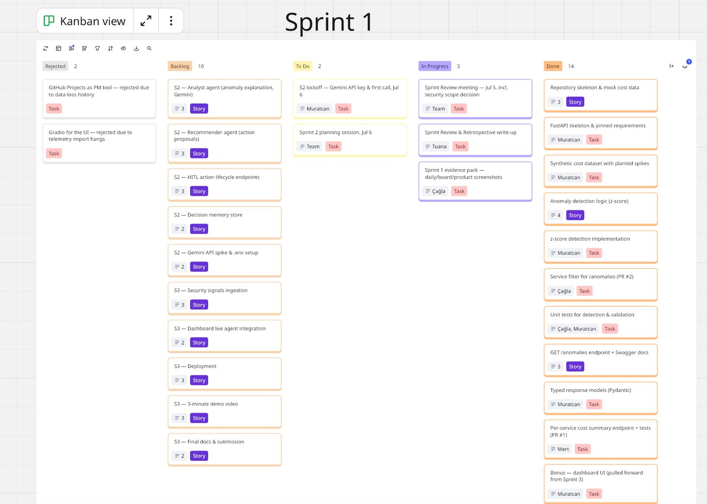

  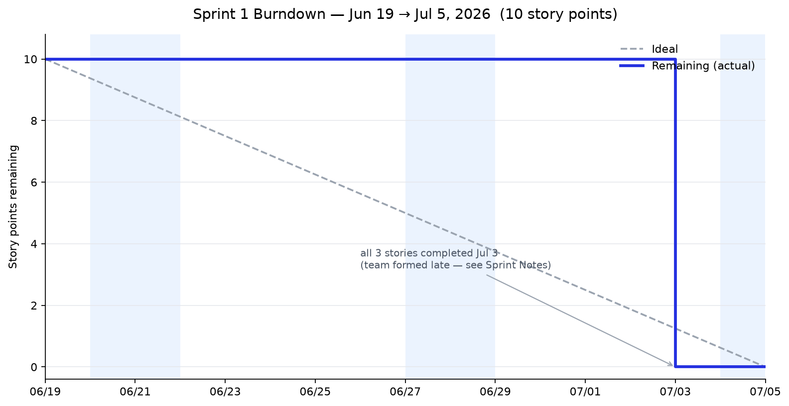

  Detail: [Done column with per-member assignments](ProjectManagement/Sprint1Documents/miro_board_done_column.jpeg).

- **Product Status**: the increment runs locally — dashboard at `/`, Swagger at `/docs`.

  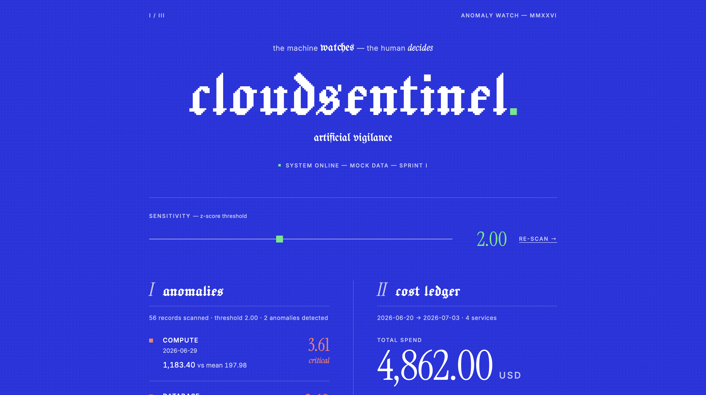

  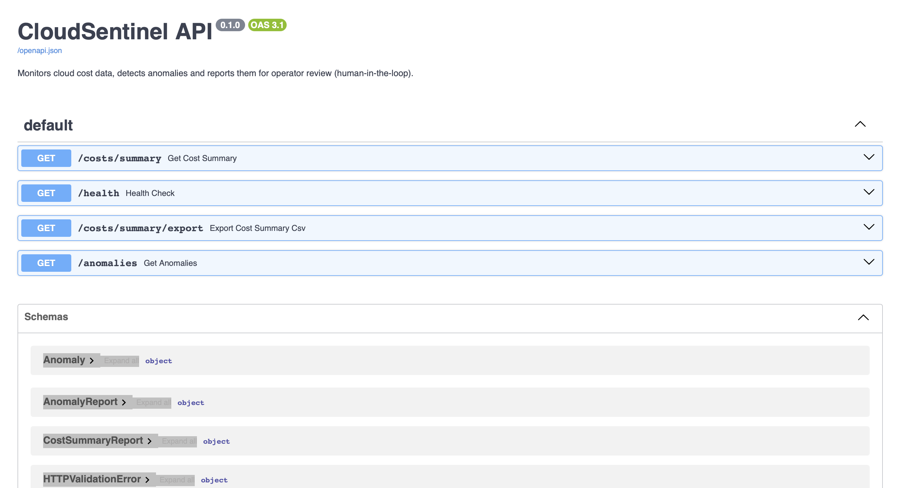

  More: [cost ledger & footer](ProjectManagement/Sprint1Documents/dashboard_ledger.png) · [typed schemas](ProjectManagement/Sprint1Documents/swagger_schemas.png).

- **Sprint Review**: Sprint 1 closed with all three committed stories completed (10/10 points). Beyond the committed scope, three teammate pull requests were reviewed and merged during the sprint — per-service cost summary (PR #1), case-insensitive service filter for `/anomalies` (PR #2), and `/health` plus CSV export (PR #3) — and the dashboard was pulled forward from Sprint 3 as a bonus, so every team member shipped reviewed, merged code in Sprint 1. The increment was demoed over the dashboard and Swagger and behaves correctly: 27 automated tests, both planted anomalies detected with zero false positives. Decisions taken: security-signal ingestion stays in scope and will flow through the same detection pipeline in Sprint 3 with mock security events, as designed in [docs/architecture.md](docs/architecture.md); the 36-point plan (10/13/13) was confirmed; the dashboard's cobalt palette will be revisited in Sprint 2 after UI reference research. Carried over to Sprint 2: Gemini integration (Analyst + Recommender agents), the human-in-the-loop action lifecycle, the decision-memory store, and a code packaging refactor.

  | Story | Points | Result |
  |---|---|---|
  | Repository skeleton & mock cost data | 3 | ✅ Completed |
  | Anomaly detection logic (z-score) | 4 | ✅ Completed |
  | `GET /anomalies` endpoint + Swagger documentation | 3 | ✅ Completed |
  | Bonus: cost summary (PR #1) · service filter (PR #2) · `/health` & CSV export (PR #3) · dashboard | — | ✅ Delivered |
  | **Total** | **10 / 10** | |

- **Sprint Review Participants**: `Tuana Aydın, Muratcan Ateş, Çağla Yurtseven, Mert Kurt`

- **Sprint Retrospective**:
  - **What went well**: a working increment was ready two days before the sprint deadline; scope discipline held with no feature creep; the team switched to a pull-request workflow mid-sprint and all three teammate PRs were reviewed and merged the day they were opened; the scrum notebook, architecture design and evidence pack were kept current throughout the sprint.
  - **What to improve**: the late team formation compressed delivery into the final days of the sprint (clearly visible in the burndown chart); the project-management board was set up late; in-team design review surfaced that the dashboard's cobalt background is tiring on the eyes.
  - **Action items**: the Sprint 2 board is filled before planning on July 6; evidence (board and daily screenshots) is captured weekly rather than at sprint end; the Gemini API spike is the first task of Sprint 2; the dashboard palette is revised after UI reference research (owner: Tuana); every member ships at least one reviewed PR per sprint.

---

# Sprint 2

*Sprint 2 ran July 6 – July 19; the sprint review and demo close it on July 19.*

- **Sprint Notes**:
  - Sprint 2's goal is the agent layer on top of the Sprint 1 detection core: Analyst and Recommender agents, the human-in-the-loop action lifecycle, and decision memory — as designed in [docs/architecture.md](docs/architecture.md).
  - The LLM layer was built provider-agnostic: a deterministic fake provider (`SENTINEL_FAKE_LLM=1`) drives all tests and offline demos, and the rule-based fallback path keeps every endpoint answering even with the LLM unavailable. Through Sprint 2 the whole chain ran on the fake provider; the live Gemini key will be provisioned from a billing-disabled project in Sprint 3, so the quota-safety posture stays zero-cost by construction.
  - Quota discipline was locked early: responses are cached, reflection runs only on critical signals, and the debate-lite skeptic costs at most one extra call per decision.
  - The Recommender's prompt interface was frozen mid-sprint so decision memory could be injected later as a single isolated change — which is exactly how it landed.
  - Money figures shown to the operator are computed deterministically in Python; the model narrates, it never invents numbers.
  - Execution stays simulated by design: the state machine records an executed action with a SIMULATION marker and no real infrastructure is ever touched.
  - The dashboard was rebuilt on a tokenized design system with a persisted four-palette switch — **horizon** (the night-blue default shown in the Sprint 2 captures, renamed from cobalt at sprint close), joined by night, paper and dawn — now letting the team and reviewers flip palettes live (night mode included). The final palette decision (retro action item, owner: Tuana) lands at the Friday design session.
  - Mid-sprint hardening from the July 12 review requests: interactive ledger tables (sortable signals, click-to-filter cost rows), monotone-curve charts, performance budget tests over the mock-data pipeline, and a regression fix that restored Swagger UI under the strict CSP.
  - The sprint's second week pulled the **Sprint 3 core forward**: detection quality (rolling baseline, MAD, weekly seasonality), the mission DSL + reflex engine, the unified security and fraud lanes, the guardrail pack (call budget, timeout, numeric post-check), the operations-intelligence analytics, the chronicler agent, the persisted agent trace and finally the **agent bus with a live feed panel** — the whole inter-agent conversation streaming into the dashboard as it happens.
  - The fraud lane is developed in this repository as published deterministic rule arithmetic (no ML); its strongest signals and a projected budget overrun now file cards into the same human decision inbox — three missions, one decision box.
  - The CI restore closed at sprint end: the token-scope block turned out to apply only to HTTPS token pushes, so the workflow shipped over an SSH push — [`ci.yml`](.github/workflows/ci.yml) now runs ruff and the full suite on every push and PR.

- **Expected point completion within the sprint**: 13 points

- **Point Completion Logic**: Sprint 2 carries 13 of the 36 total backlog points: Gemini agent spike (2), Analyst agent (3), Recommender with debate-lite (3), human-in-the-loop lifecycle (3), decision memory (2). All five stories are code-complete as of July 12 — the suite has since grown to 446 automated tests (~9s on the fake provider) — and formal completion is assessed at the July 19 review and demo.

- **Backlog order and story selections**: The Sprint 2 backlog is ordered by dependency — the Gemini agent spike first (it unblocks both agents), then the Analyst and Recommender agents, the human-in-the-loop lifecycle, and finally decision memory feeding the Recommender. Each estimate is kept below half the sprint total (at most 3 of 13). Stories are split into tasks on the Miro board and assigned across the four active team members; on the board blue cards are user stories and red/orange cards are tasks (legend on the board itself).

- **Daily Scrum**: daily communication runs over WhatsApp with team meetings and huddles on Slack — evidence captured through the sprint:

  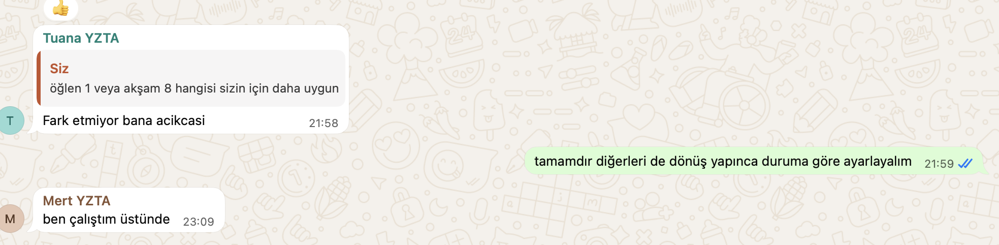

  

  More Slack / WhatsApp evidence: [scrum 1](ProjectManagement/Sprint2Documents/slack_dashboard_share.png) · [scrum 2](ProjectManagement/Sprint2Documents/slack_frontend_share.png) · [scrum 3](ProjectManagement/Sprint2Documents/whatsapp_product_share.png)

- **Sprint board update**:

  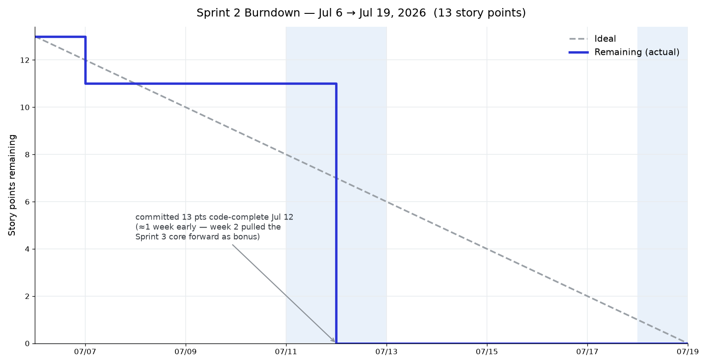

  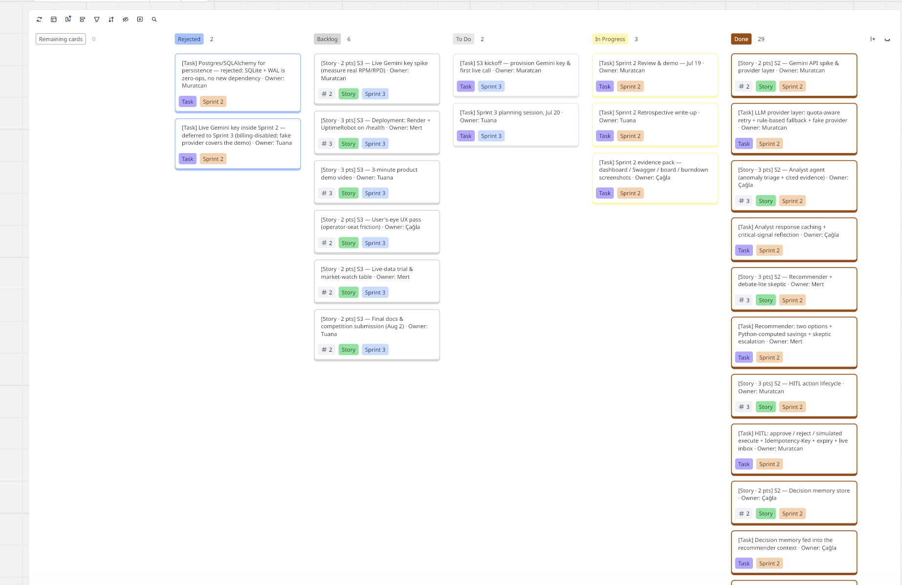

  Detail — Done column with per-member owners: [part 1](ProjectManagement/Sprint2Documents/miro_board_sprint2_done_column.png) · [part 2](ProjectManagement/Sprint2Documents/miro_board_sprint2_done_column_2.png) · [part 3](ProjectManagement/Sprint2Documents/miro_board_sprint2_done_column_3.png).

  The committed 13 points were code-complete by July 12 — about a week ahead of the sprint deadline — so the actual line sits below the ideal for the whole sprint; the second week was then spent pulling the Sprint 3 core forward as bonus. On the board, blue cards are user stories and red/orange cards are tasks (legend on the board itself).

- **Product Status — the running increment at sprint close**: a single full-page capture of the `/broadsheet` view (every room on one page) on mock data, horizon palette. One `POST /pulse` (input) drives the cost chain; the anomaly feed, cost ledger, investigation and decision inbox below are the output of that call plus one operator approval:

  ```bash
  curl -X POST http://127.0.0.1:8000/pulse
  ```

  ```json
  {"threshold": 2.0, "signals": 2, "analyzed": 2, "proposals_filed": 2,
   "chain": [
     {"event_id": 1, "service": "compute",  "severity": "critical", "triage": "REAL",
      "action_id": 1, "action_state": "proposed", "preferred": "CAUTIOUS"},
     {"event_id": 2, "service": "database", "severity": "critical", "triage": "REAL",
      "action_id": 2, "action_state": "proposed", "preferred": "CAUTIOUS"}]}
  ```

  

  Both planted cost spikes are detected (compute z=3.61, database z=3.60), triaged REAL and filed as proposals; the compute action was approved and executed — SIMULATION, the database action still awaits the hand. The same sheet runs the unified security lane (2 signals) and the experimental fraud lane (3 holds) through the same governance rails and decision inbox. The hero / top of the sheet in close-up: [dashboard hero](ProjectManagement/Sprint2Documents/dashboard_sprint2.png). Palette directions for the design decision: [night](ProjectManagement/Sprint2Documents/dashboard_night.png) · [paper](ProjectManagement/Sprint2Documents/dashboard_paper.png).

  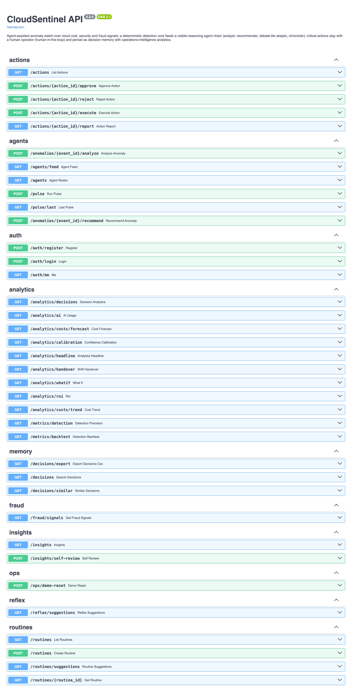

  The full API surface at sprint close is **46 endpoints** (self-hosted Swagger, no CDN). The committed Sprint 2 scope was the agent-layer subset — analyze / recommend / actions / decisions / pulse, [13 endpoints captured mid-sprint](ProjectManagement/Sprint2Documents/swagger_13_endpoints.png); the second-week bonus (security / fraud / missions / analytics / chronicler / agent bus) and the July-19 decision-brain groundwork grew it to 46.

- **Sprint Review**: Sprint 2 closed with all five committed stories completed (13/13 points), demoed end to end at the July 19 review over `POST /pulse`: detect → Analyst triage with cited evidence → debate-lite skeptic → Recommender options with Python-computed savings → decision inbox → operator verdict → decision memory. Everything ran on the deterministic provider (the live Gemini key is deferred to Sprint 3, to be provisioned from a billing-disabled project), which is itself the demo's point: the agent layer degrades honestly and never blocks on quota. Beyond the committed scope, the second week of the sprint pulled the Sprint 3 core forward — detection-quality controls, the mission DSL and reflex engine, the unified security and fraud watch, the guardrail pack, the operations-intelligence analytics, the chronicler agent, the persisted agent trace, the live agent-feed panel, cross-lane HITL cards (fraud holds and the budget guard) and self-hosted Swagger under one strict CSP — and, on July 19, a decision-brain groundwork layer (local identity + roles, history-synthesis insights, a HITL-safe self-review loop, saved routines, runbook retrieval, a detector backtest and an in-dashboard brain room) — growing the suite from 27 tests at Sprint 1 close to **446 tests over 46 endpoints**. Decisions taken: the fraud lane stays rule-based and in-repo; deployment (Render, `render.yaml` ready) and the live-key spike open Sprint 3; the final palette decision is carried into the Sprint 3 design session with the four-way switcher shipped.

  | Story | Points | Result |
  |---|---|---|
  | Gemini agent spike — provider layer, retry, fallback, fake provider | 2 | ✅ Completed |
  | Analyst agent — triage, cited evidence, reflection at critical z | 3 | ✅ Completed |
  | Recommender + debate-lite skeptic — two options, computed savings | 3 | ✅ Completed |
  | Human-in-the-loop lifecycle — approve / reject / simulated execute | 3 | ✅ Completed |
  | Decision memory — verdicts stored, retrieved and fed to the agent | 2 | ✅ Completed |
  | Bonus: Sprint 3 core pulled forward (detection quality · missions · lanes · guardrails · analytics · chronicler · agent bus) + July-19 decision-brain groundwork (identity · insights · self-review · routines · runbooks · backtest · brain room) | — | ✅ Delivered |
  | **Total** | **13 / 13** | |

- **Sprint Review Participants**: `Tuana Aydın, Muratcan Ateş, Çağla Yurtseven, Mert Kurt`

- **Sprint Retrospective**:
  - **What went well**: the fake-provider discipline let the entire agent layer land and demo with zero LLM spend; freezing the Recommender's prompt interface early meant decision memory landed later as a single isolated change, exactly as planned; the July 12 mid-sprint review requests were absorbed without breaking stride; pulling the Sprint 3 core forward leaves the final sprint free for deployment, the video and polish; the suite grew 27 → 446 tests with ruff clean on every commit.
  - **What to improve**: the second-week push concentrated commits on one member — the pull-request rhythm from Sprint 1 (every member ships reviewed PRs) slipped and must return; CI landed only at the very end of the sprint — the token-scope block turned out to apply only to HTTPS pushes — so for most of the sprint green runs lived only on developer machines; the live Gemini key was not provisioned during the sprint, so real-quota behavior (RPM/RPD) remains unmeasured.
  - **Action items**: Sprint 3 work is distributed as reviewed PRs across all four members from the board; the Gemini key spike (`scripts/spike_gemini.py`) is the first task of Sprint 3; CI stays green and grows browser E2E plus a post-deploy smoke during Sprint 3; Render deployment closes before the July 25 gate with UptimeRobot on `/health`; the final palette decision is taken at the Sprint 3 design session (owner: Tuana).

---

# Sprint 3

*The final sprint runs July 20 – August 2 and closes with deployment, the live demo and the 3-minute product video.*

- **Sprint Notes**:
  - Sprint 3 opened with its technical core already pulled forward into Sprint 2's second week (see the head start below), so the final sprint was deliberately planned around **proving the product rather than growing it**: get it deployed, get the model measured, get the evidence and the video made.
  - **Deployment closed the sprint's biggest risk.** The public instance runs from `render.yaml` with `SENTINEL_READONLY=1`, so a stranger can read every room and change nothing; the approve/reject buttons answer 403 by design, and the dashboard says why rather than looking broken. The decision flow is shown signed-in and in the video.
  - **The live Gemini spike paid for itself twice.** Running `scripts/spike_gemini.py` against a billing-disabled key surfaced two contract breaks that would have failed on stage: the pinned 2.5-family model is closed to new keys (404), and the pro models carry zero free-tier quota. The default moved to a `-latest` alias (immune to model retirement) and the review panel now seats three genuinely different free models. The demo still runs on the deterministic provider by choice: it must never block on a quota.
  - **Live data is real but honestly labelled.** Three source lanes ship — the app's own telemetry, an imported billing export (`scripts/import_costs.py`, credential-free), and external JSON feeds — plus a simulated stream for the demo. `/health` reports what each lane is *actually serving*, not what it was configured with, and the dashboard badge says `SIMULATED LIVE` rather than `LIVE DATA` when that is the truth.
  - **The site became one product, not four documents.** The console, handbook and API browser are separate HTML files; they had drifted onto their own palette, their own top bar and an older stylesheet stamp. A shared appearance module now applies the visitor's palette and accessibility settings before the first paint on every page, and one nav is pinned by test.
  - Everything shipped this sprint went in suite-green with ruff clean, and CI ran ruff plus the full suite on every push and pull request.

- **Expected point completion within the sprint**: 13 points

- **Point Completion Logic**: Sprint 3 carries the last 13 of the 36 total backlog points: deployment and uptime (3), live Gemini measurement (2), live-data trial (3), market watch (2), UX pass and evidence (3). The technical core budgeted here was delivered early inside Sprint 2 and is counted there, not double-counted in this sprint.

- **Backlog order and story selections**: The Sprint 3 backlog is ordered by **risk** rather than by dependency, because the technical dependencies had already been paid off in Sprint 2. Deployment comes first — it was the sprint's single biggest risk and every other story is demonstrated over it; then the live Gemini measurement (it can only fail once a real key exists, and we wanted that failure early); then the live-data trial and market watch, which are the two stories that turn a demo into a product; and last the UX pass and evidence, which are the only stories that can absorb a late day without breaking anything else. Each estimate stays below half the sprint total (at most 3 of 13), the same cap as the previous two sprints. Stories are cut onto the Miro board from [`docs/sprint3_backlog.md`](docs/sprint3_backlog.md) and split into tasks across the four active members; on the board blue cards are user stories and red/orange cards are tasks (legend on the board itself). The backlog's section B — the hardening list from the July 18 engineering review — was explicitly held **out** of the sprint and stands as the post-competition roadmap, so polish could not crowd out the committed scope.

- **Daily Scrum**: daily communication over WhatsApp with team meetings and huddles on Slack, as in the previous two sprints — the sprint's coordination is on the record:

  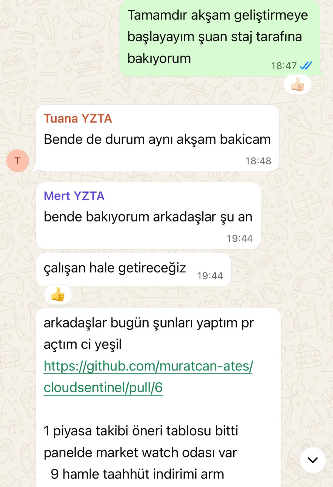

  

  More from the sprint: [scheduling the closing session](ProjectManagement/Sprint3Documents/whatsapp_meeting_scheduling.jpeg) · [the sign-in defect handed over and picked up](ProjectManagement/Sprint3Documents/whatsapp_signin_handover.jpeg) · [the live-data question, answered against the auth and security layer already shipped](ProjectManagement/Sprint3Documents/whatsapp_live_data_and_auth.jpeg) · [an independent repository analysis circulated to the team](ProjectManagement/Sprint3Documents/slack_repo_analysis.png).

- **Sprint board update**:

  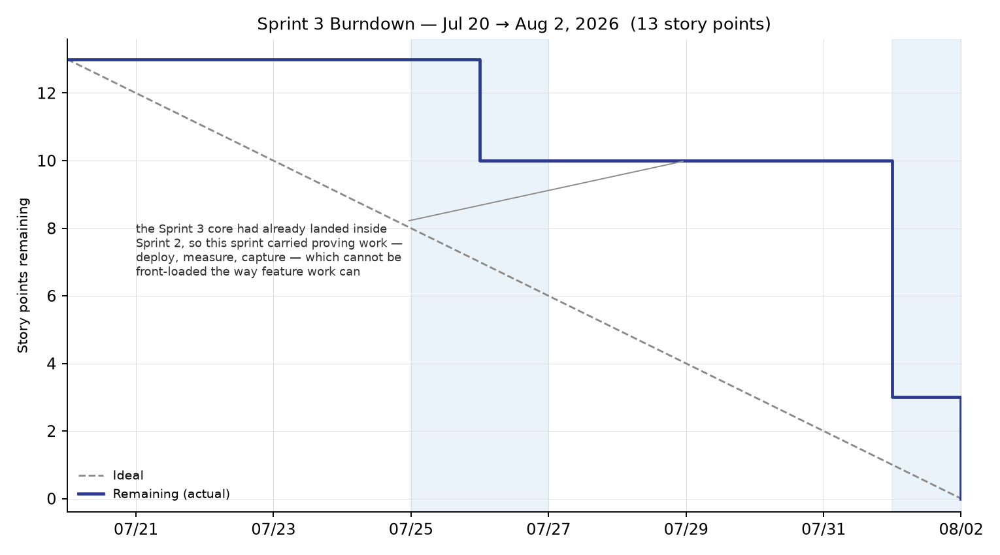

  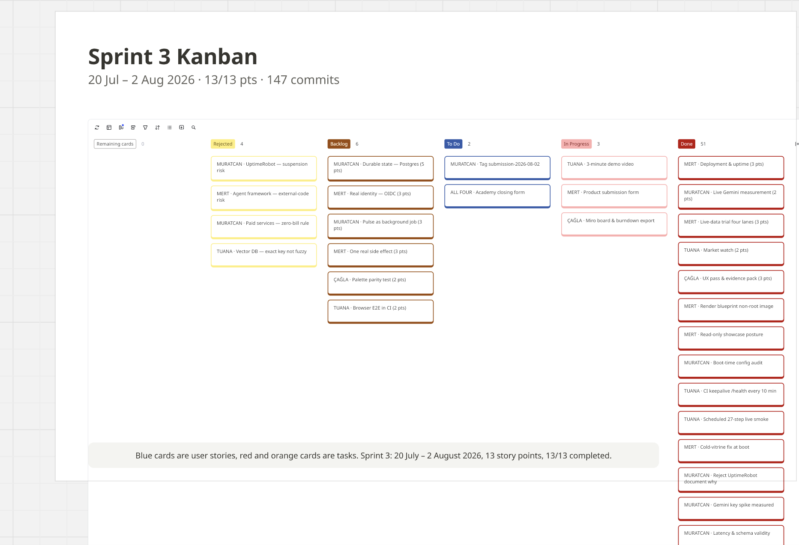

  Detail — the Done column with per-member owners: [part 1](ProjectManagement/Sprint3Documents/miro_board_sprint3_done_1.png) · [part 2](ProjectManagement/Sprint3Documents/miro_board_sprint3_done_2.png). Every card names the member who owned it, and the distribution across the four of us is **Muratcan 19 · Tuana 18 · Mert 16 · Çağla 9**. Fifty-one cards closed against four rejected — and the rejections are on the board on purpose, because a decision not to build something (UptimeRobot, an agent framework, a paid service, a vector database) is work the same way building it is.

  The burndown is **generated from the record, not drawn by hand** — [`scripts/make_burndown.py`](scripts/make_burndown.py) dates every step by the commit that closed the story, so the shape cannot drift from what happened. The curve runs the opposite way to Sprint 2's, and that is the honest story of this sprint: Sprint 2 finished its committed scope a week early and spent its second week pulling work forward, so Sprint 3 opened with its technical core already paid for and carried **proving** work instead — deploy it, measure the model, capture the evidence — which cannot be front-loaded the way feature work can. The line therefore sits above the ideal for most of the sprint and closes hard over the final two days. **147 commits between July 20 and August 2** back it up. On the board blue cards are user stories and red/orange cards are tasks, with the legend on the board itself.

- **Head start (all of this shipped inside Sprint 2)**: Sprint 2's second week pulled the Sprint 3 technical core forward — detection quality (rolling baseline / MAD / weekly seasonality), the mission DSL + reflex engine, the **security lane through the identical detection line**, the fraud rule-score lane with cross-lane HITL cards, the guardrail pack, operations-intelligence analytics, the chronicler agent, the agent bus with its live feed panel, self-hosted Swagger and the demo-operations knobs (date rebase, demo reset, read-only showcase) — and, on July 19, a decision-brain groundwork layer (local identity + roles via `/auth`, history-synthesis insights, a HITL-safe self-review loop, saved routines, runbook retrieval, a detector backtest and an in-dashboard **brain room**). All of it landed inside Sprint 2's dates and is counted in the Sprint 2 bonus above, so **none of it is claimed as Sprint 3 delivery** — the final sprint's own work is the list below.

- **Closeout**: the last two days before the gate — the ordered task list with owners, the honest answer on live data, and the submission checklist — is **[docs/CLOSEOUT_48H.md](docs/CLOSEOUT_48H.md)**.

- **Backlog**: the full prioritized working list — committed competition scope, the hardening backlog from the July 18 engineering review, the freeze list and the definition of done — lives in **[docs/sprint3_backlog.md](docs/sprint3_backlog.md)**; stories are cut onto the Miro board from there.

- **Committed scope, as it closed** (headline items — [the backlog](docs/sprint3_backlog.md) holds the detail):
  - **Deployment** — ✅ live on Render from `render.yaml` (non-root, healthchecked image) with `SENTINEL_READONLY=1` on the public link and the dashboard's LIVE banner on via `SENTINEL_ENV=render`; the deployed surface matches this checkout and the standing watch is beating.
  - **Uptime** — ✅ shipped without a third party, by decision: the repository's own [`keepalive.yml`](.github/workflows/keepalive.yml) pings `/health` every ten minutes and [`live-smoke.yml`](.github/workflows/live-smoke.yml) sweeps the deployed surface on a schedule. UptimeRobot was rejected on account-suspension risk and is not a pending task.
  - **Live Gemini spike** — ✅ run August 1 against a billing-disabled free-tier key. It caught two model-contract breaks before they could fail on stage and moved the defaults to `-latest` aliases; measured latency 0.8–2.9 s, schema parse clean end to end. The demo still runs the deterministic provider **by choice** — it must never block on a quota.
  - **Continuous integration** — ✅ landed at Sprint 2 close: [`ci.yml`](.github/workflows/ci.yml) runs ruff + the full suite on every push and PR (446 cases then, 1321 now), plus an `audit` job running bandit over our own source and pip-audit over both requirement sets. Sprint 3 added the two scheduled workflows above; browser E2E stays on the post-competition list.
  - **Live-data trial & market watch** — 🟡/✅ the mechanism shipped and is proven: four env-gated lanes (self-telemetry, credential-free billing-export import, external JSON feeds, simulated stream), each reported by `/health` as *served* rather than as configured. What remains is running it on a real export the team owns — deliberately not done with a borrowed invoice. Market watch shipped complete: `GET /market/opportunities` and the intel room's table.
  - **User's-eye UX pass** — ✅ the desk, a written [design language](docs/DESIGN_LANGUAGE.md), the `vivid` control surface promoted to default with the four editorial palettes one click away, the accessibility panel, and — last — one shared appearance module and one nav across all four pages. EN/TR overview kept in sync ([Türkçe özet](docs/README.tr.md)).
  - **Evidence & submission** — ✅ the product evidence pack, recaptured August 2 after the interface rebuild; the 3-minute video and the submission form close the sprint.

- **Product Status — the running increment at sprint close**: captured 2 August on a fresh demo stage (`make demo`, `POST /ops/demo-reset?seed=1`, then one `POST /pulse` so the desk, the inbox, the agent feed and the review panel all carry real chain output). Full-page captures at 1440 px, 2× device scale — the July 27 set was discarded because it showed an interface the product no longer has.

  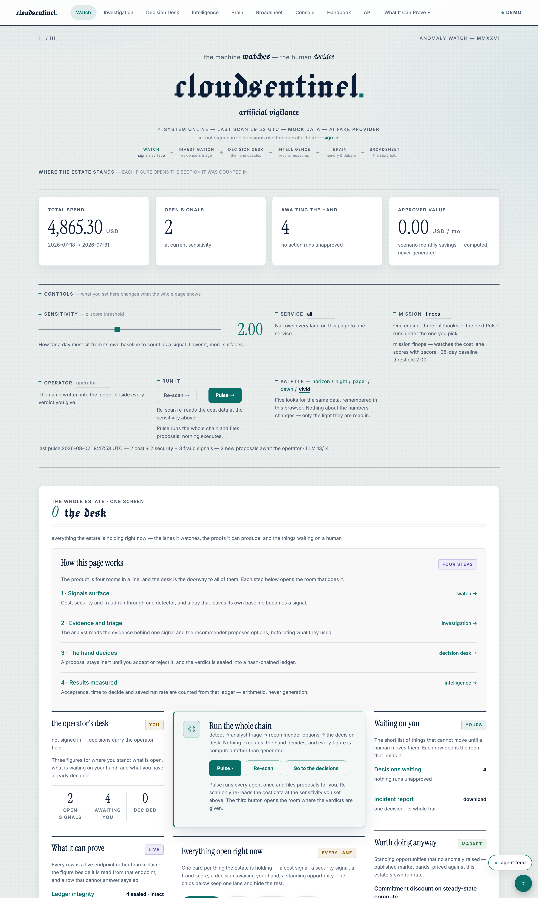

  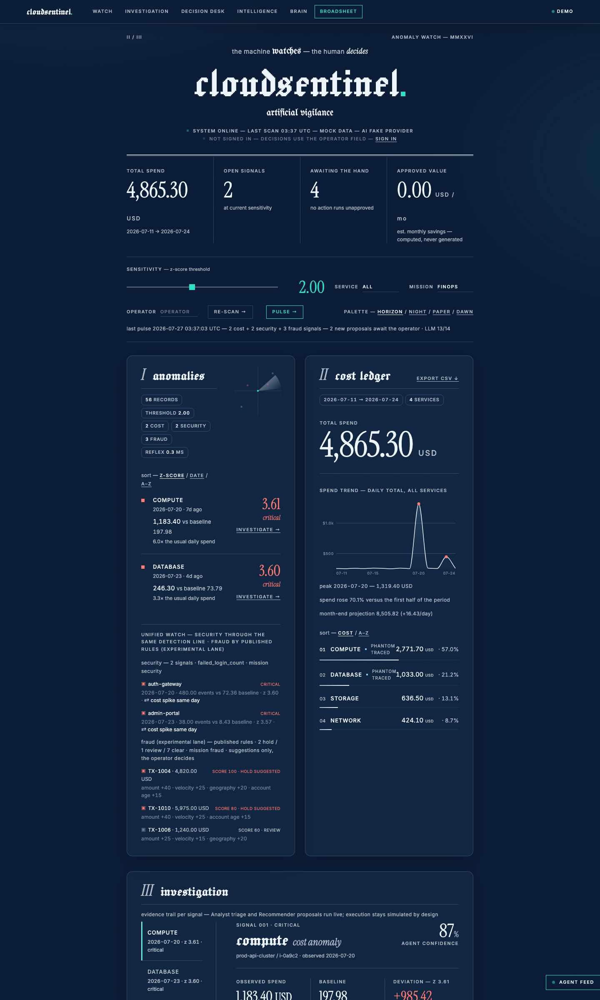

  The other four rooms in close-up: [investigation](ProjectManagement/Sprint3Documents/room_investigate.png) — fourteen days of evidence, the Analyst's cited triage and the Recommender's two costed options · [decision desk](ProjectManagement/Sprint3Documents/room_decide.png) — the reflex/conscious split, the review-panel fold on critical cards and the HITL verbs · [intelligence](ProjectManagement/Sprint3Documents/room_intel.png) — funnel, approved value, forecast, calibration and the market-watch table · [brain](ProjectManagement/Sprint3Documents/room_brain.png) — insights, self-review, routines, runbook retrieval and the backtest chart.

  

  The API surface at sprint close is **59 paths / 61 operations**, up from 46 at Sprint 2 close — and, as of this sprint, reachable from the shared top bar instead of being a dead end only the console linked to.

- **Sprint Review**: Sprint 3 closed at the August 2 meeting with all five committed stories completed (13/13 points), demoed over the deployed read-only link. The walk was the product's own argument: a signal surfaces with its z-score and baseline, the Analyst triages it citing the rows it used, the Recommender puts up two costed options, a skeptic — or, on a contested critical signal, a three-seat panel — argues them, a human approves with a rationale, the verdict survives a reload, `/audit/verify` says the chain is intact, and the mission switch visibly changes the posture rather than the label. Beyond the committed scope the sprint also delivered the hardening layer the July 18 engineering review had listed as post-competition work: the hash-chained ledger, the outbound SSRF guard, the boot configuration audit that refuses a demo posture under `SENTINEL_ENV=production`, correlation ids and JSON logs, a Prometheus exposition, account throttling with revocable sessions, and the model allowlist. The suite grew from 446 tests at Sprint 2 close to **1321 over 59 paths**, at 96% line coverage, with `make verify` measuring every counter claim in the documentation rather than trusting a human to check them at midnight. Decisions taken at the meeting: the fraud lane stays labelled experimental; UptimeRobot stays rejected and the repository's own CI remains the pinger; Postgres, OIDC and a real job queue are confirmed as the first three items of the post-competition roadmap rather than late additions; and the deterministic provider — not the live key — is what the video is recorded on.

  | Story | Points | Result |
  |---|---|---|
  | Deployment & uptime — Render blueprint, read-only public link, scheduled keepalive and live smoke | 3 | ✅ Completed |
  | Live Gemini measurement — billing-disabled key, latency and schema validity, model allowlist | 2 | ✅ Completed |
  | Live-data trial — four env-gated lanes, honestly reported by `/health` as served | 3 | ✅ Completed (mechanism proven; a team-owned export remains) |
  | Market watch — curated opportunities costed against this estate's own run rate | 2 | ✅ Completed |
  | UX pass & evidence — the desk, the design language, accessibility, one site not four documents, the capture pack | 3 | ✅ Completed |
  | Bonus: the July-18 hardening layer (ledger seal · SSRF guard · config audit · correlation ids · `/metrics` · account throttling · allowlist) + the orchestration console, decision quality, run receipts, the second scorer and the 288-case golden set | — | ✅ Delivered |
  | **Total** | **13 / 13** | |

- **Sprint Review Participants**: `Tuana Aydın, Muratcan Ateş, Çağla Yurtseven, Mert Kurt`

- **Sprint Retrospective**:
  - **What went well**: pulling the technical core forward in Sprint 2 was the decision the whole sprint rested on — the final two weeks could be spent proving the product instead of finishing it, which is why deployment, the key spike and the evidence pack all fitted. The Gemini spike was run early enough that two model-contract breaks became a configuration change instead of a failure on stage. Automating the counter check (`make verify`) removed a whole class of last-night errors: every "N tests / N endpoints" claim in the documentation is now measured against the code, and the release gate fails if one drifts. And the honesty discipline held under deadline pressure — the data badge says `SIMULATED LIVE` where that is the truth, `/health` reports what each lane actually served rather than what it was configured with, and known gaps were written into [`docs/LIMITATIONS.md`](docs/LIMITATIONS.md) rather than left for a juror to find.
  - **What to improve**: commit distribution stayed concentrated — the Sprint 1 rhythm of every member shipping reviewed pull requests did not fully return, and the retro action from Sprint 2 therefore carries forward unmet. Process evidence lagged product evidence: the room captures were recaptured on the last day because an interface rebuild had made the July 27 set obsolete, and the board and burndown exports landed at the closing meeting rather than through the sprint. The interface drifted into four separate documents before anyone noticed — three pages had their own nav, their own palette default and a stale stylesheet stamp — which is exactly the class of defect a contract test catches and we had not written one until the last day. Finally, the live-data story closed on the mechanism rather than on a real export, because the team had no billing file it owned outright.
  - **Action items**: the pull-request rhythm is re-established as a hard rule rather than an aspiration for any work after the competition, with a reviewer named per story on the board. Evidence — board, burndown and daily-scrum captures — is taken weekly, not at sprint end. Every cross-page invariant gets a contract test the day the page is added, following [`tests/test_page_consistency.py`](tests/test_page_consistency.py), and the same mechanism is extended to the palette rule so a theme can change ground and accent but never typography or copy. The post-competition roadmap starts, in order, with durable state (Postgres + migrations + backup), real identity (OIDC with approver ≠ executor), and pulse as a background job — the three items [`docs/LIMITATIONS.md`](docs/LIMITATIONS.md) names as the honest gap between this build and a production one.

---

# Field Guide — Sixty Seconds to a Decision

1. **Run it** — `make demo`, open `http://127.0.0.1:8000/` (Swagger at `/docs`, the console at `/static/chat.html`, the handbook at `/static/guide.html`).
2. **Tune the watch** — drag the sensitivity slider or pick a service; the watch room re-scans live. The page opens on **vivid**, the light control surface; prefer the newspaper, or the dark room? Flip to **horizon**, **night**, **paper** or **dawn** in the control rail — the choice persists, and it now follows you into the console and the handbook too.
3. **Investigate** — hit *investigate →* on a signal: evidence sparkline, baseline, deviation, then *run analyst agent →* for triage with cited rows.
4. **Watch them talk** — open the **agent feed** rail (bottom right): every hop of the chain — pickups, handoffs, skeptic challenges, verdicts, briefings — streams in live as it happens.
5. **Decide** — *file recommendation →*, type a rationale, then approve or reject in the inbox. Execution of the infrastructure change is always a simulation — though with `SENTINEL_EXECUTE_WEBHOOK_URL` set, the decided incident report really ships to your webhook — and the ledger remembers every hand that touched it.
6. **Check its work** — `GET /audit/verify` recomputes the decision chain from genesis and tells you where it breaks (it should say nothing broke); `GET /analytics/quality` says how the desk is doing rather than how the model is doing; `GET /analytics/receipts` itemises what that pulse actually cost; `GET /ops/preflight` answers whether this instance is fit to be shown at all.
7. **Ask it something** — open the console at `/static/chat.html`, pick an agent and ask about this estate. The answer arrives beside the rows it used and a badge naming whether it was written live, by the deterministic composer or by the rule-based fallback. The console can read everything and change nothing — that is enforced by a database authorizer, not by a promise.

# In Short

CloudSentinel closes the gap between *"your cloud bill spiked"* and *"someone accountable did something about it"*: a deterministic detector finds the spike, AI agents explain it and propose two ways out with computed savings, a skeptic challenges weak calls — critical ones face a three-seat review panel — and nothing executes until a human says so, in writing, forever.

# Acknowledgements

- **Yapay Zeka ve Teknoloji Akademisi** — for the YZTA Bootcamp 2026 program, the scrum template and the mentoring hours behind this repo.
- **Team CloudSentinel** — every feature here crossed at least one teammate's review before it landed.
- **The open tools that carried us** — FastAPI, Pydantic, pytest, SQLite, Docker, Gemini (`google-genai`), and the Google Fonts faces (Instrument Serif, Jacquard 24, UnifrakturMaguntia) that give the dashboard its voice.
- **Michelangelo** — for the two hands we borrowed; the machine watches, the human decides.

---


<div align="center"><sub>Built by Team CloudSentinel — YZTA Bootcamp 2026 · AI Track · Group 60</sub></div>
