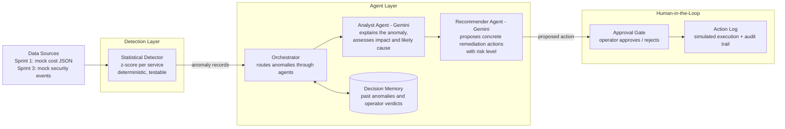

# CloudSentinel — Architecture & Agent Design

This document describes the target architecture for Sprints 2–3. Sprint 1
deliberately shipped only the deterministic detection slice; everything below
builds on that foundation without rewriting it.

## System Overview

## Design Principles

1. **Deterministic core, agentic reasoning on top.** Detection stays
   statistical and unit-tested; LLM agents interpret and recommend but never
   silently act. This keeps the demo reliable and the AI layer honest.
2. **Human-in-the-loop is a state machine, not a checkbox.** Every proposed
   action has a lifecycle: `proposed → approved | rejected → executed
   (simulated)`. Each transition is persisted with timestamp and actor.
3. **Memory makes agents purposeful.** Operator verdicts are stored and fed
   back into the Recommender's context, so repeated anomaly patterns get
   better recommendations over time — agent memory serving the product goal,
   not decoration.
4. **Same pipeline for cost and security.** Sprint 3's security signals (e.g.
   failed-login bursts, IAM policy changes) enter as another record type and
   flow through the identical detect → analyse → recommend → approve chain.

## Agent Roles (Sprint 2)

| Agent | Model | Responsibility | Input | Output |
|---|---|---|---|---|
| Analyst | Gemini | Explain the anomaly: probable cause, blast radius, urgency | anomaly record + service history | structured analysis |
| Recommender | Gemini | Propose 1–3 concrete actions with risk levels | analysis + decision memory | action proposals |
| Orchestrator | code (deterministic) | Route anomaly → analysis → recommendation → approval; retries, timeouts | anomaly records | tracked action proposals |

## API Evolution

| Sprint | Endpoint | Purpose |
|---|---|---|
| 1 (done) | `GET /anomalies` | Detect anomalies over cost data (z-score) |
| 2 | `POST /anomalies/{id}/analyze` | Run Analyst + Recommender agents on an anomaly |
| 2 | `GET /actions` · `POST /actions/{id}/approve` · `POST /actions/{id}/reject` | Human-in-the-loop action lifecycle |
| 3 | security event ingestion + dashboard + deployment | Extend the same pipeline; live demo |

## Technology Decisions

- **FastAPI + Python** (bootcamp requirement), **Gemini** for the LLM layer.
- **pip + venv**, pinned `requirements.txt`.
- Persistence starts as a simple JSON/SQLite action store in Sprint 2 —
  enough for the HITL state machine without infrastructure overhead.
- Containerized via the repo `Dockerfile`; deployment target decided in
  Sprint 3.
