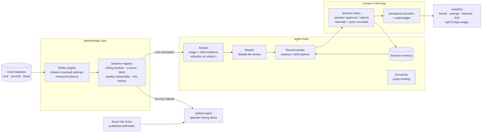

# CloudSentinel — Architecture & Agent Design

This document describes the architecture **as implemented** through Sprint 3's
core build, and what stays deliberately out of scope until after the
competition window. Sprint 1 shipped the deterministic detection slice;
Sprint 2 the agent chain and the human-in-the-loop state machine; Sprint 3
the mission DSL, the unified multi-lane watch, the guardrail pack and the
value/ops analytics described below.

## System Overview

## Design Principles

1. **Deterministic core, agentic reasoning on top.** Detection, savings
   arithmetic, fraud scoring and every figure the operator acts on are pure
   Python; LLM agents interpret and narrate but never invent a number. The
   recommender's narrative is post-checked (±5%) against the computed
   figures.
2. **Human-in-the-loop is a state machine, not a checkbox.** Every proposed
   action has a lifecycle: `proposed → approved | rejected → executed
   (simulated)`. Each transition is persisted with timestamp, actor and an
   optional rationale; decisions are idempotent (scoped idempotency keys) and
   stale proposals expire on read, attributed to `system:timeout`.
3. **Memory makes agents purposeful.** Operator verdicts feed the
   Recommender's frozen `decision_memory` prompt slot; how many verdicts were
   considered is surfaced on the card (`memory_considered` + entries fold).
4. **One detection line, many lanes.** Cost and security ride the identical
   rolling-baseline machinery under their own mission configs; fraud applies
   a published deterministic rule score. Security and fraud signals are
   operator-facing facts — they are **never** routed into the cost agents
   (the agent endpoints 409 on foreign kinds), and the HITL funnel counts
   cost anomalies only.
5. **Every claim is observable.** The chain persists a hop-by-hop trace
   (source, model, measured duration, reflection/skeptic outcome) with each
   action; the reflex pass reports its measured latency; the AI ledger and
   `/analytics/ai` account for every provider call, cache hit and fallback.

## Agent Roles (implemented)

| Agent | Backend | Responsibility | Trigger |
|---|---|---|---|
| Analyst | Gemini / fake / rule-based fallback | Triage (REAL / SEASONAL / DATA_ERROR / KNOWN_CHANGE) with cited evidence rows and self-assessed confidence | per cost anomaly |
| — Reflection | same | Second self-review pass challenging the draft | critical-severity signals only |
| Recommender | same | Exactly two options (cautious / bold) with risk + rollback; savings computed in Python | per analyzed anomaly |
| Skeptic (debate-lite) | same | One adversarial review; verdict + transcript persisted | low confidence, disagreement, or a BOLD answer to a critical signal (stakes-raised bar) |
| Chronicler | same | Narrates each pulse run (headline / summary / watch-next) from Python-computed facts | once per pulse, budget-charged |
| Orchestrator | code (deterministic) | Routes detect → analyze → debate → recommend → inbox; reuse lanes keep re-runs idempotent and quota-cheap | `POST /pulse` or per-endpoint |

## Guardrails (implemented)

- **Call budget** — a context-scoped cap on provider calls per pulse
  (`SENTINEL_PULSE_LLM_BUDGET`, per-run override via `?llm_budget=`);
  exhaustion degrades every agent to its rule-based fallback, honestly
  labeled, never a failure.
- **Hard timeout** — `SENTINEL_LLM_TIMEOUT_SECONDS` bounds every transport
  call; hung requests fail into retry/fallback instead of wedging a worker.
- **Numeric post-check** — money-looking figures in the narrative are
  verified ±5% against the computed savings; unverified figures are flagged
  on the card.
- **Spotlighting** — every untrusted payload enters prompts between
  delimiters as data, never instructions; model-cited evidence ids are
  validated against the real evidence window.
- **Quota discipline** — provider answers are cached by exact request;
  fallbacks are never cached; every call (live, fake, cached, fallback)
  lands in the `ai_usage` ledger that `/analytics/ai` prices.

## Storage (sqlite3, WAL, seed-on-startup)

| Table | Holds |
|---|---|
| `events` | every signal, all three lanes, upserted by natural key (kind, subject, day) — stable ids across rescans |
| `actions` | proposed actions with the full evidence pack (options, savings, transcript, trace, memory) in `detail_json` |
| `decisions` | operator verdicts with rationale and input context — the decision memory |
| `ai_usage` | one row per agent call: agent, model, source, prompt hash, cache flag |
| `llm_cache` | provider answers keyed by model + system + prompt |
| `idempotency` | scoped decision keys with canonical responses |
| `pulse_log` | every pulse report — `GET /pulse/last` replays the latest run |

## API Surface (implemented — 26 endpoints)

| Area | Endpoints |
|---|---|
| Detection & costs | `GET /anomalies` · `GET /costs/summary` (+ `/export`, FOCUS 1.4 schema) · `GET /costs/daily` |
| Agents | `POST /anomalies/{id}/analyze` · `POST /anomalies/{id}/recommend` · `POST /pulse` (+ `GET /pulse/last`) |
| HITL | `GET /actions` · `POST /actions/{id}/approve|reject|execute` |
| Memory | `GET /decisions/similar` · `GET /decisions/export` |
| Lanes | `GET /security/signals` · `GET /fraud/signals` (band / min_score filters) |
| Missions | `GET /reflex/suggestions` |
| Analytics | `GET /analytics/decisions` · `/costs/trend` · `/costs/forecast` · `/whatif` · `/roi` · `/ai` · `GET /metrics/detection` |
| Ops | `GET /health` (version, provider, readonly) · `POST /ops/demo-reset` (env-gated) |

## Mission DSL

Missions live in `configs/<name>.yaml`, parsed with `yaml.safe_load` and
validated hard by Pydantic (allow-listed slugs — no path traversal; the file
must declare its own name). Precedence everywhere: explicit argument > env
var > mission YAML > code default. The fraud mission's `detection` block is
schema-mandated but **inert** (only the published rule score runs); its
`rules` block (band thresholds, new-account cutoff) is live configuration.

## Operations

- Security headers + a strict CSP (`script-src 'self'`) on every path —
  Swagger UI is vendored (`static/vendor/`), so even `/docs` runs without a
  CDN exception. ReDoc is dropped by decision.
- Hand-rolled sliding-window rate limit on `POST /pulse`; `X-Request-ID`
  echo on every response; JSON failure envelope (sqlite-busy → 503 +
  `Retry-After`, unhandled → 500, never a traceback).
- Demo operations, all env-gated and off by default: whole-week date rebase
  (`SENTINEL_REBASE_DATES`), demo reset with optional seeded verdict history
  (`SENTINEL_DEMO_RESET`), read-only showcase mode (`SENTINEL_READONLY`).
- `make setup / run / test / demo`, `scripts/smoke.sh` (13-step live sweep)
  and `scripts/failure_drill.sh` (zero-budget fallback + rate-limit proof).
- Container: non-root user, stdlib `HEALTHCHECK`, `render.yaml` for the
  deploy target.

## Deliberately Out of Scope (until after the competition)

Real cloud provider adapters (AWS Cost Explorer first), authentication /
RBAC, PostgreSQL + migrations, background schedulers, Slack delivery,
ML-based fraud models, structured-log formatters and error tracking. Each is
on the post-competition roadmap; none is required to demonstrate the product
thesis: **the machine watches, the human decides.**
