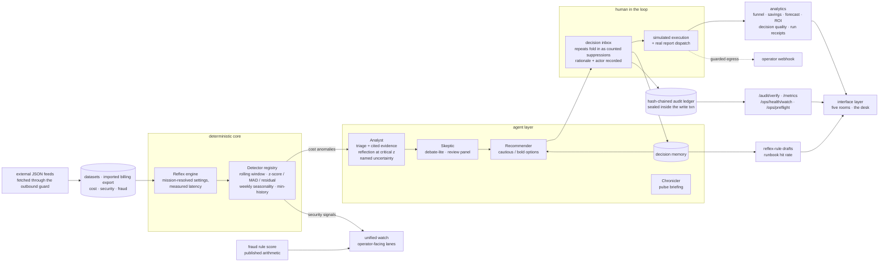

# CloudSentinel — Architecture & Agent Design

This document describes the architecture **as implemented**, and what stays
deliberately out of scope. Sprint 1 shipped the deterministic detection slice;
Sprint 2 the agent chain and the human-in-the-loop state machine; Sprint 3
the mission DSL, the unified multi-lane watch, the guardrail pack and the
value/ops analytics. The closeout pass that followed added the parts a
system needs once it is pointed at anything real: a guard on where the
process may fetch and post, an audit of its own configuration at boot, a
correlation id through the whole chain, a scrapeable exposition, a hash
chain over the decision record, and the loops that measure whether the desk
is any good — plus the interface layer that makes all of it visible.

The habit of this file is to say **why** a choice was made and **what it
cost**. A design document that only lists what exists is a feature list with
headings.

## System Overview

```mermaid
flowchart LR
    FEEDS["external JSON feeds<br/>fetched through the outbound guard"] --> DS
    DS[("datasets · imported billing export<br/>cost · security · fraud")] --> REFLEX

    subgraph deterministic core
        REFLEX["Reflex engine<br/>mission-resolved settings,<br/>measured latency"] --> DET["Detector registry<br/>rolling window · z-score / MAD / residual<br/>weekly seasonality · min-history"]
    end

    DET -->|cost anomalies| AN

    subgraph agent layer
        AN["Analyst<br/>triage + cited evidence<br/>reflection at critical z<br/>named uncertainty"] --> SK["Skeptic<br/>debate-lite · review panel"]
        SK --> REC["Recommender<br/>cautious / bold options"]
        MEM[("decision memory")] --> REC
        CHR["Chronicler<br/>pulse briefing"]
    end

    DET -->|security signals| WATCH["unified watch<br/>operator-facing lanes"]
    RULES["fraud rule score<br/>published arithmetic"] --> WATCH

    subgraph human in the loop
        REC --> INBOX["decision inbox<br/>repeats fold in as counted suppressions<br/>rationale + actor recorded"]
        INBOX --> EXEC["simulated execution<br/>+ real report dispatch"]
    end

    INBOX --> MEM
    INBOX --> LEDGER[("hash-chained audit ledger<br/>sealed inside the write txn")]
    MEM --> LEARN["reflex-rule drafts<br/>runbook hit rate"]
    EXEC --> ANALYTICS["analytics<br/>funnel · savings · forecast · ROI<br/>decision quality · run receipts"]
    LEDGER --> PROOF["/audit/verify · /metrics<br/>/ops/health/watch · /ops/preflight"]
    ANALYTICS --> UI["interface layer<br/>five rooms · the desk"]
    LEARN --> UI
    PROOF --> UI
    EXEC -.->|guarded egress| HOOK["operator webhook"]
```

## Design Principles

1. **Deterministic core, agentic reasoning on top.** Detection, savings
   arithmetic, fraud scoring and every figure the operator acts on are pure
   Python; LLM agents interpret and narrate but never invent a number. The
   recommender's narrative is post-checked (±5%) against the computed
   figures.
2. **Human-in-the-loop is a state machine, not a checkbox.** Every proposed
   action has a lifecycle: `proposed → approved | rejected → executed
   (simulated)`, plus `rejected → proposed` (reopen — the hand reconsiders,
   fresh TTL). A rejection must carry a rationale (422 without one). Each
   transition is persisted with timestamp and actor on the append-only
   `action_events` trail the desk renders as a per-card timeline; decisions
   are idempotent (scoped idempotency keys) and stale proposals expire on
   read, attributed to `system:timeout`.
3. **Memory makes agents purposeful.** Operator verdicts feed the
   Recommender's frozen `decision_memory` prompt slot; how many verdicts were
   considered is surfaced on the card (`memory_considered` + entries fold).
   The same memory is mined — never applied — into reflex-rule drafts.
4. **One detection line, many lanes.** Cost and security ride the identical
   rolling-baseline machinery under their own mission configs; fraud applies
   a published deterministic rule score. Security and fraud signals are
   operator-facing facts — they are **never** routed into the cost agents
   (the agent endpoints 409 on foreign kinds), and the HITL funnel counts
   cost anomalies only.
5. **Every claim is observable.** The chain persists a hop-by-hop trace
   (source, model, measured duration, reflection/skeptic outcome) with each
   action; the reflex pass reports its measured latency; the AI ledger and
   `/analytics/ai` account for every provider call, cache hit and fallback.
6. **A claim about ourselves must be falsifiable, not asserted.** "Append-only"
   is an architectural promise anyone with the database file can break; a
   recomputed hash chain is arithmetic. Uncertainty codes are *derived in
   code* from the evidence an agent actually had, so a model cannot talk its
   way out of one. Run receipts are assembled from measured records, never
   estimated. The runbook hit rate is recomputed on every read rather than
   stored. **The cost is that all of these can report bad news in public** —
   `/audit/verify` will say the ledger is broken, `/analytics/quality` will
   say the acceptance rate is poor. That is the trade we wanted.
7. **A safety property that defaults to off must be audited, not documented.**
   Read-only mode, the approver requirement, the provider choice and the
   outbound escape hatch are all environment variables, and a missing
   variable fails *silently*. The boot-time configuration audit turns that
   silence into either a log line or a refusal to start, depending on the
   profile. The cost: one more knob (`SENTINEL_ENV`), and the strict profile
   is deliberately **not** the one today's showcase deployment runs.
8. **The interface is where the architecture becomes visible.** Eleven
   endpoints — the ledger proof, the decision-quality measures, the run
   receipts, the runbook hit rate, the watch's own vitals, the pre-flight
   sweep — were reachable by URL and invisible in the product. A capability
   nobody can find is indistinguishable from one that does not exist, so the
   desk exists to show the surface area. The cost is a second surface that
   has to stay true to the first.

## The Request Path

**Inbound**, in the order the layers actually wrap (verified against the
running app's middleware stack, outermost first):

| Layer | Does | Note |
|---|---|---|
| `count_self_telemetry` | counts one hit per served path — the cost lane's own dataset when `SENTINEL_COSTS_SOURCE=self` | never raises; the periodic SQLite flush runs in the threadpool, never on the event loop |
| `add_security_headers` | CSP + `nosniff`, `DENY`, `no-referrer`, `Permissions-Policy` on every response | sits *outside* the read-only and rate-limit short circuits, so even a 403 or 429 comes back hardened |
| `guard_expensive_endpoints` | binds the correlation id, refuses writes under `SENTINEL_READONLY`, sliding-window rate limits on `POST /pulse` and `POST /auth/login` | the id is bound here so every downstream `[TAG]` line carries it |
| `CORSMiddleware` | allow-list of our own deployment origin plus localhost | innermost |

The ordering has one consequence worth stating plainly: a read-only 403 or a
rate-limit 429 is produced **above** the CORS layer, so it comes back with
`X-Request-ID` and the security headers but **without**
`Access-Control-Allow-Origin`. A cross-origin caller sees those two
short-circuits as a network error rather than a parsed JSON body. We accept
it because the dashboard is same-origin and the allow-list exists for
reviewers poking the API by hand, not for a third-party client — but it is a
real edge, not an oversight.

**Outbound.** Two lanes leave this process over the network: the live data
feeds (`SENTINEL_*_FEED_URL`) and the execute webhook
(`SENTINEL_EXECUTE_WEBHOOK_URL`). Both pass `app/netguard.py::assert_safe_url`
**before the socket opens** — inside `feeds._get_json` and inside
`dispatch.deliver`, at the network boundary itself rather than at the config
reader, so no future call site can skip it by loading a URL a different way.

- **https only.** Plaintext leaks a URL that may embed a token to every hop.
- **No private destination**, literal or resolved: loopback, link-local (the
  cloud metadata range), private, carrier-NAT, multicast, reserved and
  unspecified are refused.
- **No redirects** — callers pass `follow_redirects=False`, because a public
  host answering `302 → 169.254.169.254` would otherwise walk straight
  through an address check that already passed.

These URLs are configuration today, not user input, so this is not a
vulnerability being patched — it is the guard existing **before** the day a
tenant configures its own integration and an unguarded fetch becomes
server-side request forgery from inside the trust boundary. Two costs, both
deliberate: a name that does not resolve is **allowed through** (the request
that follows cannot reach anything either, and failing here would break every
hermetic test pointing at a reserved `.test` domain), and
`SENTINEL_ALLOW_PRIVATE_TARGETS=1` re-opens http and private addresses for a
developer pointing at a local stub — which is itself one of the findings the
boot audit reports. This is a guard against being aimed inward, not an egress
firewall; that belongs to the platform.

## Boot

The lifespan runs a fixed order, and the order is the argument:

1. **JSON logging first** (`SENTINEL_LOG_FORMAT=json`), so even the
   configuration findings below come out in the format the operator asked for.
2. **Configuration audit** (`app/configcheck.py`). Four findings, ordered by
   consequence: writes open to anyone (neither `SENTINEL_READONLY` nor
   `SENTINEL_REQUIRE_APPROVER` set); approvals required with no bootstrap
   admin, or one with a password under 12 characters; the deterministic fake
   provider about to serve real users; the outbound escape hatch left open.
   Each line **names the fix**, because a boot refusal that does not say what
   to set is just a longer outage.
3. **Schema build** — the deploy target's disk is ephemeral, so `init_db`
   runs every boot and is idempotent.
4. **Bootstrap admin**, when live-ops mode is on: idempotent, never
   overwrites an existing user, never logs the password.
5. **Boot manifest** — one `[BOOT]` line naming version, env, provider,
   read-only state, per-lane data sources, services and the dataset period.
   The first frame of the demo and a deploy sanity check in one glance.
6. **Standing watch**, if `SENTINEL_WATCH_INTERVAL_SECONDS > 0`.

### The production profile

`SENTINEL_ENV=production` (or `prod`) makes **every** finding fatal: the app
refuses to boot rather than serve a demo posture to real users. Any other
profile logs the same findings as `[CONFIG]` warnings and behaves exactly as
before.

Today's deployment runs `SENTINEL_ENV=render` and is a deliberate read-only
showcase, so it keeps booting unchanged. That is the honest shape of this
choice: **the strict profile is the door the product walks through when there
is a first real user, and it exists before the deployment that needs it** —
the only order that ever works. The cost of writing the check now is that the
one profile which would refuse is the one nothing currently runs, so it is
covered by tests rather than by production.

## Observability

**Correlation.** The bracketed `[TAG] {json}` trail said *what* happened and
never *which request* it happened for; two operators clicking at once
interleave into one unreadable stream. The request id the HTTP layer already
mints now rides a `ContextVar` — a context variable rather than a thread
local, because the endpoints are a mix of async and threadpool work and only
a context variable follows both — so every `log_tag` call carries
`request_id` automatically, with no change at any call site, and the same
value is on the caller's `X-Request-ID` response header. One pulse can be
followed from the click to the last agent hop.

**Machine-readability.** `[TAG] {json}` is kind to a human reading a demo and
awkward for a log pipeline, which wants one object per line with level and
timestamp. `SENTINEL_LOG_FORMAT=json` switches the whole stream to exactly
that, re-expanding a tagged line into real fields and passing anything it
does not recognise through with its message intact — a log format that drops
the lines it does not understand is worse than none. It is **opt-in**: with
the knob unset the output is byte-identical to before, because the demo reads
those bracketed lines out loud and no submission-day surprise is worth a log
format.

**Prometheus exposition** (`GET /metrics`, text format 0.0.4). Everything is
read from state the app keeps anyway — decision tables, the AI usage ledger,
the self-telemetry counters, the standing watch's vitals:
`cloudsentinel_build_info`, `_actions` by lifecycle state, `_decisions_total`
by verdict, `_ai_calls_total` by source and cache hit, `_requests_served_total`,
and the watch's `_configured` / `_degraded` / `_last_pulse_age_seconds` /
`_consecutive_errors`.

Three deliberate limits. The format is **hand-written in about forty lines
rather than pulled in as a dependency** — `prometheus_client` would bring a
process registry, a multiprocess mode and a metrics-server thread to reason
about on a single free-tier instance, in exchange for string formatting we
can read at a glance. There are **no per-request histograms or latency
quantiles**: those need either a registry that survives the request or a
sampling buffer, and a scrape endpoint that keeps its own state is a memory
leak waiting for a slow scraper — the run receipts already carry measured
durations for the runs that matter. And a metric whose source cannot be read
is **omitted rather than reported as zero**, because absent and zero mean
different things on a graph and only one of them would be true.

**The watch reports on itself.** On 1 August the deployed `/pulse/last` froze
and nobody noticed for three hours: `/health` kept answering 200 because the
*process* was up — the *watch* was not. Liveness is not the same question as
"is the sentinel still watching", so the watchdog publishes its own vitals
(last successful beat, consecutive failures, configured cadence, and
staleness). `/ready` folds that in as `degraded` and `GET /ops/health/watch`
serves the detail. Degraded is deliberately **not** 503: a slipped heartbeat
must not take the public showcase down with it. The readiness contract stays
"can this instance serve a request"; the watch answers a second question
honestly next to it.

## Agent Roles (implemented)

These are the six members `GET /agents` returns (`reflex`, `analyst`,
`recommender`, `skeptic`, `chronicler`, `operator`); Reflection is the
Analyst's critical-severity second pass, not a separate roster entry.

| Agent | Backend | Responsibility | Trigger |
|---|---|---|---|
| Reflex | code (deterministic) | Resolves the mission's detection settings, runs the scan (measured latency), and routes detect → analyze → debate → recommend → inbox; reuse lanes keep re-runs idempotent and quota-cheap | `POST /pulse` or per-endpoint |
| Analyst | Gemini / fake / rule-based fallback | Triage (REAL / SEASONAL / DATA_ERROR / KNOWN_CHANGE) with cited evidence rows and self-assessed confidence | per cost anomaly |
| — Reflection | same | The Analyst's second self-review pass challenging the draft (a sub-pass, not a separate roster member) | critical-severity signals only |
| Recommender | same | Exactly two options (cautious / bold) with risk + rollback; savings computed in Python | per analyzed anomaly |
| Skeptic (debate-lite) | same | One adversarial review; verdict + transcript persisted | contested WARNING signals — low confidence, disagreement, a repeated-reflex offender (3+ anomaly days / 14), or a BOLD answer under the stakes-raised bar |
| — Review panel | three seats: Gemini variants live (`SENTINEL_PANEL_MODELS`), deterministic personas (stability / throughput / evidence) offline | Majority over answered seats decides the stance; dissent and abstentions persist in the transcript; a dead seat abstains, below-quorum keeps the draft | contested CRITICAL signals (the debate ladder's top rung; publishes on the bus as the skeptic voice) |
| Chronicler | same | Narrates each pulse run (headline / summary / watch-next) from Python-computed facts, at three depths | once per pulse, budget-charged |
| Operator | human-in-the-loop | Approves / rejects / executes proposals; verdicts persist as decision memory | per proposed action |

### Named uncertainty (per agent)

A confidence score is a summary, and summaries are hard to act on: `0.5`
tells an operator that the agent is unsure, never **why**. So every agent
also emits *named* uncertainty sources — sixteen codes across the roster:
six for the Analyst (`short_baseline`, `single_day_evidence`,
`no_evidence_cited`, `contaminated_baseline`, `unseasoned_baseline`,
`warning_grade_signal`), six for the Recommender (`no_decision_memory`,
`contested_memory`, `low_upstream_confidence`, `triage_disputes_premise`,
`unverified_figures`, `no_measurable_excess`), three for the debate
(`seat_abstained`, `single_reviewer`, `no_quorum`), and
`simulated_provider`, which fires in every lane where no live model
reviewed the judgement.

The design decision that matters: unlike the score, these are **derived in
code** from the evidence the agent actually had. They are therefore identical
in the fake, live and fallback lanes, and a model cannot talk one up or make
one disappear. The score stays exactly as it is — the fake lane's deliberate
`0.5` included — and the sources sit beside it rather than replacing it. An
unlabelled code raises `KeyError` on purpose: a typo that reached the
dashboard would read as a real finding.

They roll up on `/analytics/quality` as `top_uncertainty_sources`, read off
the persisted orchestration trace so the tally covers every agent that spoke
on a card, not just the headline confidence the card displays.

## Guardrails (implemented)

- **Call budget** — a context-scoped cap on provider calls per pulse
  (`SENTINEL_PULSE_LLM_BUDGET`, per-run override via `?llm_budget=`);
  exhaustion degrades every agent to its rule-based fallback, honestly
  labeled, never a failure.
- **Hard timeout** — `SENTINEL_LLM_TIMEOUT_SECONDS` bounds every transport
  call; hung requests fail into retry/fallback instead of wedging a worker.
- **Model allow-list** — a model must be named on the allow-list before it
  may answer live (ADR 0003).
- **Numeric post-check** — money-looking figures in the narrative are
  verified ±5% against the computed savings; unverified figures are flagged
  on the card and raise the `unverified_figures` uncertainty.
- **Spotlighting** — every untrusted payload enters prompts between
  delimiters as data, never instructions; model-cited evidence ids are
  validated against the real evidence window.
- **Quota discipline** — provider answers are cached by exact request;
  fallbacks are never cached; every call (live, fake, cached, fallback)
  lands in the `ai_usage` ledger that `/analytics/ai` accounts for (calls,
  cache hits, fallbacks and free-tier quota usage — no monetary pricing, the
  project runs zero-cost by construction).
- **Real dispatch, simulated mutation** — executing an approved action can
  really deliver the incident report to an operator-configured webhook,
  strictly after the execute transaction commits (no network inside a write
  lock) and through the outbound guard; the outcome — host only, the URL may
  embed a secret — lands in the action's audit detail, and a failed delivery
  never fails the execute. Infrastructure mutation itself stays SIMULATION.

## The Audit Ledger

Everywhere else the trail is described as "append-only". That is an
*architectural* claim: no code path updates or deletes a row in `decisions`
or `action_events`. It is also unfalsifiable from outside — anyone with the
database file can open it in `sqlite3`, rewrite a verdict, and nothing in the
product would notice.

`app/ledger.py` replaces the claim with an arithmetic one. Every sealed row is
hashed together with the hash of the entry before it:
`entry_hash = sha256(prev_hash | stream | ref_id | canonical row body)`, with
NUL separators and a JSON body canonicalised with sorted keys — a body that
depended on dict ordering would break the chain at random and make the whole
guarantee worthless. `GET /audit/verify` walks from genesis (64 zeros, a value
SHA-256 can never produce, so genesis is unforgeable as a *position*) and
names the **first** broken link, distinguishing four failures:

| Reason | Means |
|---|---|
| `chain_break` | an entry's `prev_hash` is not its predecessor's `entry_hash` — an entry was spliced in or removed |
| `entry_rewritten` | the entry's own hash does not match its recorded contents — the ledger row was edited |
| `source_modified` | the ledger is internally consistent but the live `decisions` / `action_events` row no longer matches what was sealed |
| `source_deleted` | the sealed source row is gone entirely |

Sealing happens at **write** time, inside the caller's transaction, driven by
`history.record` — the row and its link commit or roll back together, because
a decision that committed without its link would look like tampering forever
after. **Nothing seals on read**: a chain that sealed itself when you asked
about it would only ever prove the read was self-consistent.

**What the proof does not cover**, stated because the failure mode of a
section like this is a sentence that sounds like more than it is:

- It proves the history **was not rewritten**. It does not make the history
  survive a restart — the ledger lives on the same ephemeral disk as
  everything else, and durability remains Postgres's job (ADR 0001).
- The chain covers **what the decision desk decided**: rows that never came
  through the desk stay outside it and are reported as `unsealed` rather than
  silently absorbed. The `?seed=1` demo verdicts of `POST /ops/demo-reset`
  are the honest example — injected by a reset tool, not decided by a human,
  so they are visibly not part of the chain.
- Anyone who can rewrite the source rows can also rewrite the ledger and
  recompute the chain. This is tamper **evidence**, not tamper proofing;
  making it tamper-proof needs a witness outside the machine, which is out of
  scope here.
- The whole row is sealed, not just the verdict — a chain that covered only
  the verdict would let someone rewrite the rationale for free.

`hashlib` is stdlib, so this costs no new dependency. The table is created
lazily in `ledger.py` rather than in `db._SCHEMA_STATEMENTS` so the chain and
its storage stay one auditable unit.

## Alert Suppression

Per-event dedupe (which every filing site already had) stops the *same*
signal minting a second card. It does nothing about the operator's real
burden: a service that deviates again tomorrow, and again the day after,
opens a fresh card each time while the first is still unanswered.

While an open card speaks for a service on a lane, later signals on that lane
**fold into it** as a counted repeat. Nothing is discarded — the count, the
window and a capped sample of the folded dates and z-scores ride on the card,
so the operator sees "this is the third day" at a glance, and the fold is
recorded on the append-only trail as a `suppressed` transition by
`system:suppression`.

Three scope decisions, each with its reason:

- **Only a `proposed` card suppresses.** A repeat folds into a question the
  human has not answered yet; the moment they approve, reject or execute,
  that conversation is closed and the next signal has earned its own card.
  Folding into a *decided* card would quietly apply an old verdict to a new
  fact — the one thing a human-in-the-loop system must never do.
- **Scoped by lane as well as service.** A cost card must never silence a
  fraud hold for the same service on the same day; those are different
  conversations, and the cross-lane correlation is a finding of its own.
- **The sample list is capped (20).** The folded repeats live inside
  `detail_json`, and a long-running deployment must not grow one row without
  bound.

`SENTINEL_SUPPRESSION_WINDOW_HOURS` (default 24; `<= 0` disables) sets how
long an open card keeps speaking. The cost is stated in `LIMITATIONS.md`
§8 and repeated here: **suppression hides repeats on purpose**, so the inbox
under-counts sightings by design and `folded_repeats` on
`/analytics/quality` is the only place the difference is visible.

## What the Desk Learns

Two loops mine the record. Neither of them activates anything, and that is
the point of both.

**Reflex-rule drafting** (`/reflex/suggestions`). When the same anomaly
*signature* — service, severity, direction (spike or drop) and recommended
remedy category — has been approved `min_approvals` times inside the window,
with the same preferred stance and never rejected, the system drafts the rule
it *would* have followed: condition, threshold, rationale and the decision
ids the draft rests on. The threshold is the **minimum** |z| among the
approvals, not the mean: a bar at the mean would propose a rule for cases the
humans have not actually seen. A signature carrying any rejection, or a mix
of stances, is **contested** and yields nothing — the operators have not
settled it, so neither has the machine — and the contested count is published
rather than dropped, so a quiet "no rules today" can be told apart from "we
hid the disagreement". A coarser per-service read of the same memory ships
alongside as `suggestions`. Adopting a draft is an operator decision; nothing
here is ever applied automatically.

**Runbook effectiveness** (`/runbooks/effectiveness`). The curated
remediation corpus is retrieval without embeddings — deterministic keyword
matching over playbooks that live in code, so a recommendation can cite a
known procedure instead of free-generating one, auditable and offline. And it
keeps score: every operator verdict is a judgement on the card that carried
it, so each runbook can measure how many decided cards it matches, how many
were approved and how many rejected. ≥70% approval promotes it one rank step,
≤30% demotes it one, and fewer than three decided cards moves nothing at all
— below that a hit rate is an anecdote.

The link between a card and a runbook is **recomputed, never stored**:
matching is a pure deterministic function of the card's text, so persisting
the association would only persist a derived value that could drift away from
the code that produced it. Ask again and you get the same answer, including
for cards decided before this shipped. Keyword relevance still decides what
*matches*; evidence only breaks ties among things that already matched, and a
demoted runbook that genuinely matches never falls out of the list. No model,
no learning rate — arithmetic an operator can check by hand.

## What the Desk Measures

**Decision quality** (`/analytics/quality`) asks whether the *desk* is
working, deliberately with the metrics a bigger model would not improve on
its own: acceptance rate overall and sliced by service, severity and the
model that drafted the proposal; mean and median time to decision; recurrence
per service (a service flagged on eight days is one problem seen eight times,
not eight problems, and `folded_repeats` separates "we saw it again" from "we
bothered a human again"); intelligence cost per human decision in model
calls; average agent confidence with the uncertainty tally; and the
confidence calibration buckets.

Two measurement choices carry the honesty. Latency is derived from the
**append-only trail** (filed → first human verdict), so timeout expiries —
which record no human verdict — and reopened cards cannot flatter it. And the
acceptance slices are read off each decision's `input_context_json`, the
proposal exactly as the operator saw it, rather than joined back through
`actions` where a reopen would have moved the state.

**Run receipts** (`/analytics/receipts`) are the agentic equivalent of an
itemised bill: per pulse, the signals, analyses, proposals filed and reused,
agent turns, panel seats answered, reflex milliseconds, measured agent time,
wall clock, the call budget and what was used of it. It is assembled entirely
on the **read** side from records the pulse already leaves behind, so asking
for the receipt never changes what the run costs. `agent_ms` is measured hop
time, not the HTTP round trip; turns whose duration was not measured are
counted separately as `unmeasured_turns` rather than quietly averaged in. A
dollar column appears **only** when `SENTINEL_LLM_PRICE_PER_CALL` prices a
call — the deployment runs billing-disabled, and an invented price would be a
claim rather than a measurement.

## Storage (sqlite3, WAL, seed-on-startup)

| Table | Holds |
|---|---|
| `events` | every signal, all three lanes, upserted by natural key (kind, subject, day) — stable ids across rescans |
| `actions` | proposed actions with the full evidence pack (options, savings, transcript, trace, memory, folded repeats) in `detail_json` |
| `decisions` | operator verdicts with rationale and input context — the decision memory |
| `action_events` | append-only lifecycle trail per action — filed / approved / rejected / executed / reopened / expired / suppressed, with actor and note |
| `audit_ledger` | the hash chain over `decisions` and `action_events`: body, `prev_hash`, `entry_hash`, sealed inside the writing transaction |
| `ai_usage` | one row per agent call: agent, model, source, prompt hash, cache flag |
| `llm_cache` | provider answers keyed by model + system + prompt |
| `idempotency` | scoped decision keys with canonical responses |
| `pulse_log` | every pulse report — `GET /pulse/last` replays the latest run; the receipts read from here |
| `agent_feed` | every inter-agent hop, cursor-streamed by `GET /agents/feed`, aged out so the stream cannot grow forever |
| `routines` | saved operator routines |
| `users`, `sessions` | local identity and roles for live-ops mode; revocable sessions, per-username throttling |
| `telemetry_usage` | the app's own per-path request counts — the cost lane's dataset under `SENTINEL_COSTS_SOURCE=self`, and `cloudsentinel_requests_served_total` |

## API Surface (implemented — 59 documented paths, 61 operations)

Plus eight in-app page routes (`/`, `/watch`, `/investigate`, `/decide`,
`/intel`, `/brain`, `/broadsheet`, `/docs`) kept out of the schema: they
serve the one-page dashboard, not the API.

| Area | Endpoints |
|---|---|
| Detection & costs | `GET /anomalies` · `GET /costs/summary` (+ `/export`, FOCUS 1.4 schema) · `GET /costs/daily` |
| Agents | `POST /anomalies/{id}/analyze` · `POST /anomalies/{id}/recommend` · `POST /pulse` (+ `GET /pulse/last`) |
| HITL | `GET /actions` · `POST /actions/{id}/approve\|reject\|reopen\|execute` · `GET /actions/{id}/report` (`?format=md` for a repo, ticket or the execute webhook; `html` for a browser or a mail thread — same content either way) |
| Memory | `GET /decisions` (search) · `GET /decisions/similar` · `GET /decisions/export` |
| Audit | `GET /audit/verify` — recomputes the hash chain from genesis and names the first break |
| Identity | `POST /auth/register` · `POST /auth/login` · `POST /auth/logout` · `GET /auth/me` |
| Brain | `GET /insights` · `POST /insights/self-review` |
| Routines | `GET`/`POST /routines` · `GET /routines/suggestions` · `GET`/`DELETE /routines/{id}` · `POST /routines/{id}/run` |
| Runbooks | `GET /runbooks` · `GET /runbooks/match` · `GET /runbooks/effectiveness` |
| Lanes | `GET /security/signals` · `GET /fraud/signals` (band / min_score filters) |
| Tape | `GET /stream/metrics` — env-gated simulated ticker (synthetic figures, read-only, `simulated: true` pinned) |
| Live data | `GET /telemetry/usage` (the app's own request history — the cost lane's dataset when `SENTINEL_COSTS_SOURCE=self`; `SENTINEL_COSTS_FILE` serves an imported billing export, `SENTINEL_*_FEED_URL` polls external JSON feeds through the outbound guard) |
| Market watch | `GET /market/opportunities` (standing moves costed against the estate's run rate; curated catalogue, `SENTINEL_MARKET_FEED_URL` for an external one) |
| Missions | `GET /reflex/suggestions` (per-service suggestions + signature-keyed rule drafts + contested count) |
| Analytics | `GET /analytics/decisions` · `/costs/trend` · `/costs/forecast` · `/whatif` · `/roi` · `/ai` · `/calibration` · `/quality` · `/receipts` · `/headline` · `/handover` · `GET /metrics/detection` · `GET /metrics/backtest` |
| Ops | `GET /health` (liveness: version, provider, readonly, per-lane data sources) · `GET /ready` (readiness: database, mission config, dataset, watch `degraded`) · `GET /ops/health/watch` · `GET /ops/preflight` (`DEMO_PREFLIGHT.md` as code, with a verdict instead of a checklist) · `POST /ops/demo-reset` (env-gated) |
| Scrape | `GET /metrics` — Prometheus text exposition |
| Agent bus | `GET /agents` (roster) · `GET /agents/feed` (live cursor stream) |

**Landing tonight in `app/chat.py`:** an agent chat endpoint, deliberately
**read-only and grounded** — it answers from what the database and the
existing analytics endpoints already hold, cites the figures rather than
generating them, and has no decision, execution or write verb. It is a second
door onto the same record, not a second way to change it; the desk remains
the only place anything is decided.

## Mission DSL

Missions live in `configs/<name>.yaml`, parsed as data by a `SafeLoader`
subclass — the tag set that cannot construct a Python object — and validated
hard by Pydantic in strict mode before anything runs. Precedence everywhere:
explicit argument > env var > mission YAML > code default. The mission name is
a filename component, so it is allow-listed to a strict slug and a path
traversal can never reach outside `configs/`.

The loader is deliberately unforgiving, because for a config file every
alternative to raising is a lie the system tells later: an unknown key is a
knob that does nothing while looking live; a duplicate key is silently won by
the last one, so the line an operator reads is not the setting in force; a lax
coercion (`"2.0"`, `"no"`) hides a broken template; a value the detector would
silently replace at scan time means the number in the file never runs and
nothing says so; and a shadowing file (`finops.yml` beside `finops.yaml`, or
`FinOps.yaml` on a case-insensitive laptop) is the file you edit without it
ever being the file that loads. All of them refuse, and the message names the
file, the key and the whole accepted range. The numeric ceilings
(`MAX_Z_SCORE`, `MAX_WINDOW_DAYS`) are typo catchers rather than opinions
about statistics — a slipped decimal (`2.0 → 2000.0`) mutes a lane forever and
looks healthy while it does it.

### The three postures

One schema, three genuinely different relationships to it. This is the part
worth reading closely, because "one declarative format drives every watch" is
only interesting if the watches are not the same watch.

| Mission | Posture | What is live in the file |
|---|---|---|
| `finops` | **Full agent chain.** Detection feeds the Analyst → debate → Recommender → decision inbox, and the funnel counts these cards. | `detection` (source, threshold, critical_z, detector, baseline window, seasonality) **and** `escalation.confidence_debate_threshold`, which decides when debate-lite fires. |
| `security` | **Detection only, operator-facing.** The same rolling-baseline machinery scores event counts per source, and the signals surface as facts on the watch. They are never routed into the cost agents — the agent endpoints 409 on a foreign kind — and nothing is blocked automatically. | `detection` is fully live. `escalation` is kept for **schema uniformity and future use**: no LLM escalation runs on this lane, so the knob is present and inert, and the file says so. |
| `fraud` | **Published rule score only.** A deterministic score over amount-vs-typical, velocity, geography and account age; every non-clear signal is a *suggestion* for operator review. | The `rules` block — `hold_band`, `review_band`, `new_account_days` — is live mission configuration, validated to be ordered. The `detection` block is **schema-mandated and inert**: no statistical pass runs over fraud events at all. Point values stay code constants in `app/fraud.py` so the score arithmetic remains a published, auditable contract. |

Why keep an inert block at all? Because the alternative — three schemas, or an
optional `detection` — makes the uniform loader a fiction and pushes the
per-lane branching into code where nobody reads it. The cost is exactly the
one thing a config file must not do: carry a setting that looks live and is
not. We pay it down with a comment in the file, a validator that refuses a
`rules` block anywhere but the fraud mission, and this table — and it is
still the weakest seam in the DSL. If a fourth lane arrives, the honest fix
is a discriminated union per source, not a fourth copy of the inert block.

## The Interface Layer

**Five rooms over one page.** `watch` (the home room), `investigate`,
`decide`, `intel` and `brain` are hash-tab views over a single document — no
routes, no reload, sections toggle — plus `broadsheet`, which shows all of
them at once and is what the print view always renders. The trade is a large
single page for zero navigation latency and one shared state object; the cost
is that a chart first drawn while its room was hidden has zero width and must
be redrawn on reveal, which the router does explicitly.

**The desk.** Six rooms is a good structure for someone who already knows the
product and a poor one for someone meeting it: rooms describe the *flow*, and
a visitor's first question is what the thing can do at all. The desk sits at
the top of the home room and answers that: what the estate is holding, what
the system can **prove** about itself, and what is waiting on a human. Each
capability row names its own endpoint and reduces the answer to one line —
ledger integrity from `/audit/verify`, decision quality from
`/analytics/quality`, run receipts, runbook hit rate, watch vitals, the
pre-flight sweep. A capability that cannot answer **says so** rather than
showing a hopeful dash, because a dash reads as zero. Adding a capability is
one object in one array, which is the point: the next endpoint should not be
able to hide.

**Five palettes.** Four are editorial — `horizon` (night-blue, the default),
`mission` (graphite night mode), `paper` (bone and ink) and `dawn` (ember
sunrise) — ink on a dark surface, hairlines, a broadsheet's restraint. They
read beautifully and they hide things: a hairline-separated list gives every
row the same weight, so six capabilities that landed this week look exactly
like six that were always there. `vivid` is the opposite instrument — a light
ground, white cards with a real shadow, one saturated blue for anything
actionable, colour as a *category* signal rather than decoration — so the
product can show its surface area as objects a visitor scans instead of
paragraphs they must read. It is a fifth choice, not a replacement: every
colour flows through the same semantic tokens, so a palette decision changes
exactly one block and the other four are untouched. `?theme=` still overrides
the persisted choice so review links keep working.

**Accessibility preferences** — the settings an operating system cannot
express: text scale, line height, letter spacing, a plain typeface,
highlighted links, highlighted headings, forced contrast, a reading mask, a
larger pointer, and motion off (on top of the `prefers-reduced-motion`
media query the stylesheet already honours). Each is a data attribute on
`<html>` plus a CSS variable, so the module never writes a style — the CSP
forbids inline styles anyway — and **never loads anything**. That is the
whole argument for building it: the accessibility overlays sold as a one-line
script are third-party code with a view of every keystroke on the page, and
this product's thesis is that you can see what it does. Preferences live in
one `localStorage` key; if storage is blocked the panel still works for the
session and simply forgets, which is a better failure than refusing to open.

The whole interface runs under `script-src 'self'` with no inline script, no
CDN, no framework and no build step — vanilla JS against the same public API
a reviewer can curl.

## Operations

- Security headers + a strict CSP (`script-src 'self'`) on every path —
  Swagger UI is vendored (`static/vendor/`), so even `/docs` runs without a
  CDN exception. ReDoc is dropped by decision: one API browser is product,
  two is surface area.
- Hand-rolled sliding-window rate limits on `POST /pulse` and `POST
  /auth/login` (the latter much tighter — login is cheap to script and
  expensive to serve, PBKDF2 by design); `X-Request-ID` echo on every
  response; JSON failure envelope (sqlite-busy → 503 + `Retry-After`,
  unhandled → 500, never a traceback).
- Optional standing watch (`SENTINEL_WATCH_INTERVAL_SECONDS`): one daemon
  thread, one serial loop so ticks cannot overlap, its own connection per
  tick, skipped under read-only mode, never carrying a mission so it cannot
  fight the dashboard's quick-switch. Off by default — the demo and the test
  suite keep request-triggered behaviour.
- Demo operations, all env-gated and off by default: whole-week date rebase
  (`SENTINEL_REBASE_DATES`), demo reset with optional seeded verdict history
  (`SENTINEL_DEMO_RESET`), read-only showcase mode (`SENTINEL_READONLY`).
- Live-ops mode as the showcase's alternative: `SENTINEL_REQUIRE_APPROVER=1`
  gates the three decision verbs behind an authenticated approver/admin
  session (reads stay public, registration stays viewer-only), and the
  `SENTINEL_ADMIN_USER` / `SENTINEL_ADMIN_PASSWORD` pair bootstraps one
  deciding account at startup on the ephemeral disk — idempotent, never
  overwriting an existing user or logging the password.
- `make setup / run / test / demo`, `scripts/smoke.sh` (26-step live sweep),
  `scripts/verify_release.sh` (release gate) and `scripts/failure_drill.sh`
  (zero-budget fallback + rate-limit proof); `GET /ops/preflight` is the demo
  checklist as one call.
- Container: split build, non-root user, read-only ground, stdlib
  `HEALTHCHECK`, `render.yaml` for the deploy target.

## Deliberately Out of Scope

Real cloud provider adapters, PostgreSQL + migrations, a distributed job
scheduler (the standing watch is one in-process daemon thread, not a job
queue), bundled chat-platform integrations (the operator's own webhook
receives decided incidents instead) and ML-based fraud models. Each is a
deliberate boundary of this build, not an oversight — none is required to
demonstrate the product thesis: **the machine watches, the human decides.**

Four boundaries moved during closeout, and each moved only as far as it could
be defended: the audit trail stopped asking to be believed (but still does not
survive a restart); the safety knobs are audited at boot (but the strict
profile is not the one deployed); outbound targets are checked before the
socket opens (but this is not an egress firewall); and execution is still
simulated, while *delivery* of the incident record is real. `LIMITATIONS.md`
is the long version.

## Where to Look Next

| Question | Page |
|---|---|
| What does this field mean, in what unit, from where? | [`DATA_DICTIONARY.md`](DATA_DICTIONARY.md) |
| What do we promise about serving it, and how is that measured? | [`SLO.md`](SLO.md) |
| What does this build deliberately not do? | [`LIMITATIONS.md`](LIMITATIONS.md) |
| Why was a locked choice made, and what did it cost? | [`adr/`](adr/README.md) |
| How is the demo staged, reset and recovered? | [`DEMO_PREFLIGHT.md`](DEMO_PREFLIGHT.md) |
